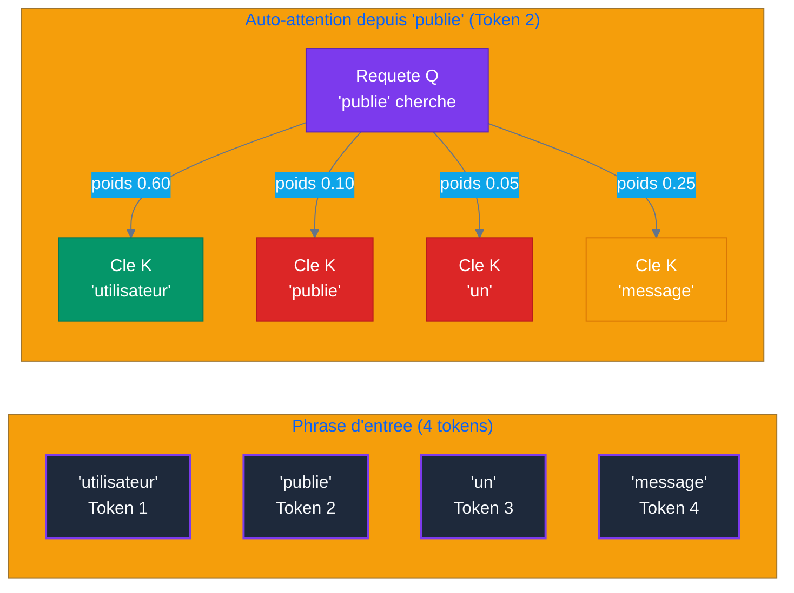

# Chapitre 1 — Histoire & Genèse de l'Intelligence Artificielle
## Objectifs pédagogiques

- Comprendre les grandes étapes qui ont mené à l'Intelligence Artificielle moderne
- Savoir situer chaque découverte dans son contexte
- Distinguer les ruptures fondamentales des améliorations incrémentales
- Comprendre pourquoi les systèmes agentiques émergent aujourd'hui

---

## 1. Les Fondations (1950-2012)

### 1.1 Le test de Turing (1950)

Alan Turing pose la question : *« Les machines peuvent-elles penser ? »* Il propose le **test de Turing** : une machine est dite intelligente si un humain ne peut pas distinguer ses réponses de celles d'un humain lors d'une conversation textuelle aveugle.

**Pourquoi c'est important :** C'est la première formalisation de l'intelligence artificielle comme objectif scientifique.

### 1.2 Les premiers systèmes (1956-1970)

- **1956** : Conférence de Dartmouth — naissance officielle du terme *Intelligence Artificielle*
- **1964-1966** : ELIZA (MIT (Massachusetts Institute of Technology)) — premier chatbot, par simulation de thérapeute rogérien. Simple jeu de motifs, mais les utilisateurs lui attribuaient une conscience.
- **1969** : Minsky & Papert démontrent les limites du perceptron (réseau à une couche). → Premier hiver de l'Intelligence Artificielle.

**Découverte clé :** Les systèmes à base de règles (*expert systems*) fonctionnent dans des domaines étroits mais ne généralisent pas.

### 1.3 Le premier hiver de l'Intelligence Artificielle (1970-1980)

- Les promesses n'ont pas été tenues. Les gouvernements réduisent les financements.
- Les systèmes experts sont fragiles : chaque nouvelle règle peut casser les précédentes.
- **Conclusion :** L'intelligence ne peut pas être programmée manuellement à grande échelle. Il faut que la machine apprenne par elle-même.

### 1.4 La renaissance (1980-1990)

- **Rétropropagation** (Rumelhart, Hinton, Williams, 1986) : algorithme fondamental qui permet d'entraîner des réseaux de neurones multicouches.
- Retour des réseaux de neurones, mais toujours limités par la puissance de calcul et les données.

### 1.5 Le deuxième hiver (1990-2000)

- Les Support Vector Machines et méthodes bayésiennes dominent. Les réseaux de neurones sont jugés trop instables.
- **Conclusion :** Sans données massives ni calcul parallèle, le deep learning ne peut pas exprimer son potentiel.

### 1.6 La révolution du Big Data (2000-2012)

- Internet explose → données massives disponibles.
- Graphics Processing Unit gaming → calcul parallèle accessible.
- **2009** : Fei-Fei Li lance **ImageNet** — 14 millions d'images labellisées.
- **2012** : **AlexNet** (Krizhevsky, Sutskever, Hinton) gagne ImageNet avec une avance écrasante. Le deep learning entre dans l'ère moderne.

**Rupture :** Pour la première fois, un réseau de neurones profonds surpasse massivement toutes les méthodes traditionnelles en vision par ordinateur.

---

## 2. La Rupture Transformer (2017)

### 2.1 Le papier fondateur

En juin 2017, Vaswani et al. publient **"Attention Is All You Need"** (Google Research). L'article propose une architecture radicalement nouvelle : le **Transformer** (architecture de deep learning basée sur l'auto-attention).

### 2.2 Le problème que ça résout

Avant le Transformer, les modèles de séquence (Recurrent Neural Network, Long Short-Term Memory) traitaient les mots un par un, séquentiellement :
- Impossible de paralléliser → lent
- Difficulté à capturer les dépendances longues (au-delà de ~50 mots)
- Gradient qui disparaît (*vanishing gradient*) dans les longues séquences

### 2.3 Le mécanisme d'attention

Le Transformer introduit **l'auto-attention** (*self-attention*, mécanisme d'attention qui pondère l'importance relative des mots) : chaque mot regarde tous les autres mots de la phrase en même temps et décide sur lesquels porter son attention.

**Exemple (projet reseau social) — visualisation des poids d'attention :**



### 2.4 La scalabilité

Contrairement aux Recurrent Neural Networks, le Transformer peut être parallélisé et **scalé** : plus de paramètres, plus de données, plus de Graphics Processing Unit = meilleures performances. Cette propriété de *scaling* est ce qui a rendu possible les modèles modernes.

### 2.5 Pourquoi c'est une découverte fondamentale

| Avant Transformer | Après Transformer |
|:---|---:|
| Traitement séquentiel (lent) | Parallélisable (rapide) |
| Contexte limité (~50-100 tokens) (unité de texte, mot ou sous-mot) | Contexte long (128K+ tokens) |
| Scaling difficile | Scaling linéaire avec les ressources |
| Un domaine à la fois (Natural Language Processing ou vision) | Architecture universelle (texte, image, audio, code) |

---

## 3. L'Ère Générative (2020-2023)

### 3.1 GPT (Generative Pre-trained Transformer) 3 et l'émergence (2020)

OpenAI publie GPT (Generative Pre-trained Transformer)-3 (175 milliards de paramètres). La découverte n'est pas le modèle lui-même, mais **l'émergence** :
- GPT (Generative Pre-trained Transformer)-2 (1.5B) était faible sur les tâches complexes
- GPT (Generative Pre-trained Transformer)-3 (175B) sait faire des choses qui n'étaient pas programmées explicitement : traduction jamais vue, raisonnement simple, code

**Découverte :** Quand un modèle dépasse un certain seuil de paramètres, des capacités nouvelles apparaissent spontanément (*emergence*).

### 3.2 RLHF (Reinforcement Learning from Human Feedback) — Le tournant (2022)

Le **RLHF (Reinforcement Learning from Human Feedback)** aligne les Large Language Models sur les préférences humaines :
1. Un modèle pré-entraîné génère des réponses
2. Des humains notent ces réponses
3. On entraîne un *reward model* qui prédit la note humaine
4. On fine-tune le LLM (Large Language Model) avec ce reward model

**Résultat :** Les modèles ne sont plus seulement *capables*, ils sont *utiles et alignés*. ChatGPT (novembre 2022) en est le premier exemple grand public.

### 3.3 Instruction Tuning & Chain-of-Thought

- **Instruction Tuning** (2022) : Fine-tuner le modèle sur des paires (instruction, réponse correcte). Le modèle apprend à *suivre des instructions* plutôt qu'à *continuer du texte*.
- **Chain-of-Thought** (Wei et al., 2022) : Demander au modèle de *raisonner étape par étape* améliore drastiquement les résultats sur les tâches de raisonnement.

### 3.4 L'explosion GPT (Generative Pre-trained Transformer)-4 & concurrents (2023)

- **GPT (Generative Pre-trained Transformer)-4** (mars 2023) : multimodal, raisonnement avancé, capable de passer des examens (barreau, médecine)
- **Claude** (Anthropic) : focus sur la sécurité et la transparence
- **Llama 2** (Meta) : open-source, poids disponibles
- **Mistral** : efficient, open-source, performant

**Découverte de 2023 :** Les modèles open-source (Llama, Mistral) rattrapent rapidement les modèles propriétaires sur de nombreuses tâches.

---

## 4. L'Ère Agentique (2024-2026)

### 4.1 Le constat de départ

Un LLM seul est passif :
- Il répond à des prompts, mais n'agit pas
- Il n'a pas de mémoire persistante
- Il ne peut pas utiliser d'outils
- Il ne planifie pas

**Solution :** Envelopper le LLM dans une **boucle agent** qui lui donne des capacités d'action et de raisonnement.

### 4.2 Tool Use & Function Calling (2024)

Le LLM peut déclarer quel outil utiliser, et un orchestrateur exécute l'appel :

```
"Quel temps fait-il à Paris ?"
→ Large Language Model : tool_call(get_weather, city="Paris")
→ Exécution : get_weather("Paris") → "15°C, nuageux"
→ Large Language Model : "Il fait 15°C et nuageux à Paris."
```

**Rupture :** Le LLM passe de *producteur de texte* à *orchestrateur d'actions*.

### 4.3 Le pattern ReAct (Reasoning + Acting) (2023-2024)

**ReAct (Reasoning + Acting)** (Yao et al., 2023) alterne pensée, action et observation :

```
Thought: L'utilisateur veut connaître la météo à Paris. Je dois utiliser l'Application Programming Interface météo.
Action: get_weather("Paris")
Observation: 15°C, nuageux
Thought: J'ai la météo. Je peux répondre.
Réponse: Il fait 15°C à Paris avec un ciel nuageux.
```

Ce pattern est la base de tous les systèmes agentiques modernes.

### 4.4 Mémoire & RAG (Retrieval-Augmented Generation) (2024)

Deux types de mémoire émergent :
- **Court-terme** : le contexte de la conversation (fenêtre de tokens)
- **Long-terme** : stockage persistant (vecteurs embeddings, base SQL (Structured Query Language))

Le **RAG (Retrieval-Augmented Generation)** combine :
1. Indexer des documents sous forme de vecteurs (embeddings)
2. À chaque question, chercher les passages les plus pertinents
3. Les injecter dans le contexte du LLM

### 4.5 Multi-Agent Orchestration (2025-2026)

Patterns qui émergent :
- **Supervisor** : un LLM chef délègue à des sous-agents spécialisés
- **Fan-out** : plusieurs agents travaillent en parallèle
- **Débat** : plusieurs agents argumentent pour converger vers une meilleure réponse
- **Hiérarchique** : agents subordonnés → agents managers → agent décisionnaire

### 4.6 MCP (Model Context Protocol) (2025-2026)

Anthropic introduit le **MCP (Model Context Protocol)**, un standard ouvert pour connecter Large Language Models à des sources de données et outils :
- Un serveur MCP (Model Context Protocol) expose des *ressources*, *outils* et *prompts*
- N'importe quel client (LLM, agent, application) peut les consommer
- Equivalent du *USB-C* pour l'Intelligence Artificielle : interopérabilité universelle

### 4.7 GitHub Agents & opencode (2026)

- **GitHub Copilot Coding Agent** : agent autonome dans l'IDE (Integrated Development Environment), capable de chercher, lire, éditer, exécuter des tests
- **Opencode** : plateforme agentic open-source orchestrant des équipes d'agents spécialisés via des fichiers de configuration (`opencode.json`, `AGENTS.md`)
- Les agents deviennent des membres à part entière de l'équipe de développement

> **Projet reseau social** : tout au long de ce cours, nous utiliserons comme projet le developpement d'une application web sociale simplifiee (inspiree de Twitter/Facebook). Le Cahier des Charges complet est disponible dans [`projet/gestion_de_projet/cdc.md`](projet/gestion_de_projet/cdc.md). Chaque TP montrera comment l'agentic permet de construire ce projet concret.

---

## 5. Panorama 2026

### 5.1 Les acteurs

| Acteur | Modèle phare | Particularité |
|---|---|---|
| OpenAI | GPT (Generative Pre-trained Transformer)-5 | Généraliste, API (Application Programming Interface) la plus utilisée |
| Anthropic | Claude Opus 4.5 | Sécurité, long contexte, agentic |
| Google | Gemini 2.0 | Multimodal natif |
| Meta | Llama 4 | Open-source performant |
| Mistral | Mistral Large | Efficient, open-source |
| xAI | Grok 3 | Raisonnement, temps réel |

### 5.2 Benchmarks clés

- **SWE-bench** (résolution de bugs GitHub) : de 3% (2023) à >90% (2026)
- **HumanEval** (génération de code) : saturé à ~95%
- **MMLU** (connaissance générale) : saturé à ~92%

**Tendance :** Les benchmarks classiques saturent. Les nouveaux benchmarks (SWE-bench, AgentBench) mesurent les capacités *agentiques* plutôt que la connaissance statique.

### 5.3 Limites actuelles

- **Hallucination** : les modèles inventent encore des faits
- **Coût** : un appel agentique peut coûter 10-100x un appel classique
- **Latence** : les boucles agentiques multiplient les appels
- **Prompt injection** : des instructions malveillantes dans les données peuvent détourner un agent
- **Jailbreak** : contournement des garde-fous de sécurité

### 5.4 Pourquoi ce cours ?

Les Large Language Models seuls sont insuffisants pour les applications réelles. La compétence la plus demandée en 2026 n'est pas la *prompt engineering* mais l'**architecture agentique** : concevoir des systèmes où des Large Language Models collaborant avec des outils, de la mémoire et d'autres agents résolvent des problèmes complexes de façon autonome.

Ce cours vous donne les clés pour concevoir, construire et déployer ces systèmes.

---

## Prérequis

Avant de commencer ce chapitre, installez les outils suivants :

### 1. Installation sur Linux (Ubuntu/Debian)

```bash
# Mettre à jour les paquets
sudo apt update

# Installer Python, pip, venv, Git et Docker
sudo apt install python3 python3-pip python3-venv git docker.io -y

# Autoriser l'utilisateur courant à utiliser Docker sans sudo
sudo usermod -aG docker "$USER"

# Important : déconnectez-vous puis reconnectez-vous avant de tester Docker.

# Installer opencode
python3 -m pip install --user opencode
```

### 2. Installation sur macOS

```bash
# Installer Homebrew si nécessaire : https://brew.sh

# Installer Python et Git
brew install python git

# Installer Docker Desktop
brew install --cask docker

# Ouvrir Docker Desktop une première fois
open -a Docker

# Installer opencode
python3 -m pip install --user opencode
```

### 3. Installation sur Windows 10/11 (PowerShell)

Ouvrez **PowerShell** en mode normal, puis exécutez :

```powershell
# Installer Python 3.12
winget install Python.Python.3.12

# Installer Git
winget install Git.Git

# Installer Docker Desktop
winget install Docker.DockerDesktop

# Redémarrez Windows, lancez Docker Desktop, puis installez opencode
py -m pip install --user opencode
```

### 4. Vérification finale par OS (Operating System)

#### Linux et macOS

```bash
# Vérifier Python, pip, Git, Docker et opencode
python3 --version
python3 -m pip --version
git --version
docker --version
opencode --version

# Vérifier que Docker fonctionne réellement
docker run hello-world

# Tester le modèle gratuit big-pickle
opencode -m opencode/big-pickle -t "Bonjour ! Quel est ton nom et ton rôle ?"
```

#### Windows PowerShell

```powershell
# Vérifier Python, pip, Git, Docker et opencode
py --version
py -m pip --version
git --version
docker --version
opencode --version

# Vérifier que Docker fonctionne réellement
docker run hello-world

# Tester le modèle gratuit big-pickle
opencode -m opencode/big-pickle -t "Bonjour ! Quel est ton nom et ton rôle ?"
```

> **Résultat attendu :** chaque outil affiche une version. `docker run hello-world` affiche un message de succès. L'agent opencode répond avec une présentation (ex: "Je suis un assistant opencode basé sur big-pickle...").

### Tableau de vérification rapide

| Outil | Commande Linux/macOS | Commande Windows PowerShell | Résultat attendu |
|---|---|---|---|
| Python | `python3 --version` | `py --version` | Version >= 3.10 |
| pip | `python3 -m pip --version` | `py -m pip --version` | pip disponible |
| Git | `git --version` | `git --version` | Version Git |
| Docker | `docker --version` | `docker --version` | Version Docker |
| Docker runtime | `docker run hello-world` | `docker run hello-world` | Message de succès |
| opencode | `opencode --version` | `opencode --version` | Version opencode |

### Si une commande échoue

- **Python/pip échoue :** réinstallez Python puis rouvrez le terminal.
- **Docker échoue :** démarrez Docker Desktop (macOS/Windows) ou reconnectez votre session (Linux après `usermod`).
- **opencode échoue :** vérifiez que le dossier d'installation utilisateur de Python est dans le `PATH`.
- **Git échoue :** réinstallez Git puis rouvrez le terminal.

Ne continuez pas le cours tant que cette vérification n'est pas validée.

### Convention de commandes pour tous les chapitres

| Usage | Linux/macOS | Windows PowerShell |
|---|---|---|
| Lancer Python | `python3 script.py` | `py script.py` |
| Installer un paquet | `python3 -m pip install paquet` | `py -m pip install paquet` |
| Lancer pytest | `python3 -m pytest tests/ -v` | `py -m pytest tests/ -v` |
| Commandes Git | `git ...` | `git ...` |
| Commandes Docker | `docker ...` | `docker ...` |
| Commandes opencode | `opencode ...` | `opencode ...` |

Dans la suite du cours, les commandes sont souvent montrées en version Linux/macOS avec `python3`. Sous Windows PowerShell, remplacez `python3` par `py`.

### Convention de dossiers pour les TPs

Chaque TP du cours doit être fait dans un **dossier de travail séparé**.

Avant de commencer un TP, placez-vous dans le dossier où vous rangez vos exercices. Exemple :

Linux/macOS :

```bash
# Créer le dossier racine de tous les TPs du cours
mkdir -p ~/agentic-labs
# Se positionner dans ce dossier avant de commencer un TP
cd ~/agentic-labs
```

Windows PowerShell :

```powershell
# Créer le dossier racine de tous les TPs du cours
mkdir $HOME\agentic-labs
# Se positionner dans ce dossier avant de commencer un TP
cd $HOME\agentic-labs
```

Ensuite, quand le cours dit `mkdir nom-du-tp && cd nom-du-tp`, cela crée un nouveau dossier de TP à l'intérieur de ce dossier d'exercices. Tous les fichiers du TP doivent être créés dans ce dossier courant.

Pour vérifier où vous êtes :

```bash
# Afficher le chemin du dossier courant pour vérifier sa position
pwd
```

Sous Windows PowerShell, `pwd` fonctionne aussi.

### Où se trouve le dépôt du cours par rapport à vos TPs ?

Ce fichier fait partie du dépôt `Agentic-Developer-Craftsmanship/`. Ce dépôt contient **uniquement la documentation** du cours (les fichiers `CHAPITRE-*.md`). Vous ne créez jamais de code ni de projet opencode à l'intérieur.

Vos TPs se font dans un dossier **SÉPARÉ** appelé `agentic-labs/` :

```
Votre ordinateur/
├── Agentic-Developer-Craftsmanship/                  ← dépôt Git du cours (lecture seule)
│   ├── README.md
│   ├── CHAPITRE-01-histoire-ia.md   ← vous lisez ce fichier ici
│   ├── CHAPITRE-02-fondations-llm.md
│   ├── CHAPITRE-03-prompt-tool-use.md
│   ├── CHAPITRE-04-architecture-agent.md
│   ├── CHAPITRE-05-memoire-rag.md
│   ├── CHAPITRE-06-multi-agent.md
│   ├── CHAPITRE-07-mcp-standards.md
│   ├── CHAPITRE-08-cicd-devops.md
│   ├── CHAPITRE-09-securite.md
│   ├── CHAPITRE-10-opencode-labs.md
│   └── projet/gestion_de_projet/
│       └── cdc.md                ← cahier des charges du projet final
└── agentic-labs/                 ← votre dossier de travail (à créer)
    ├── mon-premier-agent/        ← TP Chapitre 1
    ├── tokenisation/             ← TP Chapitre 2
    ├── assistant-cli/            ← TP Chapitre 3
    ├── agent-loop/               ← TP Chapitre 4
    ├── agent-memoire/            ← TP Chapitre 5
    ├── supervisor-agent/         ← TP Chapitre 6
    ├── serveur-mcp/              ← TP Chapitre 7
    ├── cicd-agents/              ← TP Chapitre 8
    ├── securite-agent/           ← TP Chapitre 9
    ├── lab1-premier-projet/      ← Lab 1 (Chapitre 10)
    ├── equipe-agentic/           ← Lab 2 (Chapitre 10)
    └── reseau-social-agentic/    ← Lab 3 (Chapitre 10)
```

**Règle importante :** vous ne créez jamais de fichiers dans `Agentic-Developer-Craftsmanship/`. Vous travaillez toujours dans `agentic-labs/` ou l'un de ses sous-dossiers.

---
## 6. Travaux Pratiques — Premier agent opencode

> **Projet reseau social** : ce premier TP prepare votre environnement de travail pour l'ensemble du cours. Vous allez installer les outils necessaires (Python, opencode, big-pickle), verifier leur bon fonctionnement, puis interagir avec votre premier agent.

**Objectif :** Installer et configurer votre environnement de development agentique, executer votre premier agent opencode.

**Durée :** 30 min

---

### Énoncé

Vous devez :

1. Installer Python 3.10+ (si pas déjà fait)
2. Installer opencode et le modele gratuit big-pickle
3. Creer un premier projet opencode
4. Interagir avec l'agent via la ligne de commande
5. Verifier que tout fonctionne correctement

**Fichiers à créer :**
- `mon-premier-agent/opencode.json` — configuration de l'agent
- `mon-premier-agent/AGENTS.md` — description de l'equipe

---

### Corrigé

#### Étape 1 — Creer le dossier du projet

**Point de départ :** ouvrez un terminal dans votre dossier d'exercices, par exemple `~/agentic-labs` ou `$HOME\agentic-labs`.

Ce TP crée un **nouveau dossier indépendant** nommé `mon-premier-agent`.

```bash
# Créer le dossier du TP Chapitre 1
mkdir -p mon-premier-agent
# Se positionner dedans — toutes les commandes suivantes s'exécutent ici
cd mon-premier-agent
# Vérifier qu'on est bien dans le bon dossier
pwd
```

**Résultat attendu :** `pwd` doit se terminer par `mon-premier-agent`. Tous les fichiers de ce TP seront créés dans ce dossier.

#### Étape 2 — Initialiser Git

```bash
# Initialiser un dépôt Git pour versionner la configuration de l'agent
git init
```

Vous devriez voir :

```
Initialized empty Git repository in /chemin/vers/mon-premier-agent/.git/
```

#### Étape 3 — Configurer opencode

Vous êtes toujours dans `mon-premier-agent/`. Créez `opencode.json` à la racine de ce dossier :

```text
mon-premier-agent/
├── opencode.json          ← à créer maintenant
└── .git/
```

Creez un fichier `opencode.json` :

```jsonc
{
  "$schema": "https://opencode.ai/config.json",  // Validation du format
  "model": "opencode/big-pickle",                 // Modele gratuit
  "default_agent": "decouverte",                  // Nom de l'agent par defaut
  "agent": {
    "decouverte": {
      "mode": "primary",                          // Agent principal
      "description": "Agent de decouverte du cours"
    }
  }
}
```

#### Étape 4 — Creer le fichier d'equipe

##### À quoi sert `AGENTS.md` dans ce premier projet ?

`AGENTS.md` explique à l'agent le contexte du projet et la façon dont il doit être utilisé. Dans ce premier TP, il est volontairement simple : il sert à documenter que l'agent est un agent de découverte du cours.

Même si le projet ne contient qu'un seul agent, prendre l'habitude de créer `AGENTS.md` est important. Plus tard, ce fichier décrira une vraie équipe : scrum-master, développeur, testeur, devops.

##### Où créer le fichier ?

Créez-le dans le dossier `mon-premier-agent/`, au même niveau que `opencode.json` :

```text
mon-premier-agent/
├── opencode.json
└── AGENTS.md
```

Creez `AGENTS.md` :

```markdown
# Mon premier agent

Agent de decouverte installe pour le cours Agentic Developer Craftsmanship.

## Utilisation

- Demandez a l'agent de repondre a des questions sur l'histoire de l'IA
- Testez ses capacites avec des instructions simples
- Explorez les limites du modele big-pickle
```

##### Résultat attendu

Le fichier documente le rôle de l'agent. Quand vous relirez le projet plus tard, vous saurez immédiatement pourquoi cet agent existe et comment l'utiliser.

#### Étape 5 — Lancer opencode

```bash
# Lancer l'interface interactive d'opencode dans le dossier du projet
# opencode lit automatiquement opencode.json pour la configuration
opencode
```

Vous entrez dans l'interface interactive d'opencode. Essayez ces instructions :

```
Qui a invente le test de Turing et en quoi consiste-t-il ?
```

```
Que s'est-il passe en 2012 avec AlexNet ?
```

```
Qu'est-ce que le pattern ReAct ?
```

```
Quelle est la particularite de ce cours ?
```

> Chaque question correspond à une section du chapitre. L'agent puisera dans ses connaissances pour répondre. Observez la qualité et la précision des réponses du modèle big-pickle.

#### Étape 6 — Quitter opencode

```bash
# Quitter l'interface interactive d'opencode
exit
```

#### Étape 7 — Test en mode one-shot

Vous pouvez aussi interagir sans entrer dans l'interface interactive :

```bash
# Mode one-shot : opencode répond à la question puis se termine immédiatement
# Utile pour des questions rapides sans entrer dans l'interface interactive
opencode -t "Qu'est-ce que le test de Turing ?"
```

L'agent repond directement puis se termine.

---

### Résultat attendu

Après ces étapes :

```
mon-premier-agent/
├── opencode.json          ← Configuration de l'agent
├── AGENTS.md              ← Description de l'équipe
└── .git/                  ← Dépôt Git initialisé
```

- L'agent opencode répond aux questions sur l'histoire de l'Intelligence Artificielle
- Le modèle big-pickle fonctionne sans abonnement API (Application Programming Interface)
- Vous pouvez interagir en mode interactif ou one-shot

---

### Validation

- [ ] Linux/macOS : `python3 --version` affiche >= 3.10
- [ ] Windows : `py --version` affiche >= 3.10
- [ ] Linux/macOS : `python3 -m pip --version` fonctionne
- [ ] Windows : `py -m pip --version` fonctionne
- [ ] `git --version` affiche un numéro de version
- [ ] `docker --version` affiche un numéro de version
- [ ] `docker run hello-world` affiche un message de succès
- [ ] `opencode --version` affiche un numéro de version
- [ ] `opencode -m opencode/big-pickle -t "test"` répond sans erreur
- [ ] Le dossier `mon-premier-agent/` contient `opencode.json` et `AGENTS.md`
- [ ] `git status` affiche "On branch main" ou "master"

---

### Points clés à retenir

1. **Opencode** transforme un LLM en assistant interactif accessible en ligne de commande
2. **big-pickle** est un modèle libre et gratuit — pas d'abonnement API (Application Programming Interface) nécessaire
3. La configuration se fait via `opencode.json` (agent, modèle, permissions)
4. `AGENTS.md` documente le rôle et l'utilisation de l'équipe d'agents
5. Deux modes d'interaction : **interactif** (`opencode`) et **one-shot** (`opencode -t "..."`)

---

## Pour aller plus loin

- Vaswani et al., *"Attention Is All You Need"* (2017)
- Wei et al., *"Chain-of-Thought Prompting Elicits Reasoning in Large Language Models"* (2022)
- Yao et al., *"ReAct (Reasoning + Acting): Synergizing Reasoning and Acting in Language Models"* (2023)
- Anthropic, *"MCP (Model Context Protocol)"* (2025)
- GitHub, *"Copilot Coding Agent"* (2026)

---
**Projet reseau social** : [`projet/gestion_de_projet/cdc.md`](projet/gestion_de_projet/cdc.md)
