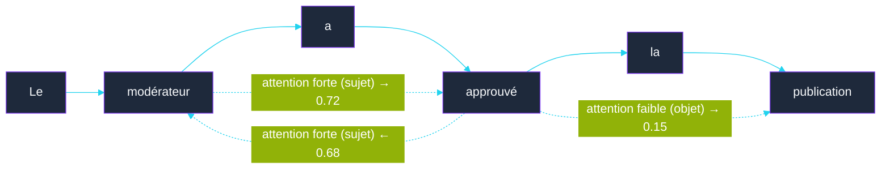
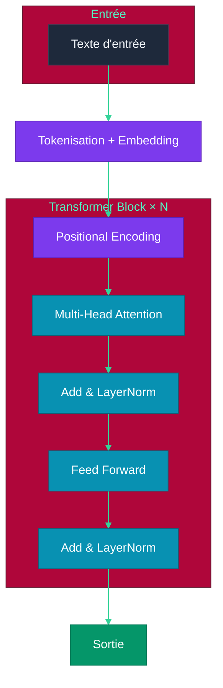
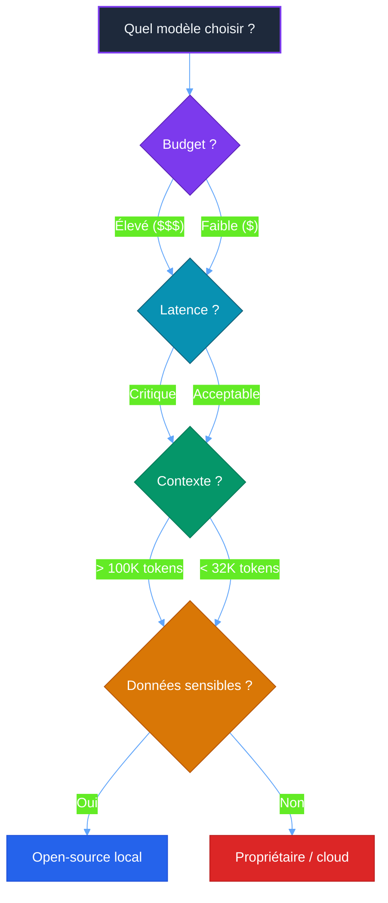

# Chapitre 2 — Architecture des LLMs (Large Language Models)

## Objectifs pédagogiques

- Comprendre le fonctionnement interne d'un LLM (Large Language Model) (tokenisation → prédiction)
- Maîtriser la notion de fenêtre de contexte et ses implications
- Connaître les différents types de modèles et leurs usages
- Comprendre les scaling laws et l'émergence

---

## Prérequis

Avant de commencer ce chapitre, assurez-vous d'avoir :

- Terminé le **[Chapitre 1](CHAPITRE-01-histoire-ia.md)** et son TP (environnement opencode fonctionnel)
- Python 3.10+ installé
- pip à jour

### Installation des dépendances

#### Linux et macOS

```bash
python3 -m pip install tiktoken pytest

# Vérification
python3 -m pip show tiktoken pytest
```

#### Windows PowerShell

```powershell
py -m pip install tiktoken pytest

# Vérification
py -m pip show tiktoken pytest
```

### Vérification

#### Linux et macOS

```bash
python3 -c "import tiktoken; print(tiktoken.__version__)"
```

#### Windows PowerShell

```powershell
py -c "import tiktoken; print(tiktoken.__version__)"
```

> **Résultat attendu :** un numéro de version s'affiche (ex: `0.7.0`).

---

## 1. Tokenisation

### 1.1 Principe

Un LLM (Large Language Model) ne lit pas du texte, il lit des **tokens** (unités de texte, mots ou sous-mots) — des morceaux de mots ou caractères.

```
"Les agents Intelligence Artificielle sont fascinants"
→ ["Les", " agents", " IA", " sont", " fascin", "ants"]
```

**Règles générales :**
- 1 token ≈ 0.75 mot en français
- 1 token ≈ 0.25 mot en anglais (plus dense)
- Les mots rares ou techniques sont découpés en plusieurs tokens
- Les espaces et ponctuations comptent

### 1.2 Implications pratiques

| Capacité | Tokens | Mots (français) |
|---|---|---|
| Contexte court (GPT (Generative Pre-trained Transformer)-3) | 4 096 | ~3 000 |
| Contexte long (GPT (Generative Pre-trained Transformer)-4) | 128 000 | ~96 000 |
| Contexte géant (Claude 4) | 200 000 | ~150 000 |
| Contexte infini (Gemini) | 1 000 000 | ~750 000 |

**Impact sur les agents :** Plus la fenêtre de contexte est grande, plus l'agent peut raisonner sur des informations nombreuses avant de décider.

---

## 2. Mécanisme d'Attention

### 2.1 Le problème

Dans une phrase, les mots n'ont pas tous la même importance et leurs relations ne sont pas linéaires :

```
"Le modérateur a approuvé la publication du nouvel utilisateur."
                      ↑
           "a approuvé" se réfère à "modérateur", pas à "publication"
```

### 2.2 Solution : Self-Attention

Chaque token calcule un **score d'attention** (mécanisme de pondération contextuelle) avec tous les autres tokens de la phrase :



### 2.3 Multi-Head Attention

Au lieu d'un seul calcul d'attention, on en fait plusieurs en parallèle (*têtes*) :
- Une tête peut capturer les relations grammaticales
- Une autre les relations sémantiques
- Une autre la position dans la phrase

Le tout est concaténé et re-projeté.

---

## 3. Architecture Transformer

### 3.1 Vue d'ensemble



### 3.2 Les couches

1. **Embedding** (représentation vectorielle d'un token) : chaque token → vecteur numérique dense (ex: 4096 dimensions)
2. **Positional Encoding** : ajoute une information de position (ordre des mots)
3. **Multi-Head Attention** : calcule les relations entre tous les tokens
4. **Feed Forward** : réseau de neurones classique qui transforme chaque token
5. **LayerNorm** : normalisation qui stabilise l'entraînement
6. **Résidu** (Add) : ajoute l'entrée à la sortie (*skip connection*)

Ces blocs sont empilés **N fois** (ex: GPT (Generative Pre-trained Transformer)-3 = 96 couches).

---

## 4. Scaling Laws

### 4.1 La découverte (Kaplan et al., 2020)

Les performances d'un LLM (Large Language Model) suivent une **loi de puissance** prévisible :

```
Performance ∝ (Paramètres) × (Données) × (Calcul)
```

Si on multiplie l'un de ces trois facteurs par 10, la performance s'améliore de façon prévisible.

### 4.2 L'émergence (2022)

Au-delà d'un certain seuil (~100 milliards de paramètres), des capacités **émergent** :

| Taille | Capacités |
|---|---|
| < 1B | Génération basique, complétion |
| 1-10B | Traduction, Q&A simple |
| 10-100B | Raisonnement, code, planification |
| > 100B | Émergence : tool use, instruction following avancé |

### 4.3 Évolution des modèles (2018-2026)

| Modèle | Année | Paramètres | Contexte |
|---|---|---|---|
| GPT (Generative Pre-trained Transformer)-1 | 2018 | 117M | 512 |
| GPT (Generative Pre-trained Transformer)-2 | 2019 | 1.5B | 1 024 |
| GPT (Generative Pre-trained Transformer)-3 | 2020 | 175B | 2 048 |
| GPT (Generative Pre-trained Transformer)-4 | 2023 | ~1.8T | 128K |
| Claude 4 | 2025 | ~2T | 200K |
| DeepSeek-R1 | 2025 | ~1T | 128K |
| GPT (Generative Pre-trained Transformer)-5 | 2026 | ~3T | 256K |

---

## 5. Processus de génération

### 5.1 Autoregression

Un LLM (Large Language Model) génère du texte **token par token**, en prédisant le token suivant à chaque étape :

```
"Les agents" → ["Intelligence Artificielle"] (probabilité 0.45)
            → ["intelligents"] (probabilité 0.30)
            → ["autonomes"] (probabilité 0.15)
            → ...
```

### 5.2 Température

Contrôle l'**aléas** dans la sélection du prochain token :

| Température | Effet | Usage |
|---|---|---|
| 0.0 | Toujours le token le plus probable | Précision, faits |
| 0.2 - 0.5 | Peu d'aléas | Code, logique |
| 0.7 - 0.9 | Aléas modéré | Créatif, conversation |
| 1.0+ | Très aléas | Brainstorming, poésie |

### 5.3 Top-k et Top-p

- **Top-k** : ne considérer que les k tokens les plus probables
- **Top-p** : ne considérer que les tokens dont la somme cumulée des probabilités atteint p

---

## 6. Types de modèles

### 6.1 Modèles propriétaires

| Modèle | Forces | Faiblesses |
|---|---|---|
| GPT (Generative Pre-trained Transformer)-5 | Généraliste, API (Application Programming Interface) stable | Coûteux, pas modifiable |
| Claude 4 | Long contexte, safety | Moins performant en code |
| Gemini 2 | Multimodal natif | Moins flexible |

### 6.2 Modèles open-source

| Modèle | Forces | Usage |
|---|---|---|
| Llama 4 | Performant, communauté | Fine-tuning (ajustement fin du modèle sur des données spécifiques) local |
| Mistral | Efficient, léger | Applications embarquées |
| DeepSeek | Raisonnement, math | Tâches complexes |
| Qwen | Multilingue | International |

### 6.3 Critères de choix pour un agent



---

> **Projet réseau social** : le projet social défini dans [`projet/gestion_de_projet/cdc.md`](projet/gestion_de_projet/cdc.md) utilisera les LLMs (Large Language Models) via opencode pour automatiser le développement de ses fonctionnalités (authentification, mur public, gestion des utilisateurs).

---

## 7. Travaux Pratiques — Visualiser la tokenisation

> **Projet réseau social** : dans ce TP, vous allez tokeniser des phrases de l'application réseau social (messages, noms d'utilisateur) pour comprendre comment un LLM (Large Language Model) les "voit" et estimer le coût en tokens des futures fonctionnalités.

**Objectif :** Installer tiktoken, tokeniser du texte, comprendre la différence entre mots et tokens, et estimer le coût d'un message.

**Durée :** 45 min

---

### Énoncé

Vous devez :

1. Installer tiktoken (tokeniseur OpenAI compatible avec big-pickle)
2. Écrire un script Python qui tokenise une phrase
3. Afficher chaque token, son ID, et le nombre total de tokens
4. Comparer des phrases en français et en anglais
5. Estimer le nombre de tokens dans un message du réseau social

**Fichiers à créer :**
- `tokenisation/demo_tokenisation.py` — script de démonstration
- `tokenisation/test_tokenisation.py` — tests de vérification

---

### Corrigé

#### Étape 1 — Créer le dossier

**Point de départ :** ouvrez un terminal dans votre dossier d'exercices. Ce TP crée un **nouveau dossier indépendant** nommé `tokenisation`.

```bash
mkdir -p tokenisation
cd tokenisation
pwd
```

**Résultat attendu :** `pwd` doit se terminer par `tokenisation`. Les fichiers `demo_tokenisation.py` et `test_tokenisation.py` seront créés dans ce dossier.

#### Étape 2 — Script de tokenisation

Vous êtes toujours dans `tokenisation/`. Créez `demo_tokenisation.py` à la racine de ce dossier :

```python
import tiktoken

# Charge l'encodeur compatible avec big-pickle (cl100k_base)
# est le meme encodeur que GPT-4, adapte au code et au texte
enc = tiktoken.get_encoding("cl100k_base")

# Phrase a tokeniser (exemple d'un message du reseau social)
phrase = "Bonjour tout le monde ! Je viens de publier mon premier message."

# Tokenisation : convertit le texte en une liste d'entiers (IDs de tokens)
tokens = enc.encode(phrase)

# Decodage inverse : reconvertit chaque ID en texte lisible
texte_tokens = [enc.decode([t]) for t in tokens]

print("=" * 60)
print("DEMONSTRATION DE TOKENISATION")
print("=" * 60)

# Affiche la phrase originale
print(f"\nPhrase originale : {phrase}")
print(f"Nombre de caracteres : {len(phrase)}")
print(f"Nombre de tokens : {len(tokens)}")
print(f"Rapport caracteres/token : {len(phrase) / len(tokens):.1f}")

# Affiche chaque token avec son ID et sa representation texte
print(f"\n{'ID':<8} {'Token':<20} {'Repr. texte'}")
print("-" * 60)
for i, (token_id, token_text) in enumerate(zip(tokens, texte_tokens)):
    print(f"{token_id:<8} {repr(token_text):<20} {token_text}")

# Exemple 2 : comparaison français / anglais
print("\n" + "=" * 60)
print("COMPARAISON FRANCAIS / ANGLAIS")
print("=" * 60)

phrases = {
    "francais": "Les agents intelligents transforment le développement logiciel",
    "anglais": "Intelligent agents are transforming software development",
}

for langue, texte in phrases.items():
    nb_tokens = len(enc.encode(texte))
    print(f"\n{langue.upper()} : {texte}")
    print(f"  Tokens : {nb_tokens} | Caractères : {len(texte)} | Ratio : {len(texte)/nb_tokens:.1f}")

# Exemple 3 : estimation du coût d'un message pour le réseau social
print("\n" + "=" * 60)
print("ESTIMATION DU COUT D'UN MESSAGE")
print("=" * 60)

message = (
    "Salut ! Voici mon premier post sur le reseau social. "
    "Je suis tres content de decouvrir cette plateforme. "
    "Au fait, est-ce que quelqu'un sait comment modifier "
    "son profil ? Merci d'avance pour votre aide !"
)

nb_tokens = len(enc.encode(message))
# big-pickle est gratuit mais l'estimation reste utile
# si on migre vers un modèle payant
cout_estime = (nb_tokens / 1000) * 0.01  # $0.01/1K tokens (exemple)
print(f"\nMessage : {message[:80]}...")
print(f"  Tokens : {nb_tokens}")
print(f"  Coût estimé (modèle payant) : ${cout_estime:.6f}")
print(f"  Avec big-pickle : GRATUIT")
```

#### Étape 3 — Exécuter le script

```bash
python3 demo_tokenisation.py
```

**Résultat attendu :**

```
============================================================
DEMONSTRATION DE TOKENISATION
============================================================

Phrase originale : Bonjour tout le monde ! Je viens de publier mon premier message.
Nombre de caracteres : 68
Nombre de tokens : 12
Rapport caracteres/token : 5.7

ID       Token                Repr. texte
------------------------------------------------------------
...
```

Les IDs de tokens seront différents selon l'encodeur, mais vous verrez chaque token individuel.

#### Étape 4 — Tests unitaires

Vous êtes toujours dans `tokenisation/`. Créez `test_tokenisation.py` à côté de `demo_tokenisation.py` :

```python
import tiktoken

enc = tiktoken.get_encoding("cl100k_base")


def test_tokenisation_longueur():
    """Vérifie que la tokenisation produit bien des tokens."""
    texte = "Hello world"
    tokens = enc.encode(texte)
    assert len(tokens) > 0, "La tokenisation devrait produire des tokens"


def test_tokenisation_decodage():
    """Vérifie que le décodage redonne le texte original."""
    texte = "Bonjour le monde"
    tokens = enc.encode(texte)
    decode = enc.decode(tokens)
    assert decode == texte, (
        f"Le decodage devrait redonner le texte original. "
        f"Obtenu: {decode}"
    )


def test_tokenisation_non_vide():
    """Vérifie qu'une chaîne vide donne zéro token."""
    tokens = enc.encode("")
    assert len(tokens) == 0, "Une chaine vide devrait donner 0 token"


def test_tokenisation_message_reseau_social():
    """Vérifie qu'un message type reseau social tient dans le contexte."""
    message = "Salut ! Voici mon premier post sur le reseau social."
    tokens = enc.encode(message)
    # Le contexte minimal est 4096 tokens, largement suffisant
    assert len(tokens) < 4096, (
        f"Un message devrait tenir dans le contexte. "
        f"Tokens: {len(tokens)}"
    )


def test_comparaison_francais_anglais():
    """Vérifie que l'anglais est plus dense en tokens que le français."""
    phrase_fr = "Les agents intelligents transforment le développement"
    phrase_en = "Intelligent agents transform development"

    tokens_fr = len(enc.encode(phrase_fr))
    tokens_en = len(enc.encode(phrase_en))

    print(f"\nFrancais : {len(phrase_fr)} chars -> {tokens_fr} tokens")
    print(f"Anglais  : {len(phrase_en)} chars -> {tokens_en} tokens")

    # En moyenne l'anglais a un ratio caracteres/token plus eleve
    ratio_fr = len(phrase_fr) / tokens_fr
    ratio_en = len(phrase_en) / tokens_en
    assert ratio_en > ratio_fr, (
        f"L'anglais devrait etre plus dense. "
        f"FR: {ratio_fr:.1f}, EN: {ratio_en:.1f}"
    )
```

#### Étape 5 — Lancer les tests

```bash
python3 -m pytest test_tokenisation.py -v
```

#### Étape 6 — Explorer avec opencode

**Point de départ :** vous êtes normalement dans le dossier `tokenisation/` après les tests.

Pour lancer opencode sur le TP, vous pouvez rester dans `tokenisation/`. Si vous préférez revenir au dossier parent où se trouvent tous vos TPs, utilisez `cd ..`.

```bash
# Optionnel : revenir au dossier parent de tokenisation
cd ..

# Lancer opencode et demander :
opencode
```

Dans l'interface interactive :

```
Explique moi comment fonctionne la tokenisation avec tiktoken
```

```
Quel est l'impact du nombre de tokens sur le coût d'un appel LLM (Large Language Model) ?
```

---

### Résultat attendu

```
tokenisation/
├── demo_tokenisation.py    ← Script de demonstration
└── test_tokenisation.py    ← Tests unitaires
```

- Le script affiche chaque token avec son ID
- La comparaison FR/EN montre que l'anglais est plus dense (moins de tokens)
- Les tests passent (pytest vert)
- Vous comprenez la difference entre mots et tokens

---

### Validation

- [ ] `pip show tiktoken` affiche la version installée
- [ ] `python3 demo_tokenisation.py` affiche les tokens et leurs IDs
- [ ] `python3 -m pytest test_tokenisation.py -v` passe (5 tests verts)
- [ ] Le rapport caractères/token du français est inférieur à celui de l'anglais
- [ ] Vous pouvez expliquer pourquoi "fascinants" est découpé en plusieurs tokens

---

### Points clés à retenir

1. Un **token** n'est pas un mot : c'est une unité plus petite (sous-mot, caractère)
2. **1 token ≈ 0.75 mot** en français, **≈ 0.25 mot** en anglais
3. Les mots rares ou longs sont découpés en plusieurs tokens
4. Le nombre de tokens impacte le **coût** (si modèle payant) et la **fenêtre de contexte**
5. `tiktoken` est l'outil de référence pour compter les tokens

---

## Points clés à retenir

1. Un LLM (Large Language Model) est un **prédicteur de tokens** entraîné sur des masses de texte
2. Le **Transformer** est l'architecture universelle depuis 2017
3. L'**attention** permet au modèle de se concentrer sur les relations pertinentes
4. Le **scaling** (plus de paramètres + données + calcul) améliore les performances de façon prévisible
5. L'**émergence** de capacités agentiques (tool use, planification) apparaît au-delà d'un certain seuil
6. Le choix d'un modèle dépend du **budget, de la latence, du contexte requis et de la sensibilité des données**

---

## Liens

- [Chapitre 1 — Histoire de l'Intelligence Artificielle](./CHAPITRE-01-histoire-ia.md)
- [Chapitre 3 — Prompt & Tool Use](./CHAPITRE-03-prompt-tool-use.md)
- [Documentation technique — Architecture Transformer (Vaswani et al., 2017)](https://arxiv.org/abs/1706.03762)

---
**Projet réseau social** : [`projet/gestion_de_projet/cdc.md`](projet/gestion_de_projet/cdc.md)
