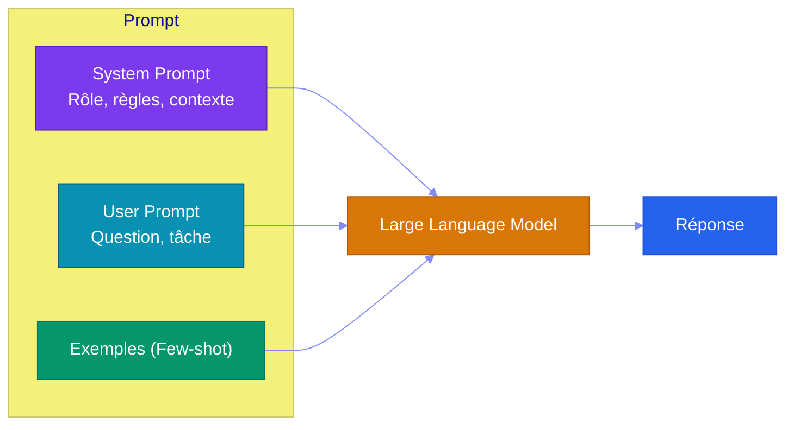
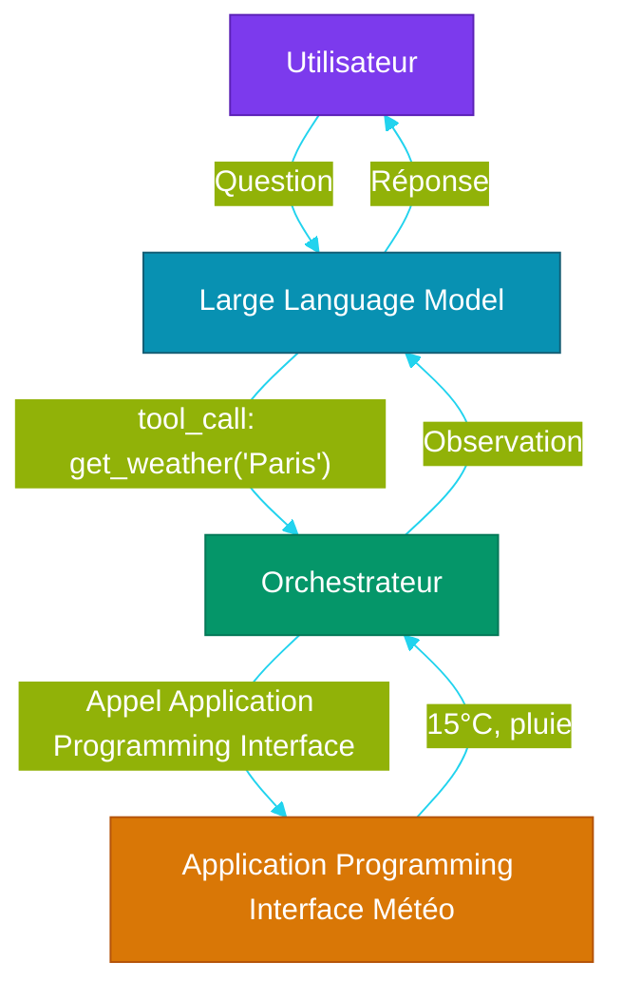

# Chapitre 3 — Prompt Engineering & Tool Use

## Objectifs pédagogiques

- Maîtriser les différentes techniques de prompting
- Savoir concevoir un system prompt efficace
- Comprendre et implémenter le function calling
- Maîtriser le pattern ReAct (Reasoning + Acting)

---

## Prérequis

Avant de commencer ce chapitre, assurez-vous d'avoir :

- Terminé les **[Chapitres 1](CHAPITRE-01-histoire-ia.md)** et **[Chapitre 2](CHAPITRE-02-fondations-llm.md)** avec leurs TP
- Python 3.10+ et opencode installés
- Compris les bases de la tokenisation (P2)

### Vérification

#### Linux et macOS

```bash
# Tester que tout est fonctionnel
python3 --version && opencode --version
```

#### Windows PowerShell

```powershell
py --version
opencode --version
```

> **Aucune dépendance supplémentaire** pour ce chapitre — Python standard suffit.

---

## 1. Les Fondamentaux du Prompt

### 1.1 Structure d'un prompt

Un prompt (instruction donnée au modèle de langage) se compose de plusieurs éléments :



### 1.2 System Prompt

Le **system prompt** (consigne de rôle et de comportement) définit le rôle, le ton et les contraintes :

```
Tu es un assistant expert en développement Python.
Tu réponds uniquement avec du code fonctionnel.
Tu expliques brièvement ton raisonnement avant chaque réponse.
```

**Bonnes pratiques :**
- Clair et direct (pas d'ambiguïté)
- Règles précises (format, longueur, ton)
- Contraintes de sécurité (ne pas exécuter de code dangereux)
- Contexte utile (utilisateur, projet, version)

### 1.3 User Prompt

Le prompt utilisateur contient la **demande spécifique** :

```
Peux-tu écrire une fonction Python qui vérifie
si un email est valide ?
```

---

## 2. Techniques de Prompting

### 2.1 Zero-shot

Donner une instruction sans exemple. Fonctionne bien pour les tâches simples.

```
Traduis en anglais : "Les agents Intelligence Artificielle sont fascinants"
→ "AI agents are fascinating"
```

### 2.2 Few-shot (apprentissage avec quelques exemples)

Fournir **2-3 exemples** avant la question. Améliore la précision pour les tâches complexes.

```
Anglais → Français
"Hello world" → "Bonjour le monde"
"Good morning" → "Bonjour"
"AI agents" → ?
```

### 2.3 CoT (Chain-of-Thought)

Demander au modèle de **raisonner étape par étape** :

```
Jean a 12 pommes. Il en donne 3 à Marie, puis en achète 5.
Combien en a-t-il maintenant ?

Raisonnement :
1. Jean commence avec 12 pommes
2. Il donne 3 à Marie : 12 - 3 = 9
3. Il achète 5 : 9 + 5 = 14
Résultat : 14 pommes
```

**Quand l'utiliser :** Problèmes mathématiques, logiques, planification, décisions multi-étapes.

### 2.4 Instruction vs Format

On peut structurer la réponse attendue :

```
Tu es un assistant de réservation.
Pour chaque demande, réponds au format JSON :
{
  "action": "réserver | annuler | consulter",
  "paramètres": { ... }
}

Demande : "Je veux réserver une table pour 2 à 20h"
```

### 2.5 Persona Pattern

Donner un rôle spécifique au modèle :

```
Tu es un DevOps senior avec 15 ans d'expérience.
Analyse ce Dockerfile et identifie les problèmes de sécurité.
```

---

## 3. Tool Use & Function Calling

### 3.1 Principe

Le Large Language Model peut déclarer qu'il souhaite utiliser un outil externe, sans l'exécuter lui-même.

#### Principe expliqué simplement

Un Large Language Model seul ne fait que produire du texte. Il ne sait pas réellement consulter une météo, lire une base de données ou exécuter un calcul fiable. Le **tool use** ajoute une couche d'orchestration autour du Large Language Model.

Le Large Language Model dit : "je veux appeler tel outil avec tels paramètres". Ensuite, votre programme exécute réellement l'outil, récupère le résultat, puis le renvoie au Large Language Model.

```text
Utilisateur → pose une question
Large Language Model → demande un outil : get_weather(city="Paris")
Programme → exécute get_weather("Paris")
Outil → retourne "15°C"
Large Language Model → rédige la réponse finale
```

#### Pourquoi c'est utile ?

- Le Large Language Model peut utiliser des données fraîches ou externes
- Les réponses sont moins inventées, car elles s'appuient sur un résultat d'outil
- Les actions restent contrôlées par le code applicatif
- Les permissions permettent d'autoriser certains outils et d'en bloquer d'autres

#### Limite importante

Un outil trop puissant ou mal décrit peut être dangereux. Il faut toujours valider les paramètres côté serveur, limiter les permissions et gérer les erreurs.



### 3.2 Définir un outil

#### Où créer le fichier ?

**Point de départ :** ouvrez un terminal dans votre dossier d'exercices `~/agentic-labs` (Linux/macOS) ou `$HOME\agentic-labs` (Windows PowerShell).

```bash
mkdir -p chapitre-03-tool-use
cd chapitre-03-tool-use
pwd
```

**Résultat attendu :** `pwd` doit se terminer par `chapitre-03-tool-use`. Les fichiers `tools.py` et plus tard `agent_loop.py` seront créés dans ce dossier.

Créez `tools.py` dans ce dossier :

```python
import json

# Liste des outils disponibles pour le Large Language Model
# Chaque outil est défini comme un dictionnaire conforme au schema OpenAI
tools = [
    {
        "type": "function",  # Type d'outil : appel de fonction
        "function": {
            "name": "get_weather",  # Nom unique de l'outil
            # Description qui aide le Large Language Model à décider quand utiliser cet outil
            "description": "Obtenir la météo d'une ville",
            "parameters": {
                "type": "object",  # Le paramètre est un objet JSON
                "properties": {
                    "city": {
                        "type": "string",  # Type string pour le nom de ville
                        "description": "Nom de la ville"  # Description du champ
                    }
                },
                "required": ["city"]  # Le champ city est obligatoire
            }
        }
    }
]


if __name__ == "__main__":
    print(json.dumps(tools, indent=2, ensure_ascii=False))
```

#### Exécuter le fichier

```bash
python3 tools.py
```

#### Résultat attendu

```text
[
  {
    "type": "function",
    "function": {
      "name": "get_weather",
      "description": "Obtenir la météo d'une ville",
      ...
    }
  }
]
```

### 3.3 Appel et exécution

```
Réponse Large Language Model : tool_call(id="call_123", name="get_weather", args={"city": "Paris"})

→ Orchestrateur exécute : get_weather("Paris") → "15°C, nuageux"

→ Envoie l'observation au Large Language Model :
  tool_result(id="call_123", content="15°C, nuageux")

→ Large Language Model répond : "Il fait 15°C et nuageux à Paris."
```

### 3.4 Bonnes pratiques

| Pratique | Pourquoi |
|---|---|
| Description claire de l'outil | Le Large Language Model comprend quand l'utiliser |
| Paramètres bien typés | Moins d'erreurs d'appel |
| Gestion des erreurs | L'outil peut échouer → le Large Language Model doit le savoir |
| Timeout | Un outil lent bloque l'agent |
| Sécurité | Vérifier les arguments avant exécution |

---

## 4. Le Pattern ReAct

### 4.1 Principe

**ReAct** (Reasoning + Acting) alterne trois étapes :

#### Principe expliqué simplement

ReAct signifie **Reasoning + Acting** : l'agent alterne raisonnement et action.

Au lieu de répondre immédiatement, il avance étape par étape :

```text
Thought      → je réfléchis
Action       → j'appelle un outil ou je fais une action
Observation  → je lis le résultat
Thought      → je décide quoi faire ensuite
Réponse      → je réponds quand j'ai assez d'informations
```

Ce pattern est la base des agents modernes : l'agent ne se contente pas de deviner. Il agit, observe, puis ajuste sa réponse.

#### Pourquoi c'est utile ?

- Découpe un problème complexe en petites étapes
- Permet de combiner plusieurs outils
- Réduit les hallucinations grâce aux observations
- Rend le raisonnement plus contrôlable

#### Limite importante

Une boucle ReAct doit avoir une limite (`max_steps`). Sans limite, un agent peut tourner indéfiniment : réfléchir, appeler un outil, observer, recommencer.


1. **Thought** : Le Large Language Model réfléchit à ce qu'il doit faire
2. **Action** : Il appelle un outil ou produit une réponse
3. **Observation** : Le résultat de l'outil est renvoyé au Large Language Model

### 4.2 Exemple complet

```
Question : "Quel est l'écart de température entre Paris et Tokyo aujourd'hui ?"

Thought: Je dois obtenir la météo des deux villes, puis calculer la différence.
Action: get_weather("Paris")
Observation: 15°C, nuageux

Thought: J'ai la météo de Paris. Il me faut celle de Tokyo.
Action: get_weather("Tokyo")
Observation: 22°C, ensoleillé

Thought: J'ai les deux températures. L'écart est de 22 - 15 = 7°C.
Réponse: L'écart de température entre Paris (15°C) et Tokyo (22°C) est de 7°C.
```

### 4.3 Implémentation simple

#### Où créer le fichier ?

**Point de départ :** vous devriez être dans `~/agentic-labs`. Si c'est le cas, restez ici ou recréez le dossier.

```bash
mkdir -p chapitre-03-tool-use
cd chapitre-03-tool-use
pwd
```

**Résultat attendu :** `pwd` doit se terminer par `chapitre-03-tool-use`, au même endroit que `tools.py`.

Créez `agent_loop.py` :

```python
class FakeResponse:
    def __init__(self, content=None, tool_calls=None):
        self.content = content
        self.tool_calls = tool_calls or []


class FakeLLM:
    """Large Language Model factice pour rendre la boucle exécutable sans Application Programming Interface."""

    def chat(self, messages, tools=None):
        return FakeResponse(content="Réponse finale après raisonnement ReAct simulé.")


llm = FakeLLM()
tools = []


def agent_loop(question: str, max_steps: int = 5):
    """Boucle principale du pattern ReAct."""
    # Initialise l'historique avec la question de l'utilisateur
    messages = [{"role": "user", "content": question}]
    
    # Boucle ReAct : Thought -> Action -> Observation
    for step in range(max_steps):
        # Envoie les messages au Large Language Model avec les outils disponibles
        response = llm.chat(messages, tools=tools)
        
        # Si le Large Language Model répond directement, c'est la réponse finale
        if response.content:  # Réponse finale
            return response.content
        
        # Si le Large Language Model demande un appel d'outil
        if response.tool_calls:
            # Parcourt tous les appels d'outils demandés
            for tool_call in response.tool_calls:
                result = execute_tool(tool_call)  # Exécute l'outil
                # Ajoute la demande d'appel à l'historique
                messages.append(tool_call.to_message())
                # Ajoute le résultat (observation) à l'historique
                messages.append({
                    "role": "tool",  # Rôle tool pour l'observation
                    "content": str(result),  # Résultat formaté en chaîne
                    "tool_call_id": tool_call.id  # Lie l'observation à l'appel
                })
    
    # Si on dépasse le nombre max d'étapes sans réponse finale
    return "Max steps atteint"


if __name__ == "__main__":
    print(agent_loop("Quel temps fait-il à Paris ?"))
```

#### Exécuter le fichier

```bash
python3 agent_loop.py
```

#### Résultat attendu

```text
Réponse finale après raisonnement ReAct simulé.
```

---

## 5. Système de prompt pour un agent

Voici un exemple de **system prompt** pour un agent complet :

```
Tu es un agent autonome capable d'utiliser des outils.
Règles :
1. Réfléchis avant d'agir (Thought: ...)
2. Utilise les outils à ta disposition si nécessaire (Action: ...)
3. Observe le résultat des outils (Observation: ...)
4. Réponds à l'utilisateur quand tu as assez d'informations

Outils disponibles :
- get_weather(ville) → météo actuelle
- search(query) → recherche web
- calculate(expression) → calcul mathématique

Ne JAMAIS inventer des résultats d'outils.
Si un outil échoue, explique pourquoi à l'utilisateur.
```

---

## 6. Travaux Pratiques — Assistant CLI avec Outils

> **Projet reseau social** : ce TP s'appuie sur le reseau social defini dans [`projet/gestion_de_projet/cdc.md`](projet/gestion_de_projet/cdc.md). L'assistant CLI que vous allez construire permettra de manipuler les utilisateurs et publications de cette application.

**Objectif :** Créer un assistant en ligne de commande qui utilise des outils (tool use) avec le pattern ReAct.

**Durée :** 2h

---

### 6.1 Énoncé

Vous devez creer un assistant interactif en ligne de commande avec :

1. Un outil **meteo** qui retourne la temperature d'une ville
2. Un outil **calcul** qui evalue une expression mathematique
3. Un systeme de **detection automatique** : l'assistant reconnait quelle action executer selon la question
4. Un fichier de configuration **opencode.json** pour ameliorer l'assistant avec un agent
5. Des **tests** pour chaque outil

**Fichiers à créer :**
- `assistant-cli/assistant.py` — l'assistant avec ses outils
- `assistant-cli/opencode.json` — configuration pour l'amelioration par agent
- `assistant-cli/AGENTS.md` — description de l'equipe
- `assistant-cli/.opencode/skills/common.md` — règles communes de l'agent
- `assistant-cli/test_assistant.py` — tests automatisés sans dépendance externe

---

### 6.2 Corrigé — Étape 1 : Structure du projet

**Point de départ :** ouvrez un terminal dans votre dossier d'exercices. Ce TP crée un **nouveau dossier indépendant** nommé `assistant-cli`.

```bash
mkdir assistant-cli && cd assistant-cli
pwd
```

**Résultat attendu :** `pwd` doit se terminer par `assistant-cli`. Tous les fichiers de ce TP seront créés dans ce dossier.

Vous êtes toujours dans `assistant-cli/`. Créez `assistant.py` à la racine de ce dossier :

```python
import json  # Pour la manipulation de données JSON
import sys   # Pour les interactions système (entrée/sortie)

class Assistant:
    def __init__(self):
        # Dictionnaire associant les noms d'outils à leurs implémentations
        self.tools = {
            "calculer": self.calculer,  # Outil de calcul mathématique
            "meteo": self.meteo,        # Outil de requête météo simulée
        }
    
    def calculer(self, expression: str) -> str:
        """Calcule une expression mathématique."""
        try:
            # eval évalue l'expression (attention : sécurité à vérifier)
            return str(eval(expression))
        except Exception as e:
            # Retourne un message d'erreur explicite
            return f"Erreur: {e}"
    
    def meteo(self, ville: str) -> str:
        """Simule une requête météo."""
        # Retourne une valeur fixe pour la simulation
        return f"15°C à {ville}, ciel nuageux"
    
    def run(self, question: str) -> str:
        # Version simplifiée du pattern ReAct
        # Analyse la question pour détecter une demande météo
        if "météo" in question.lower():
            # Parcourt une liste de villes prédéfinies
            for ville in ["Paris", "Lyon", "Marseille", "Tokyo", "Londres"]:
                if ville.lower() in question.lower():
                    # Appelle l'outil météo avec la ville trouvée
                    return self.meteo(ville)
        
        # Détecte les expressions mathématiques
        if "calcul" in question.lower() or "+" in question or "-" in question:
            # Extrait l'expression après le séparateur ":" si présent
            parts = question.split(":")[-1].strip() if ":" in question else question
            return self.calculer(parts)
        
        # Retourne un message par défaut si aucune correspondance
        return f"Je ne sais pas répondre à: {question}"

# Point d'entrée principal du programme
if __name__ == "__main__":
    agent = Assistant()  # Crée une instance de l'Assistant
    while True:          # Boucle interactive infinie
        q = input("\n> ")  # Attend la saisie de l'utilisateur
        if q == "quit":    # Commande pour quitter l'application
            break
        print(agent.run(q))  # Affiche la réponse de l'assistant
```

### 6.3 Corrigé — Étape 2 : Tester sans agent

```bash
python3 assistant.py
> météo à Paris
> calcul: 42 + 18
> quit
```

### 6.4 Corrigé — Étape 3 : Configurer opencode pour l'assistant

Vous êtes toujours dans `assistant-cli/`. Créez les dossiers nécessaires :

```bash
mkdir -p .opencode/skills
```

Créez un fichier `opencode.json` à la racine du projet `assistant-cli/`, au même niveau que `assistant.py` :

```text
assistant-cli/
├── assistant.py
├── opencode.json          ← à créer maintenant
└── .opencode/
    └── skills/
```

```json
{
  "$schema": "https://opencode.ai/config.json",
  "model": "opencode/big-pickle",
  "default_agent": "developer",
  "instructions": ["AGENTS.md"],
  "skills": {"paths": [".opencode/skills"]},
  "agent": {
    "developer": {
      "mode": "primary",
      "description": "Développe l'assistant CLI",
      "skills": ["common"]
    }
  }
}
```

#### À quoi sert `AGENTS.md` ici ?

Dans ce TP, `AGENTS.md` explique à opencode que le projet concerne un assistant CLI avec outils. Le fichier donne le contexte métier : quels outils existent, quel est l'objectif du projet, et comment l'agent doit l'améliorer.

Sans ce fichier, l'agent voit seulement une configuration technique dans `opencode.json`. Avec `AGENTS.md`, il comprend ce qu'il doit préserver : l'assistant doit rester simple, testable, et orienté tool use.

#### Où créer le fichier ?

Créez `AGENTS.md` à la racine de `assistant-cli/`, au même niveau que `assistant.py` et `opencode.json` :

```text
assistant-cli/
├── assistant.py
├── opencode.json
├── AGENTS.md
└── .opencode/
    └── skills/
```

Créez `AGENTS.md` :

```markdown
# Assistant CLI avec outils

Ce projet contient un assistant en ligne de commande qui utilise deux outils :

- `meteo(ville)` : retourne une météo simulée
- `calculer(expression)` : calcule une expression mathématique simple

## Objectif

Améliorer progressivement l'assistant avec opencode : meilleure détection d'intention, nouveaux outils, tests.
```

#### Résultat attendu

Quand opencode démarre, il charge `AGENTS.md` grâce à la ligne suivante dans `opencode.json` :

```jsonc
"instructions": ["AGENTS.md"]
```

L'agent sait alors que son travail doit rester centré sur l'assistant CLI et ses outils.

Créez `.opencode/skills/common.md` :

```markdown
# Règles communes

Langage : Python 3.10+

Conventions :
- Code simple et lisible
- Commentaires pédagogiques
- Tests avec la bibliothèque standard `unittest`
- Ne pas ajouter de dépendance externe sans justification
```

### 6.5 Corrigé — Étape 4 : Ajouter les tests

Créez `test_assistant.py` :

```python
import unittest

from assistant import Assistant


class TestAssistant(unittest.TestCase):
    def setUp(self):
        # Crée un assistant neuf avant chaque test
        self.agent = Assistant()

    def test_meteo_paris(self):
        # Vérifie que l'outil météo répond pour Paris
        result = self.agent.run("météo à Paris")
        self.assertIn("15°C", result)
        self.assertIn("Paris", result)

    def test_calcul_simple(self):
        # Vérifie un calcul mathématique simple
        result = self.agent.run("calcul: 42 + 18")
        self.assertEqual(result, "60")

    def test_expression_invalide(self):
        # Vérifie qu'une expression invalide ne fait pas planter l'assistant
        result = self.agent.run("calcul: 42 +")
        self.assertIn("Erreur", result)

    def test_question_inconnue(self):
        # Vérifie que l'assistant répond même s'il ne sait pas traiter la demande
        result = self.agent.run("Bonjour")
        self.assertIn("Je ne sais pas", result)


if __name__ == "__main__":
    unittest.main()
```

Lancez les tests :

```bash
python3 -m unittest -v test_assistant.py
```

### 6.6 Corrigé — Étape 5 : Améliorer avec l'agent

Lancez opencode et demandez-lui d'améliorer l'assistant :

```
"Améliore l'assistant pour gérer la météo de n'importe quelle ville"
"Ajoute un outil de conversion euro → dollar"
"Ajoute des tests pour chaque outil"
```

### 6.7 Corrigé — Étape 6 : Validation

- [ ] L'assistant répond correctement aux questions météo
- [ ] L'assistant calcule des expressions mathématiques
- [ ] L'assistant gère les cas d'erreur (ville inconnue, expression invalide)
- [ ] `python3 -m unittest -v test_assistant.py` passe
- [ ] `opencode` charge bien `opencode.json` et `AGENTS.md`

### 6.8 Pour aller plus loin

- Implémentez le vrai pattern ReAct avec une boucle Large Language Model
- Ajoutez un outil de recherche web (fichier local)
- Utilisez opencode pour ajouter une interface web Flask/FastAPI

---

## Points clés à retenir

1. Le **prompt engineering** est la première compétence à maîtriser pour interagir avec les Large Language Models
2. Le **few-shot** et le **chain-of-thought** améliorent significativement la qualité des réponses
3. Le **function calling** transforme un Large Language Model passif en orchestrateur d'actions
4. Le **pattern ReAct** (Thought → Action → Observation) est la boucle fondamentale de tout système agentique
5. Un **system prompt bien conçu** est crucial pour le comportement d'un agent

---

## Liens

- [Chapitre 2 — Architecture des Large Language Models](./CHAPITRE-02-fondations-llm.md)
- [Chapitre 4 — Architecture Agentique](./CHAPITRE-04-architecture-agent.md)
- [Référence OpenAI Function Calling](https://platform.openai.com/docs/guides/function-calling)
- [ReAct Paper (Yao et al., 2023)](https://arxiv.org/abs/2210.03629)
