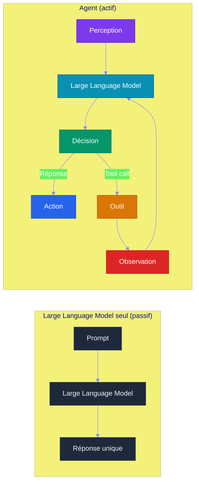
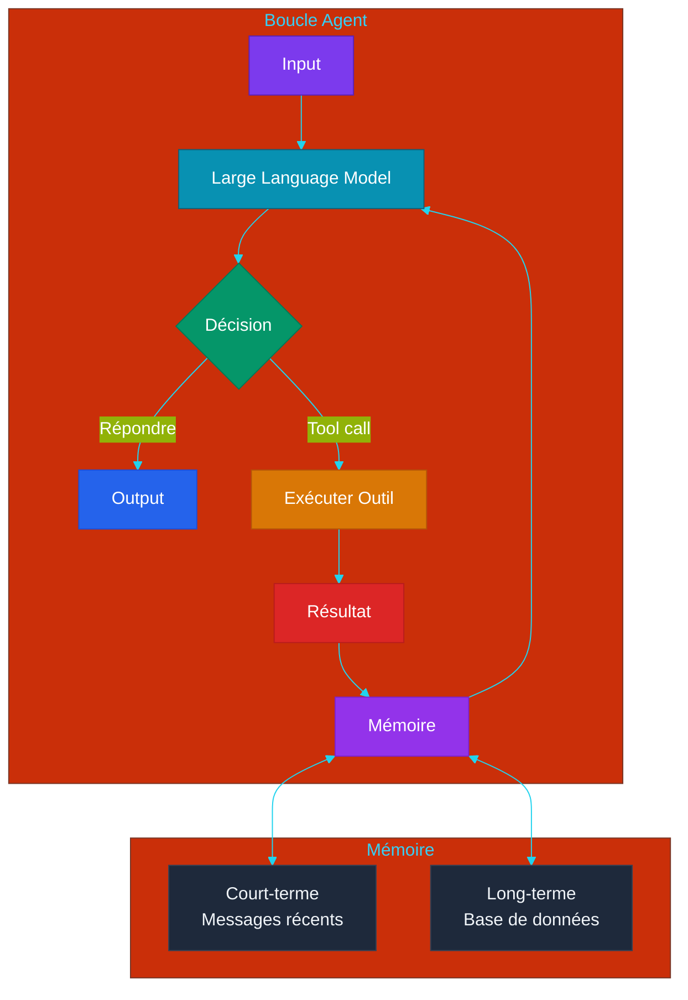
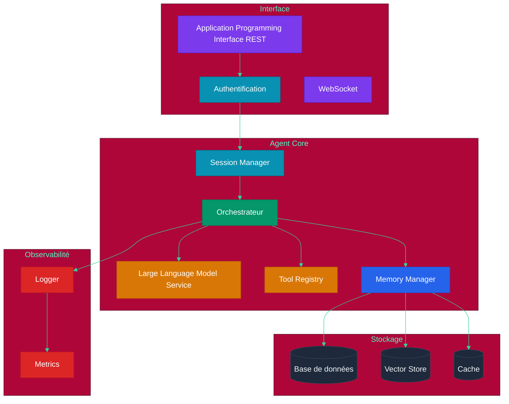

# Chapitre 4 — Architecture Agentique

## Objectifs pédagogiques

- Comprendre ce qu'est un agent et en quoi il diffère d'un Large Language Model seul
- Maîtriser la boucle agent (perception → raisonnement → action)
- Savoir implémenter un agent simple avec état
- Comprendre la gestion de contexte et de mémoire court-terme

---

## Prérequis

Avant de commencer ce chapitre, assurez-vous d'avoir :

- Terminé le **[Chapitre 3](CHAPITRE-03-prompt-tool-use.md)** et son TP (Travaux Pratiques) assistant CLI (Command Line Interface)
- Python 3.10+ installé
- opencode fonctionnel
- Compris les notions de prompt, outil et pattern Reasoning + Acting

### Vérification

#### Linux et macOS

```bash
python3 --version
opencode --version
```

#### Windows PowerShell

```powershell
py --version
opencode --version
```

> **Aucune dépendance supplémentaire** : le TP (Travaux Pratiques) utilise uniquement la bibliothèque standard Python.

---

## 1. Qu'est-ce qu'un Agent ?

### 1.1 Définition

Un **agent** est un système qui :
1. **Perçoit** son environnement (entrée utilisateur, données, événements)
2. **Raisonne** à partir de ces perceptions (via un Large Language Model)
3. **Agit** sur son environnement (réponse, appel d'outil, modification)

### 1.2 Large Language Model seul vs Agent



| Caractéristique | Large Language Model seul | Agent |
|---|---|---|
| Appels Application Programming Interface | 1 | Multiples (boucle) |
| Mémoire | Fenêtre de contexte | Contexte + mémoire persistante |
| Outils | Aucun | Function calling |
| Planification | Aucune | Reasoning + Acting, plan multi-étapes |
| Autonomie | Réponse unique | Boucle jusqu'à résolution |

---

## 2. La Boucle Agent

### 2.1 Architecture générale



### 2.2 États de l'agent

Un agent peut être dans plusieurs états :

| État | Description | Action |
|---|---|---|
| **Idle** | En attente d'entrée | Écouter |
| **Thinking** | Le Large Language Model raisonne | Appel Large Language Model |
| **Acting** | Exécution d'un outil | Appel externe |
| **Observing** | Traitement du résultat | Mise à jour mémoire |
| **Error** | Échec d'un outil | Log + re-planification |
| **Done** | Objectif atteint | Retour à Idle |

### 2.3 Implémentation minimale

> **Projet reseau social** : l'architecture agentique developpee ici sera utilisee pour coordonner le developpement du reseau social defini dans [`projet/gestion_de_projet/cdc.md`](projet/gestion_de_projet/cdc.md).

#### Où créer le fichier ?

**Point de départ :** ouvrez un terminal dans votre dossier d'exercices `~/agentic-labs` (Linux/macOS) ou `$HOME\agentic-labs` (Windows PowerShell).

```bash
mkdir -p chapitre-04-agent-simple
cd chapitre-04-agent-simple
pwd
```

**Résultat attendu :** `pwd` doit se terminer par `chapitre-04-agent-simple`. Les fichiers `agent_simple.py` et `gestion_contexte.py` seront créés dans ce dossier.

Créez le fichier `agent_simple.py` dans ce dossier :

```python
class FakeResponse:
    """Réponse simulée d'un Large Language Model pour rendre l'exemple exécutable."""

    def __init__(self, content=None, tool_calls=None):
        self.content = content
        self.tool_calls = tool_calls or []


class FakeLLM:
    """Large Language Model factice : il répond sans appeler de vraie Application Programming Interface."""

    def chat(self, messages, tools=None):
        # Récupère le dernier message utilisateur
        last_user_message = messages[-1]["content"]
        return FakeResponse(
            content=f"Réponse agentique à : {last_user_message}"
        )


class Agent:
    def __init__(self, llm, tools, system_prompt):
        # Initialise l'agent avec le modèle de langage, les outils et le prompt système
        self.llm = llm  # Modèle de langage pour les réponses
        self.tools = tools  # Outils disponibles pour l'agent
        self.memory = [{"role": "system", "content": system_prompt}]  # Mémoire initiale avec le prompt système
    
    def run(self, user_input: str, max_steps: int = 10):
        # Boucle principale de l'agent : perçoit, raisonne et agit
        self.memory.append({"role": "user", "content": user_input})  # Ajoute l'entrée utilisateur à la mémoire
        
        for step in range(max_steps):  # Limite le nombre d'itérations pour éviter les boucles infinies
            response = self.llm.chat(self.memory, tools=self.tools)  # Appelle le Large Language Model avec la mémoire et les outils
            
            if response.content:  # Si le Large Language Model produit une réponse textuelle (pas d'appel d'outil)
                self.memory.append({"role": "assistant", "content": response.content})  # Stocke la réponse
                return response.content  # Retourne la réponse finale à l'utilisateur
            
            if response.tool_calls:  # Si le Large Language Model demande l'exécution d'un ou plusieurs outils
                for tc in response.tool_calls:  # Parcourt chaque appel d'outil
                    result = self.execute_tool(tc)  # Exécute l'outil et récupère le résultat
                    self.memory.append(tc.to_message())  # Ajoute l'appel d'outil à l'historique
                    self.memory.append({"role": "tool", "content": result})  # Ajoute le résultat de l'outil

        return "Max steps atteint"  # Sécurité : évite les boucles infinies


if __name__ == "__main__":
    agent = Agent(
        llm=FakeLLM(),
        tools=[],
        system_prompt="Tu es un agent pédagogique pour le cours.",
    )
    print(agent.run("Explique la boucle agent en une phrase."))
```

#### Exécuter le fichier

```bash
python3 agent_simple.py
```

#### Résultat attendu

```text
Réponse agentique à : Explique la boucle agent en une phrase.
```

Ce résultat prouve que :

- Le fichier est au bon endroit
- La boucle `run()` ajoute l'entrée utilisateur en mémoire
- Le faux Large Language Model produit une réponse
- L'agent retourne la réponse finale

---

## 3. Gestion du Contexte

### 3.1 Le problème de la mémoire

La fenêtre de contexte d'un Large Language Model est limitée. Plus la conversation est longue, plus on risque d'atteindre cette limite.

### 3.2 Stratégies de gestion

| Stratégie | Description | Quand l'utiliser |
|---|---|---|
| **Sliding Window** | Garder les N derniers messages | Conversations simples |
| **Summarization** | Résumer les messages anciens | Longues conversations |
| **Token Budget** | Allouer un budget tokens par type | Agents complexes |
| **Structured Memory** | Stocker par type (instructions, faits, historique) | Agents avec rôles |

### 3.3 Sliding Window

#### Principe expliqué simplement

La **Sliding Window** signifie littéralement "fenêtre glissante".

Un Large Language Model ne peut pas lire une conversation infinie. Il reçoit seulement une fenêtre de contexte limitée : les messages que l'on met dans le prompt au moment de l'appel. Quand la conversation devient trop longue, on garde les messages les plus importants et on retire les plus anciens.

Imaginez une fenêtre qui se déplace sur une longue conversation :

```text
Conversation complète :
[system] [message 1] [message 2] [message 3] [message 4] [message 5]

Fenêtre envoyée au Large Language Model :
[system] [message 3] [message 4] [message 5]
```

Le message `system` reste toujours conservé, car il contient les règles de comportement de l'agent. Les messages récents sont conservés, car ils sont les plus utiles pour répondre correctement à l'utilisateur.

#### Pourquoi c'est utile ?

- Éviter de dépasser la limite de tokens du modèle
- Réduire le coût si le modèle est payant
- Garder les échanges récents, donc le contexte immédiat
- Simplifier la mémoire court-terme d'un agent

#### Limite importante

La Sliding Window peut faire oublier des informations anciennes mais importantes. Si une information doit survivre longtemps, il faut la stocker dans une mémoire persistante : base SQLite, vector store ou résumé long-terme.

#### Où créer le fichier ?

**Point de départ :** vous devriez être dans `~/agentic-labs`. Si c'est le cas, restez ici ou recréez le dossier.

```bash
mkdir -p chapitre-04-agent-simple
cd chapitre-04-agent-simple
pwd
```

**Résultat attendu :** `pwd` doit se terminer par `chapitre-04-agent-simple`, au même endroit que `agent_simple.py`.

Créez `gestion_contexte.py` :

```python
def count_tokens(messages: list[dict]) -> int:
    """Estimation simple : 1 token ≈ 4 caractères."""
    total_chars = sum(len(message["content"]) for message in messages)
    return total_chars // 4


class AgentMemory:
    def __init__(self):
        self.memory = [
            {"role": "system", "content": "Tu es un assistant utile."},
            {"role": "user", "content": "Message ancien 1"},
            {"role": "assistant", "content": "Réponse ancienne 1"},
            {"role": "user", "content": "Message récent important"},
            {"role": "assistant", "content": "Réponse récente importante"},
        ]

    def manage_context(self, max_tokens: int = 20):
        """Garde le système prompt et retire les messages anciens si besoin."""
        system = [m for m in self.memory if m["role"] == "system"]
        others = [m for m in self.memory if m["role"] != "system"]

        # Supprime les plus vieux messages tant que le budget est dépassé.
        while count_tokens(system + others) > max_tokens and len(others) > 2:
            others.pop(0)

        self.memory = system + others


if __name__ == "__main__":
    memory = AgentMemory()
    print("Avant:", len(memory.memory), "messages")
    memory.manage_context(max_tokens=20)
    print("Après:", len(memory.memory), "messages")
    print("Messages conservés:")
    for message in memory.memory:
        print(f"- {message['role']}: {message['content']}")
```

#### Exécuter le fichier

```bash
python3 gestion_contexte.py
```

#### Résultat attendu

```text
Avant: 5 messages
Après: 3 messages
Messages conservés:
- system: Tu es un assistant utile.
- user: Message récent important
- assistant: Réponse récente importante
```

---

## 4. Planification

### 4.1 Planification statique vs dynamique

| Type | Description | Exemple |
|---|---|---|
| **Statique** | Séquence d'étapes prédéfinie | "1. Chercher → 2. Analyser → 3. Répondre" |
| **Dynamique** | Le Large Language Model génère son propre plan | "Je dois d'abord X, puis Y, ensuite Z" |

### 4.2 Planification dynamique (Plan-and-Solve)

Le Large Language Model génère d'abord un plan, puis l'exécute étape par étape :

```
Question : "Compare les prix des billets Paris-Londres
            cette semaine et trouve le moins cher."

Plan :
1. Appeler search("vols Paris-Londres cette semaine")
2. Analyser les résultats
3. Appeler search("comparateur vols Paris-Londres")
4. Synthétiser les résultats
5. Répondre avec la meilleure option
```

### 4.3 Re-planification

Si une étape échoue, l'agent doit pouvoir **re-planifier** :

```
Observation (étape 1): Application Programming Interface météo indisponible
→ Nouveau plan : Utiliser les données historiques
ou une autre source météo
```

---

## 5. Architecture d'un agent en production



---

## 6. Travaux Pratiques — Boucle agent minimale

> **Projet reseau social** : ce TP (Travaux Pratiques) introduit la boucle agent qui servira ensuite à automatiser les actions du réseau social : lire une demande utilisateur, choisir une action, exécuter un outil, puis répondre.

**Objectif :** Implémenter un agent simple avec une boucle perception → raisonnement → action.

**Durée :** 1h30

---

### 6.1 Énoncé

Vous devez créer un agent CLI (Command Line Interface) capable de :

1. Lire une demande utilisateur
2. Identifier l'intention : aide, heure, calcul, mémoire court-terme
3. Exécuter l'outil adapté
4. Conserver l'historique de la session
5. Répondre clairement à l'utilisateur

**Fichiers à créer :**
- `agent-loop/agent.py` — boucle agent complète
- `agent-loop/test_agent.py` — tests avec `unittest`

---

### 6.2 Corrigé — Étape 1 : Créer le projet

**Point de départ :** ouvrez un terminal dans votre dossier d'exercices. Ce TP (Travaux Pratiques) crée un **nouveau dossier indépendant** nommé `agent-loop`.

```bash
mkdir -p agent-loop
cd agent-loop
pwd
```

**Résultat attendu :** `pwd` doit se terminer par `agent-loop`. Les fichiers `agent.py` et `test_agent.py` seront créés dans ce dossier.

### 6.3 Corrigé — Étape 2 : Créer l'agent

Vous êtes toujours dans `agent-loop/`. Créez `agent.py` à la racine de ce dossier :

```python
from datetime import datetime


class Agent:
    def __init__(self):
        # Mémoire court-terme : elle existe seulement pendant la session
        self.history = []

    def perceive(self, user_input: str) -> str:
        """Étape 1 : recevoir et normaliser l'entrée utilisateur."""
        text = user_input.strip()
        self.history.append({"role": "user", "content": text})
        return text

    def reason(self, perception: str) -> dict:
        """Étape 2 : décider quelle action exécuter."""
        text = perception.lower()

        if text in {"quit", "exit"}:
            return {"action": "stop"}
        if "heure" in text:
            return {"action": "time"}
        if "historique" in text:
            return {"action": "history"}
        if "calcul" in text:
            expression = perception.split(":", 1)[-1].strip()
            return {"action": "calculate", "expression": expression}
        return {"action": "help"}

    def act(self, decision: dict) -> str:
        """Étape 3 : exécuter l'action décidée."""
        action = decision["action"]

        if action == "stop":
            return "STOP"
        if action == "time":
            return datetime.now().strftime("Il est %H:%M:%S")
        if action == "history":
            return f"Historique : {len(self.history)} message(s) utilisateur"
        if action == "calculate":
            try:
                # Exemple pédagogique : eval est dangereux en production.
                return str(eval(decision["expression"]))
            except Exception as exc:
                return f"Erreur de calcul : {exc}"
        return "Commandes : heure | calcul: 2 + 2 | historique | quit"

    def run_once(self, user_input: str) -> str:
        """Exécute une itération complète de la boucle agent."""
        perception = self.perceive(user_input)
        decision = self.reason(perception)
        response = self.act(decision)
        self.history.append({"role": "assistant", "content": response})
        return response


if __name__ == "__main__":
    agent = Agent()
    while True:
        user_input = input("\n> ")
        response = agent.run_once(user_input)
        if response == "STOP":
            print("Fin de session.")
            break
        print(response)
```

### 6.4 Corrigé — Étape 3 : Tester manuellement

```bash
python3 agent.py
```

Essayez :

```text
> heure
> calcul: 10 + 5
> historique
> quit
```

### 6.5 Corrigé — Étape 4 : Ajouter les tests

Créez `test_agent.py` :

```python
import unittest

from agent import Agent


class TestAgentLoop(unittest.TestCase):
    def setUp(self):
        self.agent = Agent()

    def test_calculate(self):
        self.assertEqual(self.agent.run_once("calcul: 2 + 2"), "4")

    def test_history(self):
        self.agent.run_once("bonjour")
        result = self.agent.run_once("historique")
        self.assertIn("message", result)

    def test_help(self):
        result = self.agent.run_once("commande inconnue")
        self.assertIn("Commandes", result)

    def test_stop(self):
        self.assertEqual(self.agent.run_once("quit"), "STOP")


if __name__ == "__main__":
    unittest.main()
```

Lancez les tests :

```bash
python3 -m unittest -v test_agent.py
```

---

### 6.6 Résultat attendu

```text
agent-loop/
├── agent.py
└── test_agent.py
```

- L'agent accepte des commandes en boucle
- Chaque demande passe par perception, raisonnement, action
- L'historique de session est conservé
- Les tests passent

---

### 6.7 Validation

- [ ] `python3 agent.py` lance l'agent interactif
- [ ] `calcul: 10 + 5` retourne `15`
- [ ] `historique` affiche le nombre de messages
- [ ] `python3 -m unittest -v test_agent.py` passe
- [ ] Vous savez identifier les trois étapes : percevoir, raisonner, agir

---

## Points clés à retenir

1. Un **agent** est un Large Language Model enveloppé dans une boucle perception → raisonnement → action
2. La **boucle agent** est le pattern fondamental : chaque itération peut appeler un outil
3. La **gestion du contexte** est cruciale : sliding window, summarization ou token budget
4. La **planification dynamique** (Plan-and-Solve) donne de l'autonomie à l'agent
5. Un agent en production nécessite session manager, tool registry, memory manager et observabilité

---

## Liens

- [Chapitre 3 — Prompt & Tool Use](./CHAPITRE-03-prompt-tool-use.md)
- [Chapitre 5 — Mémoire & Retrieval-Augmented Generation](./CHAPITRE-05-memoire-rag.md)
- [Chapitre 6 — Multi-Agent Orchestration](./CHAPITRE-06-multi-agent.md)
