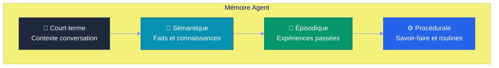
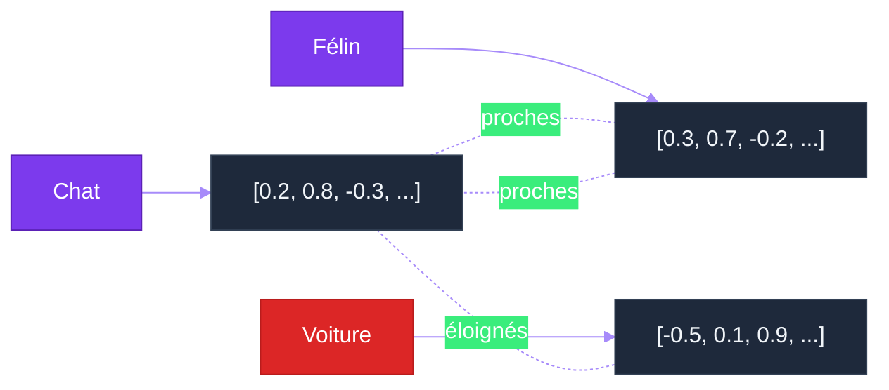
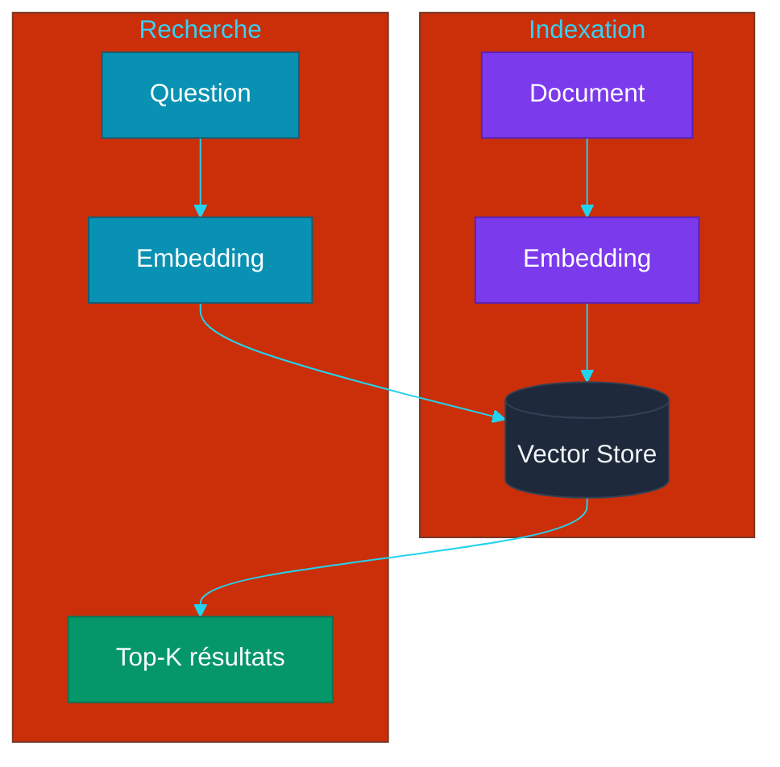
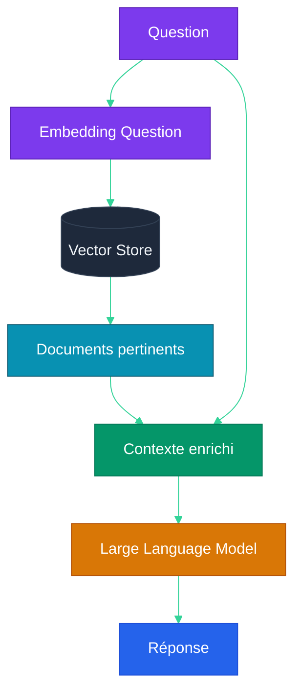
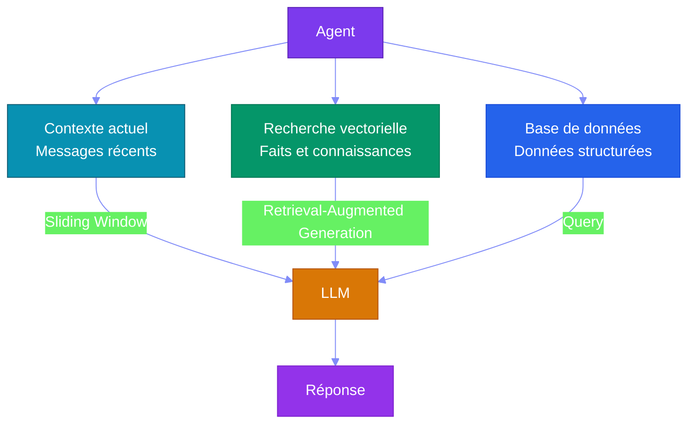

# Chapitre 5 — Mémoire & RAG (Retrieval-Augmented Generation)

## Objectifs pédagogiques

- Comprendre les différents types de mémoire pour un agent
- Maîtriser les embeddings et vector stores
- Savoir implémenter un RAG (Retrieval-Augmented Generation)
- Connaître les stratégies de mémoire long-terme

---

## Prérequis

Avant de commencer ce chapitre, assurez-vous d'avoir :

- Terminé le **[Chapitre 4](CHAPITRE-04-architecture-agent.md)** et son TP boucle agent
- Python 3.10+ installé
- Compris la différence entre mémoire court-terme et historique persistant

### Vérification

#### Linux et macOS

```bash
python3 --version
python3 -c "import sqlite3; print(sqlite3.sqlite_version)"
```

#### Windows PowerShell

```powershell
py --version
py -c "import sqlite3; print(sqlite3.sqlite_version)"
```

> **Aucune dépendance externe obligatoire** pour le TP principal : SQLite est inclus avec Python.

Pour l'option vectorielle en fin de TP :

```bash
python3 -m pip install chromadb sentence-transformers
```

Windows PowerShell :

```powershell
py -m pip install chromadb sentence-transformers
```

---

## 1. Les Types de Mémoire

### 1.1 Pyramide de la mémoire agentique



| Type | Description | Stockage | Persistance |
|---|---|---|---|
| **Court-terme** | Messages récents de la conversation | Fenêtre de contexte LLM (Large Language Model) | Volatile |
| **Sémantique** | Faits, connaissances générales | Vector store / Base SQL (Structured Query Language) | Persistante |
| **Épisodique** | Historique des actions et décisions | Logs structurés | Persistante |
| **Procédurale** | Règles, routines, compétences | Code + Prompts | Permanente |

---

## 2. Embeddings

### 2.1 Principe

Un **embedding** est une représentation vectorielle d'un texte dans un espace sémantique continu.



**Propriétés :**
- Deux textes proches sémantiquement → vecteurs proches (similarité cosinus élevée)
- Deux textes différents → vecteurs éloignés
- La dimension typique : 384 à 3072 (selon le modèle)

### 2.2 Modèles d'embeddings

| Modèle | Dimensions | Usage |
|---|---|---|
| `text-embedding-3-small` (OpenAI) | 512-1536 | Usage général |
| `text-embedding-3-large` (OpenAI) | 3072 | Haute précision |
| `e5-mistral-7b` (Open source) | 4096 | Multilingue |
| `BGE-M3` (BAAI) | 1024 | Multilingue + dense |

---

## 3. Vector Stores

### 3.1 Principe

Une **base vectorielle** stocke les embeddings et permet de chercher les plus proches voisins.



### 3.2 Solutions disponibles

| Solution | Type | Persistance | Idéal pour |
|---|---|---|---|
| **Chroma** | Python pur | Fichier | Développement, petits projets |
| **FAISS** | Index local | Fichier | Haute performance |
| **Qdrant** | Serveur | Docker | Production |
| **Weaviate** | Serveur | Docker | Production, scalabilité |
| **PGVector** | Extension PostgreSQL | Base de données | Si déjà PostgreSQL |
| **SQLite + vec** | Extension SQLite | Fichier | Projets simples, embarqué |

---

## 4. RAG (Retrieval-Augmented Generation)

### 4.1 Architecture



### 4.2 Pipeline RAG (Retrieval-Augmented Generation)

#### Principe expliqué simplement

Le **RAG (Retrieval-Augmented Generation)** signifie **RAG (Retrieval-Augmented Generation)** : génération augmentée par recherche.

Un LLM seul répond avec ce qu'il a appris pendant son entraînement. Il ne connaît pas forcément vos fichiers, votre base de données ou le cahier des charges du projet. Le RAG (Retrieval-Augmented Generation) ajoute une étape de recherche avant la génération.

Le principe est :

```text
Question utilisateur
→ recherche des documents pertinents
→ ajout de ces documents dans le prompt
→ génération de la réponse par le Large Language Model
```

Exemple avec le réseau social : si l'utilisateur demande "quelles fonctionnalités sont exclues du MVP (Minimum Viable Product) ?", l'agent doit chercher dans `cdc.md`, récupérer la section correspondante, puis répondre à partir de ce contexte.

#### Pourquoi c'est utile ?

- Répondre à partir de documents privés ou récents
- Réduire les hallucinations
- Garder le modèle générique, sans fine-tuning
- Mettre à jour les connaissances en changeant les documents, pas le modèle

#### Limite importante

Le RAG (Retrieval-Augmented Generation) dépend de la qualité de la recherche. Si les mauvais passages sont retrouvés, le LLM répondra avec un mauvais contexte. C'est pourquoi le découpage en chunks, les embeddings et le top-K sont critiques.

```
1. INDEXATION (une fois)
   Documents → découpage en chunks → embeddings → vector store

2. RECHERCHE (à chaque question)
   Question → embedding → top-K chunks pertinents

3. GÉNÉRATION (à chaque question)
   Contexte (chunks) + Question → Large Language Model → Réponse
```

### 4.3 Implémentation

#### Où créer le fichier ?

**Point de départ :** ouvrez un terminal dans votre dossier d'exercices `~/agentic-labs` (Linux/macOS) ou `$HOME\agentic-labs` (Windows PowerShell).

```bash
mkdir -p chapitre-05-rag
cd chapitre-05-rag
pwd
```

**Résultat attendu :** `pwd` doit se terminer par `chapitre-05-rag`. Les fichiers `rag_agent.py` et `agent_memoire_vectorielle.py` seront créés dans ce dossier.

Créez `rag_agent.py` :

```python
class FakeLLM:
    """Large Language Model factice pour rendre l'exemple exécutable sans Application Programming Interface."""

    def embed(self, texts: list[str]) -> list[set[str]]:
        # Embedding simplifié : ensemble de mots minuscules
        return [set(text.lower().split()) for text in texts]

    def chat(self, prompt: str) -> str:
        return "Réponse générée à partir du contexte fourni."


class SimpleVectorStore:
    def __init__(self):
        self.items = []

    def add(self, embeddings, chunks):
        for embedding, chunk in zip(embeddings, chunks):
            self.items.append((embedding, chunk))

    def search(self, query_embedding, k=5):
        # Score très simple : nombre de mots en commun
        scored = []
        for embedding, chunk in self.items:
            score = len(query_embedding & embedding)
            scored.append((score, chunk))
        scored.sort(reverse=True)
        return [chunk for score, chunk in scored[:k] if score > 0]


class RAGAgent:
    def __init__(self, llm, vector_store):
        # Initialise l'agent Retrieval-Augmented Generation avec un modèle de langage et un stockage vectoriel
        self.llm = llm  # Modèle de langage pour la génération de réponses
        self.vs = vector_store  # Base vectorielle pour la recherche sémantique
    
    def index_documents(self, documents: list[str]):
        # Indexe les documents : découpage, embedding et stockage dans la base vectorielle
        chunks = []  # Liste des morceaux de texte à indexer
        for doc in documents:  # Parcourt chaque document fourni
            chunks.extend(self._chunk_text(doc, size=512))  # Découpe en morceaux de 512 tokens
        embeddings = self.llm.embed(chunks)  # Génère les vecteurs d'embedding pour chaque morceau
        self.vs.add(embeddings, chunks)  # Stocke les vecteurs et le texte associé dans la base
    
    def query(self, question: str) -> str:
        # Interroge la base vectorielle et génère une réponse à partir du contexte pertinent
        q_emb = self.llm.embed([question])[0]  # Calcule l'embedding de la question posée
        chunks = self.vs.search(q_emb, k=5)  # Cherche les 5 morceaux les plus pertinents
        context = "\n\n".join(chunks)  # Concatène les morceaux pour former le contexte enrichi
        
        prompt = f"""Contexte :
{context}

Question : {question}

Réponds en utilisant uniquement le contexte ci-dessus.
Si le contexte ne contient pas l'information, dis-le."""
         
        return self.llm.chat(prompt)  # Envoie le prompt au Large Language Model et retourne la réponse générée

    def _chunk_text(self, text: str, size: int = 512) -> list[str]:
        """Découpe simplifiée : un paragraphe = un chunk."""
        return [chunk.strip() for chunk in text.split("\n") if chunk.strip()]


if __name__ == "__main__":
    docs = [
        "Le réseau social utilise SQLite pour stocker les utilisateurs.",
        "Les publications sont affichées de la plus récente à la plus ancienne.",
    ]
    agent = RAGAgent(FakeLLM(), SimpleVectorStore())
    agent.index_documents(docs)
    print(agent.query("Comment sont affichées les publications ?"))
```

#### Exécuter le fichier

```bash
python3 rag_agent.py
```

#### Résultat attendu

```text
Réponse générée à partir du contexte fourni.
```

---

## 5. Stratégies de Chunking

### Principe expliqué simplement

Le **chunking** consiste à découper un document long en petits morceaux appelés `chunks`.

Un agent ne recherche presque jamais dans un document entier. Il recherche dans des morceaux plus petits. Chaque morceau est transformé en embedding, puis stocké dans le vector store.

```text
Document complet
→ chunk 1
→ chunk 2
→ chunk 3
→ embeddings
→ recherche sémantique
```

#### Pourquoi c'est utile ?

- Un petit morceau est plus précis qu'un document entier
- Le LLM reçoit seulement les passages utiles
- Le coût en tokens diminue
- Les réponses sont mieux ancrées dans le bon contexte

#### Limite importante

Si les chunks sont trop petits, ils perdent le contexte. S'ils sont trop grands, ils contiennent trop d'informations inutiles. Le bon compromis dépend du type de document.

| Stratégie | Description | Quand |
|---|---|---|
| **Fixed size** | Découpage à N tokens | Documents homogènes |
| **Semantic** | Découpage par paragraphe/section | Documents structurés |
| **Sentence** | Découpage par phrase | Textes narratifs |
| **Recursive** | Découpage récursif avec overlap | Documents longs |
| **Agentic** | Découpage intelligent par LLM | Qualité maximale |

---

## 6. Mémoire Long-Terme pour Agents

### 6.1 Architecture hybride



### 6.2 Exemple : Agent qui retient

#### Où créer le fichier ?

**Point de départ :** vous devriez être dans `~/agentic-labs`. Si c'est le cas, restez ici ou recréez le dossier.

```bash
mkdir -p chapitre-05-rag
cd chapitre-05-rag
pwd
```

**Résultat attendu :** `pwd` doit se terminer par `chapitre-05-rag`, au même endroit que `rag_agent.py`.

Créez `agent_memoire_vectorielle.py` :

```python
class LLM:
    """Encodeur factice : transforme un texte en ensemble de mots."""

    def embed(self, texts: list[str]) -> list[set[str]]:
        return [set(text.lower().split()) for text in texts]


class VectorStore:
    def __init__(self):
        self.memories = []

    def add(self, embedding, text: str):
        self.memories.append((embedding, text))

    def search(self, embedding, k=3):
        scored = []
        for stored_embedding, text in self.memories:
            scored.append((len(embedding & stored_embedding), text))
        scored.sort(reverse=True)
        return [text for score, text in scored[:k] if score > 0]


class AgentAvecMemoire:
    def __init__(self):
        # Initialise l'agent avec mémoire vectorielle et court-terme
        self.llm = LLM()  # Modèle de langage pour les interactions
        self.vs = VectorStore()  # Mémoire long-terme : stockage vectoriel des faits
        self.history = []        # Mémoire court-terme : historique de la conversation
    
    def remember(self, key: str, value: str):
        """Stocke un fait en mémoire long-terme."""
        text = f"{key}: {value}"  # Formate le fait en texte structuré clé-valeur
        self.vs.add(self.llm.embed([text])[0], text)  # Embedding du texte puis stockage vectoriel
    
    def recall(self, question: str) -> list[str]:
        """Recherche dans la mémoire long-terme."""
        emb = self.llm.embed([question])[0]  # Calcule l'embedding de la question
        return self.vs.search(emb, k=3)  # Retourne les 3 souvenirs les plus pertinents


if __name__ == "__main__":
    agent = AgentAvecMemoire()
    agent.remember("Paris", "capitale de la France")
    agent.remember("SQLite", "base de données embarquée")
    print(agent.recall("Que sais-tu sur Paris ?"))
```

#### Exécuter le fichier

```bash
python3 agent_memoire_vectorielle.py
```

#### Résultat attendu

```text
['Paris: capitale de la France']
```

---

> **Projet reseau social** : la memoire agentique permet de suivre l'avancement du developpement du reseau social (cf. [`projet/gestion_de_projet/cdc.md`](projet/gestion_de_projet/cdc.md)) en conservant le contexte entre les sessions.

## 7. Travaux Pratiques — Agent avec Mémoire Persistante

**Objectif :** Ajouter de la mémoire long-terme à un agent en utilisant SQLite.

**Durée :** 2h

---

### 7.1 Énoncé

Vous devez créer un agent capable de retenir des informations entre deux exécutions du programme.

L'agent doit savoir :

1. Enregistrer un fait : `souviens-toi que Paris est la capitale de la France`
2. Retrouver un fait : `que sais-tu sur Paris`
3. Lister tous les sujets connus : `liste ce que tu sais`
4. Persister les données dans une base SQLite
5. Passer des tests de persistance

**Fichiers à créer :**
- `agent-memoire/agent_memoire.py` — agent avec mémoire persistante
- `agent-memoire/test_agent_memoire.py` — tests automatisés
- `agent-memoire/memoire.db` — base SQLite générée automatiquement

---

### 7.2 Corrigé — Étape 1 : Structure

**Point de départ :** ouvrez un terminal dans votre dossier d'exercices. Ce TP crée un **nouveau dossier indépendant** nommé `agent-memoire`.

```bash
mkdir agent-memoire && cd agent-memoire
pwd
```

**Résultat attendu :** `pwd` doit se terminer par `agent-memoire`. Les fichiers `agent_memoire.py`, `test_agent_memoire.py`, `opencode.json` et `AGENTS.md` seront créés dans ce dossier.

### 7.3 Corrigé — Étape 2 : Agent avec mémoire

Vous êtes toujours dans `agent-memoire/`. Créez le fichier `agent_memoire.py` à la racine de ce dossier :

```python
import sqlite3  # Module pour la base de données SQLite (persistance des données)
import json  # Module pour la manipulation de données JSON
from datetime import datetime  # Horodatage des entrées en mémoire

class AgentMemoire:
    def __init__(self, db_path="memoire.db"):
        # Initialise la connexion à la base de données SQLite persistante
        self.conn = sqlite3.connect(db_path)  # Connexion à la base de données
        self._init_db()  # Crée les tables si elles n'existent pas encore
    
    def _init_db(self):
        # Crée les tables de mémoire et d'historique dans la base SQLite
        self.conn.execute("""
            CREATE TABLE IF NOT EXISTS memoire (
                id INTEGER PRIMARY KEY AUTOINCREMENT,
                cle TEXT UNIQUE,
                valeur TEXT,
                date_maj TIMESTAMP
            )
        """)  # Table des faits retenus par l'agent de façon persistante
        self.conn.execute("""
            CREATE TABLE IF NOT EXISTS historique (
                id INTEGER PRIMARY KEY AUTOINCREMENT,
                question TEXT,
                reponse TEXT,
                date TIMESTAMP
            )
        """)  # Table de l'historique des conversations
        self.conn.commit()  # Valide les créations de tables
    
    def retenir(self, cle: str, valeur: str):
        # Stocke ou met à jour un fait en mémoire persistante
        self.conn.execute(
            "INSERT OR REPLACE INTO memoire (cle, valeur, date_maj) VALUES (?, ?, ?)",
            (cle, valeur, datetime.now())  # Paramètres : clé, valeur, horodatage actuel
        )
        self.conn.commit()  # Sauvegarde immédiate dans la base
    
    def rappeler(self, cle: str) -> str | None:
        # Récupère un fait par sa clé depuis la mémoire persistante
        cursor = self.conn.execute(
            "SELECT valeur FROM memoire WHERE cle = ?", (cle,)
        )  # Requête paramétrée pour éviter les injections Structured Query Language
        row = cursor.fetchone()  # Récupère la première ligne du résultat
        return row[0] if row else None  # Retourne la valeur ou None si inexistante
    
    def toutes_cles(self) -> list[str]:
        # Liste toutes les clés connues par l'agent
        cursor = self.conn.execute("SELECT cle FROM memoire")  # Récupère toutes les clés
        return [row[0] for row in cursor.fetchall()]  # Convertit le curseur en liste de chaînes
    
    def run(self, question: str) -> str:
        # Point d'entrée principal : traite une question utilisateur et interagit avec la mémoire
        self.conn.execute(
            "INSERT INTO historique (question, date) VALUES (?, ?)",
            (question, datetime.now())  # Enregistre la question dans l'historique
        )
        self.conn.commit()
        
        # Commande : "souviens-toi que X est Y" → stocke un fait en mémoire
        if question.startswith("souviens-toi que "):
            contenu = question.replace("souviens-toi que ", "")  # Extrait le contenu après le préfixe
            if " est " in contenu:  # Vérifie la présence du séparateur " est "
                cle, valeur = contenu.split(" est ", 1)  # Sépare la clé et la valeur
                self.retenir(cle.strip(), valeur.strip())  # Stocke le fait en mémoire persistante
                return f"J'ai retenu que {cle} est {valeur}"
        
        # Commande : "que sais-tu sur X" → interroge la mémoire persistante
        if question.startswith("que sais-tu sur "):
            sujet = question.replace("que sais-tu sur ", "")  # Extrait le sujet de la question
            valeur = self.rappeler(sujet.strip())  # Cherche dans la mémoire persistante
            if valeur:
                return f"Je sais que {sujet} est {valeur}"  # Retourne la connaissance stockée
            return f"Je ne sais rien sur {sujet}"  # Aucune connaissance trouvée
        
        # Commande : "liste ce que tu sais" → affiche toutes les connaissances
        if question == "liste ce que tu sais":
            cles = self.toutes_cles()  # Récupère toutes les clés depuis la base
            if cles:
                return "Je connais: " + ", ".join(cles)  # Liste les connaissances
            return "Je ne connais rien pour l'instant"  # Aucune connaissance stockée
        
        return f"Question reçue: {question}"  # Réponse par défaut pour les autres questions

if __name__ == "__main__":
    agent = AgentMemoire()  # Crée une instance de l'agent avec mémoire persistante
    while True:  # Boucle interactive infinie
        q = input("\n> ")  # Attend l'entrée de l'utilisateur
        if q == "quit":  # Commande de sortie
            break  # Quitte la boucle
        print(agent.run(q))  # Affiche la réponse de l'agent
```

### 7.4 Corrigé — Étape 3 : Tester manuellement

```bash
python3 agent_memoire.py
> souviens-toi que Paris est la capitale de la France
> que sais-tu sur Paris
> liste ce que tu sais
> quit
```

Vérifiez que les données persistent :

```bash
python3 agent_memoire.py
> que sais-tu sur Paris   # Doit encore répondre !
```

### 7.5 Corrigé — Étape 4 : Ajouter les tests

Créez `test_agent_memoire.py` :

```python
import os
import tempfile
import unittest

from agent_memoire import AgentMemoire


class TestAgentMemoire(unittest.TestCase):
    def setUp(self):
        # Base temporaire pour isoler chaque test
        self.tmp = tempfile.NamedTemporaryFile(delete=False)
        self.tmp.close()
        self.agent = AgentMemoire(self.tmp.name)

    def tearDown(self):
        self.agent.conn.close()
        os.unlink(self.tmp.name)

    def test_retenir_et_rappeler(self):
        self.agent.run("souviens-toi que Paris est la capitale de la France")
        result = self.agent.run("que sais-tu sur Paris")
        self.assertIn("capitale de la France", result)

    def test_liste_connaissances(self):
        self.agent.run("souviens-toi que SQLite est une base embarquee")
        result = self.agent.run("liste ce que tu sais")
        self.assertIn("SQLite", result)

    def test_persistence(self):
        self.agent.run("souviens-toi que Python est un langage")
        self.agent.conn.close()

        nouvel_agent = AgentMemoire(self.tmp.name)
        result = nouvel_agent.run("que sais-tu sur Python")
        nouvel_agent.conn.close()

        self.assertIn("langage", result)


if __name__ == "__main__":
    unittest.main()
```

Lancez les tests :

```bash
python3 -m unittest -v test_agent_memoire.py
```

### 7.6 Corrigé — Étape 5 : Configurer opencode

#### Pourquoi ajouter `opencode.json` et `AGENTS.md` ici ?

À ce stade, votre agent mémoire fonctionne déjà en Python pur. L'objectif est maintenant d'utiliser opencode pour l'améliorer proprement : ajouter une commande, écrire des tests, ou refactorer le code sans perdre le contexte du projet.

- `opencode.json` dit à opencode quel modèle utiliser et quel agent lancer
- `AGENTS.md` explique à l'agent ce que fait le projet mémoire et quelles règles respecter

#### Où créer les fichiers ?

Créez-les dans le dossier `agent-memoire/`, au même niveau que `agent_memoire.py` :

```text
agent-memoire/
├── agent_memoire.py
├── test_agent_memoire.py
├── opencode.json
└── AGENTS.md
```

Vous êtes toujours dans `agent-memoire/`. Créez `opencode.json` à la racine de ce dossier :

```text
agent-memoire/
├── agent_memoire.py
├── test_agent_memoire.py
└── opencode.json          ← à créer maintenant
```

Créez `opencode.json` :

```jsonc
{
  "$schema": "https://opencode.ai/config.json",
  "model": "opencode/big-pickle",
  "default_agent": "developer",
  "instructions": ["AGENTS.md"],
  "agent": {
    "developer": {
      "mode": "primary",
      "description": "Améliore l'agent avec mémoire persistante"
    }
  }
}
```

Vous êtes toujours dans `agent-memoire/`. Créez `AGENTS.md` au même niveau que `opencode.json` :

```text
agent-memoire/
├── agent_memoire.py
├── test_agent_memoire.py
├── opencode.json
└── AGENTS.md              ← à créer maintenant
```

Créez `AGENTS.md` :

```markdown
# Agent mémoire persistante

Ce projet contient un agent Python qui stocke des informations dans SQLite.

## Règles

- Préserver la persistance SQLite
- Ajouter des tests pour chaque nouvelle commande
- Ne pas supprimer les données sans commande explicite
- Garder le code simple et pédagogique
```

#### Résultat attendu

opencode charge `AGENTS.md` via `opencode.json`. L'agent comprend qu'il travaille sur un projet de mémoire persistante et qu'il doit protéger les données SQLite.

Lancez opencode et demandez :

```
"Ajoute une commande 'oublie tout' qui vide la mémoire"
"Ajoute un compteur de questions posées"
"Crée un test qui vérifie la persistance des données"
```

### 7.7 Validation

- [ ] L'agent retient les informations entre les sessions
- [ ] L'agent peut lister ce qu'il connaît
- [ ] Les données persistent après redémarrage (vérifiez avec SQLite)
- [ ] `python3 -m unittest -v test_agent_memoire.py` passe

### 7.8 Aller plus loin — Version vectorielle

Pour une vraie mémoire sémantique, utilisez des embeddings :

```bash
python3 -m pip install chromadb sentence-transformers
```

Windows PowerShell :

```powershell
py -m pip install chromadb sentence-transformers
```

Et remplacez SQLite par Chroma pour la recherche par similarité.

### 7.9 Pour aller plus loin

- Ajoutez une date d'expiration aux souvenirs
- Implémentez un "résumé automatique" des longues conversations
- Utilisez opencode avec l'agent développeur pour ajouter une API REST (Representational State Transfer)

---

## Points clés à retenir

1. Un agent a besoin de **quatre types de mémoire** : court-terme, sémantique, épisodique, procédurale
2. Les **embeddings** transforment le texte en vecteurs numériques comparables
3. Le **RAG (Retrieval-Augmented Generation)** combine recherche vectorielle et génération LLM pour répondre à partir de documents
4. Le **chunking** (découpage des documents) est une étape critique de la qualité du RAG (Retrieval-Augmented Generation)
5. La **mémoire long-terme** permet à un agent de retenir des informations entre les sessions

---

## Liens

- [Chapitre 4 — Architecture Agentique](./CHAPITRE-04-architecture-agent.md)
- [Chapitre 6 — Multi-Agent Orchestration](./CHAPITRE-06-multi-agent.md)
- [Chroma Documentation](https://docs.trychroma.com/)
- [LangChain RAG (Retrieval-Augmented Generation) Guide](https://python.langchain.com/docs/use_cases/question_answering/)
