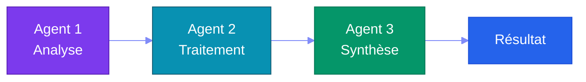
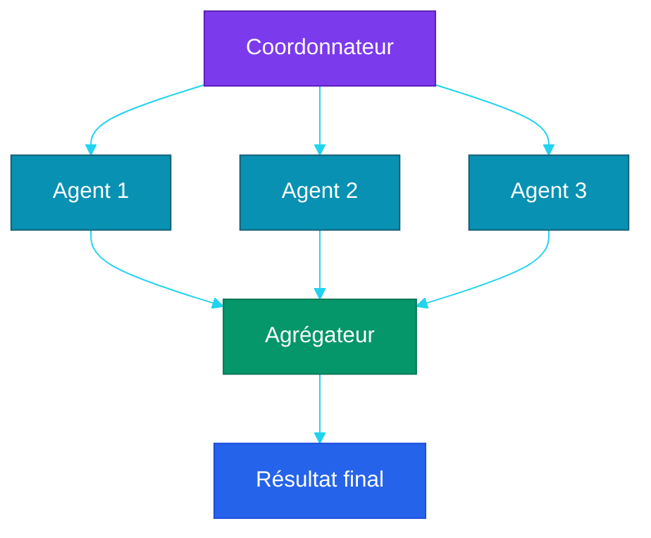
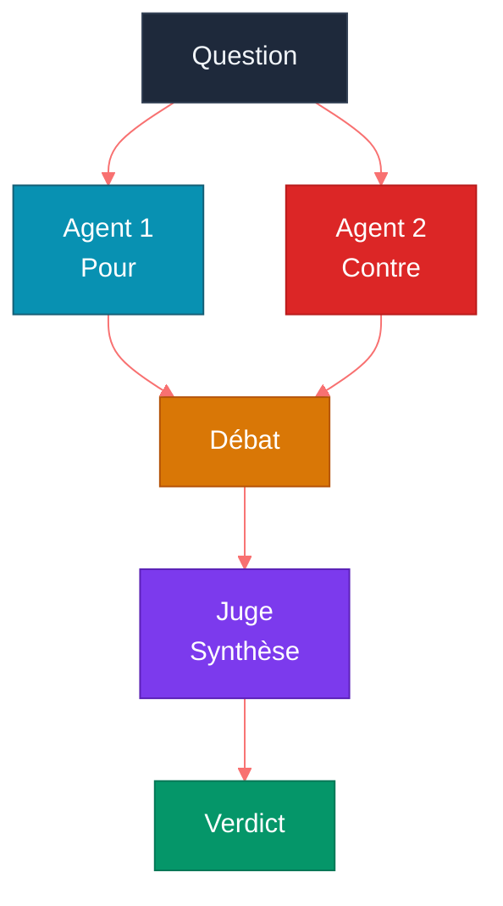
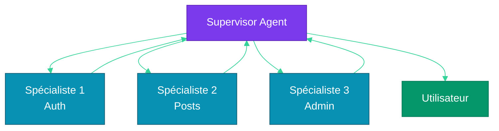
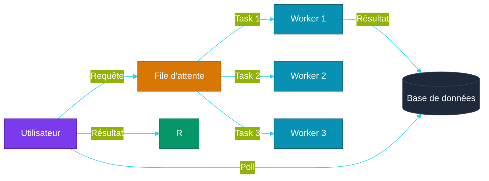

# Chapitre 6 — Multi-Agent Orchestration

## Objectifs pédagogiques

- Comprendre pourquoi un seul agent ne suffit pas toujours
- Maîtriser les patterns de communication entre agents
- Savoir implémenter un Supervisor Agent
- Connaître les approches asynchrones et files d'attente

---

## Prérequis

Avant de commencer ce chapitre, assurez-vous d'avoir :

- Terminé le **[Chapitre 5](CHAPITRE-05-memoire-rag.md)** et son TP mémoire persistante
- opencode installé et fonctionnel
- Git installé
- Compris les fichiers `opencode.json`, `AGENTS.md` et `.opencode/skills/`

### Vérification

#### Linux, macOS et Windows PowerShell

```bash
opencode --version
git --version
```

> **Aucune dépendance Python obligatoire** : ce TP configure une équipe d'agents avec opencode.

---

## 1. Pourquoi Plusieurs Agents ?

### 1.1 Limites d'un agent unique

| Problème | Exemple | Solution multi-agent |
|---|---|---|
| **Spécialisation** | Un agent ne peut pas être bon en tout | Agents spécialisés par domaine |
| **Contexte** | Un seul LLM (Large Language Model) a une fenêtre limitée | Chaque agent a son propre contexte |
| **Parallélisme** | Tâches séquentielles lentes | Agents qui travaillent en parallèle |
| **Résilience** | Un agent qui échoue bloque tout | Agents redondants, fallback |
| **Modularité** | Tout le code dans une boucle | Agents indépendants et remplaçables |

### 1.2 Principe de spécialisation

Chaque agent a un **rôle précis** et un **système prompt dédié** :

```
Agent Modérateur → Analyse de toxicité, spam
Agent Résumé     → Synthèse de contenu
Agent Recherche  → Retrieval-Augmented Generation, recherche documentaire
Agent Code      → Génération et révision de code
```

---

## 2. Patterns de Communication

### 2.1 Séquentiel (Pipeline)



**Quand :** Tâches où chaque étape dépend de la précédente.
**Exemple :** Analyser → Résumer → Traduire

### 2.2 Fan-Out (Parallèle)



**Quand :** Tâches indépendantes qui peuvent être parallélisées.
**Exemple :** Analyser 3 documents en même temps.

### 2.3 Débat



**Quand :** Décisions complexes où plusieurs perspectives sont utiles.
**Exemple :** "Cette PR (Pull Request) est-elle prête à être mergée ?"

### 2.4 Hiérarchique (Supervisor)



**Quand :** Orchestration complexe avec délégation dynamique.
**Exemple :** Un chef de projet qui délègue à des spécialistes.

---

## 3. Architecture Supervisor

### Principe expliqué simplement

Un **Supervisor** est un agent coordinateur. Il ne fait pas forcément tout lui-même. Son rôle est de comprendre la demande, découper le travail, déléguer aux bons sous-agents, puis consolider les résultats.

Dans une équipe humaine, c'est proche du rôle d'un chef de projet technique :

```text
Utilisateur → demande globale
Supervisor → découpe la demande
Backend agent → traite l'Application Programming Interface
Frontend agent → traite l'interface
Tester agent → vérifie le résultat
Supervisor → synthétise et répond
```

#### Pourquoi c'est utile ?

- Chaque agent peut être spécialisé
- Le contexte est mieux organisé
- Les tâches peuvent être parallélisées
- Les erreurs sont plus faciles à isoler

#### Limite importante

Un mauvais Supervisor peut mal déléguer, oublier une étape ou fusionner des résultats incompatibles. Il faut donc définir clairement les rôles des sous-agents et les critères de validation.

### 3.1 Principe

Le **Supervisor Agent** est un LLM qui :
1. Reçoit la demande de l'utilisateur
2. Décide quel(s) sous-agent(s) invoquer
3. Consolide les résultats
4. Planifie la prochaine action

### 3.2 Prompt du Supervisor

```
Tu es un Supervisor Agent. Tu coordonnes une équipe d'agents spécialisés.

Agents disponibles :
- moderator(content) → analyse toxicité, spam (0-1)
- summarizer(texts) → résumé de contenu
- searcher(query) → recherche dans la base de connaissances

Règles :
1. Analyse la demande de l'utilisateur
2. Décide quels agents activer (séquentiel ou parallèle)
3. Consolide les résultats
4. Si un agent échoue, replanifie
5. Réponds à l'utilisateur uniquement quand tu as le résultat final
```

### 3.3 Implémentation

#### Où créer le fichier ?

**Point de départ :** ouvrez un terminal dans votre dossier d'exercices `~/agentic-labs` (Linux/macOS) ou `$HOME\agentic-labs` (Windows PowerShell).

```bash
mkdir -p chapitre-06-multi-agent
cd chapitre-06-multi-agent
pwd
```

**Résultat attendu :** `pwd` doit se terminer par `chapitre-06-multi-agent`. Les fichiers `supervisor_agent.py` et `async_orchestrator.py` seront créés dans ce dossier.

Créez `supervisor_agent.py` :

```python
class ModeratorAgent:
    def run(self, content: str) -> str:
        return "contenu acceptable" if "spam" not in content.lower() else "spam detecté"


class SummarizerAgent:
    def run(self, text: str) -> str:
        return text[:60] + "..." if len(text) > 60 else text


class SearcherAgent:
    def run(self, query: str) -> str:
        return f"Résultat simulé pour : {query}"


class SupervisorAgent:
    def __init__(self):
        self.agents = {
            "moderator": ModeratorAgent(),
            "summarizer": SummarizerAgent(),
            "searcher": SearcherAgent(),
        }
        self.history = []
    
    def run(self, user_input: str) -> str:
        """Délègue selon des règles simples pour rendre l'exemple testable."""
        self.history.append({"role": "user", "content": user_input})

        moderation = self.agents["moderator"].run(user_input)
        summary = self.agents["summarizer"].run(user_input)
        search = self.agents["searcher"].run("réseau social")

        return (
            f"Modération: {moderation}\n"
            f"Résumé: {summary}\n"
            f"Recherche: {search}"
        )


if __name__ == "__main__":
    supervisor = SupervisorAgent()
    print(supervisor.run("Créer le mur public du réseau social"))
```

#### Exécuter le fichier

```bash
python3 supervisor_agent.py
```

#### Résultat attendu

```text
Modération: contenu acceptable
Résumé: Créer le mur public du réseau social
Recherche: Résultat simulé pour : réseau social
```

---

## 4. Gestion Asynchrone & Files d'Attente

### 4.1 Problème

Un appel agent peut prendre plusieurs secondes, voire minutes. En séquentiel, l'utilisateur attend.

#### Principe expliqué simplement

Une **file d'attente asynchrone** permet de lancer une tâche longue sans bloquer l'utilisateur.

Au lieu d'attendre le résultat immédiatement, le système retourne un identifiant de tâche. L'application peut ensuite demander l'état de cette tâche avec cet identifiant.

```text
Utilisateur → demande longue
Système → retourne task_id
Worker → travaille en arrière-plan
Utilisateur → demande le résultat avec task_id
Système → retourne le résultat final
```

#### Pourquoi c'est utile ?

- L'interface reste réactive
- Plusieurs tâches peuvent tourner en parallèle
- Les erreurs peuvent être stockées et consultées
- On peut ajouter timeout, retry et monitoring

#### Limite importante

L'asynchrone ajoute de la complexité : suivi d'état, erreurs, nettoyage, persistance et concurrence. Pour un petit script CLI (Command Line Interface), une boucle simple suffit souvent.

### 4.2 Solution : File d'attente



### 4.3 Approche asynchrone simple

#### Où créer le fichier ?

**Point de départ :** vous devriez être dans `~/agentic-labs`. Si c'est le cas, restez ici ou recréez le dossier.

```bash
mkdir -p chapitre-06-multi-agent
cd chapitre-06-multi-agent
pwd
```

**Résultat attendu :** `pwd` doit se terminer par `chapitre-06-multi-agent`, au même endroit que `supervisor_agent.py`.

Créez `async_orchestrator.py` :

```python
import asyncio   # Bibliothèque pour la programmation asynchrone
import uuid      # Génération d'identifiants uniques


class FakeAsyncAgent:
    async def arun(self, input_data: str) -> str:
        await asyncio.sleep(0.2)
        return f"Traitement terminé pour : {input_data}"

class AsyncAgentOrchestrator:
    # Initialise le dictionnaire des tâches
    def __init__(self):
        self.tasks = {}  # stocke l'état de chaque tâche par son ID
        self.agents = {"worker": FakeAsyncAgent()}
    
    # Soumet une tâche et retourne immédiatement un ID
    async def submit(self, agent_name: str, input_data: str) -> str:
        task_id = str(uuid.uuid4())                                      # Génère un ID unique
        self.tasks[task_id] = {"status": "pending", "result": None}      # État initial
        
        # Lance le traitement en arrière-plan sans bloquer
        asyncio.create_task(self._process(agent_name, input_data, task_id))
        return task_id  # L'utilisateur récupérera le résultat plus tard
    
    # Attend le résultat d'une tâche (polling)
    async def get_result(self, task_id: str):
        while self.tasks[task_id]["status"] == "pending":  # Boucle tant que la tâche est en cours
            await asyncio.sleep(0.5)                       # Pause pour éviter de surcharger le CPU (Central Processing Unit)
        return self.tasks[task_id]["result"]               # Retourne le résultat final
    
    # Traitement interne d'une tâche en arrière-plan
    async def _process(self, agent_name, input_data, task_id):
        try:
            self.tasks[task_id]["status"] = "running"      # Passe en cours d'exécution
            result = await self.agents[agent_name].arun(input_data)  # Appel asynchrone du sous-agent
            self.tasks[task_id]["result"] = result         # Stocke le résultat
            self.tasks[task_id]["status"] = "done"         # Marque comme terminé
        except Exception as e:
            self.tasks[task_id]["result"] = f"Error: {e}"  # Enregistre l'erreur
            self.tasks[task_id]["status"] = "failed"       # Marque comme échoué


async def main():
    orchestrator = AsyncAgentOrchestrator()
    task_id = await orchestrator.submit("worker", "générer les tests")
    result = await orchestrator.get_result(task_id)
    print(result)


if __name__ == "__main__":
    asyncio.run(main())
```

#### Exécuter le fichier

```bash
python3 async_orchestrator.py
```

#### Résultat attendu

```text
Traitement terminé pour : générer les tests
```

---

## 5. Erreurs & Résilience

| Pattern | Description | Code |
|---|---|---|
| **Retry** | Réessayer après un échec temporaire | `retry(max=3, delay=1)` |
| **Fallback** | Agent de remplacement si le principal échoue | `agent_b if agent_a fails` |
| **Circuit Breaker** | Arrêter les appels après N échecs consécutifs | Arrêt temporaire puis reprise |
| **Timeout** | Limiter le temps d'exécution d'un agent | `asyncio.wait_for(task, timeout=30)` |
| **Graceful degradation** | Réponse partielle si un agent est indisponible | "Module X indisponible, voici le reste" |

---

## 6. Travaux Pratiques — Supervisor Multi-Agent avec Opencode

> **Projet reseau social** : l'equipe multi-agent que vous allez configurer a pour objectif d'implementer les fonctionnalites du reseau social defini dans [`projet/gestion_de_projet/cdc.md`](projet/gestion_de_projet/cdc.md).

**Objectif :** Configurer une équipe d'agents opencode avec un Supervisor qui délègue à des spécialistes.

**Durée :** 3h

---

### 6.1 Énoncé

Vous devez configurer une équipe opencode avec :

1. Un **scrum-master** qui joue le rôle de supervisor
2. Un agent **backend-dev** pour Application Programming Interfaces, logique métier et authentification
3. Un agent **frontend-dev** pour interfaces et templates
4. Un agent **data-dev** pour SQLite, migrations et mémoire/Retrieval-Augmented Generation
5. Des skills dédiées pour cadrer chaque rôle
6. Une validation manuelle de la délégation

**Fichiers à créer :**
- `supervisor-agent/opencode.json` — configuration multi-agent
- `supervisor-agent/AGENTS.md` — documentation de l'équipe
- `supervisor-agent/.opencode/skills/scrum_master.md`
- `supervisor-agent/.opencode/skills/backend.md`
- `supervisor-agent/.opencode/skills/frontend.md`
- `supervisor-agent/.opencode/skills/data.md`

---

### 6.2 Corrigé — Étape 1 : Créer le projet

**Point de départ :** ouvrez un terminal dans votre dossier d'exercices. Ce TP crée un **nouveau dossier indépendant** nommé `supervisor-agent`.

```bash
mkdir supervisor-agent && cd supervisor-agent
mkdir -p .opencode/skills
pwd
```

**Résultat attendu :** `pwd` doit se terminer par `supervisor-agent`. Tous les fichiers de ce TP seront créés dans ce dossier.

### 6.3 Corrigé — Étape 2 : Configurer l'équipe

Vous êtes toujours dans `supervisor-agent/`. Créez `opencode.json` à la racine de ce dossier :

```text
supervisor-agent/
├── opencode.json          ← à créer maintenant
└── .opencode/
    └── skills/
```

`opencode.json` :

```json
{
  "$schema": "https://opencode.ai/config.json",
  "model": "opencode/big-pickle",
  "default_agent": "scrum-master",
  "instructions": ["AGENTS.md"],
  "skills": {"paths": [".opencode/skills"]},
  "agent": {
    "scrum-master": {
      "mode": "primary",
      "description": "Supervisor — analyse, délègue, consolide",
      "skills": ["common", "scrum_master"]
    },
    "backend-dev": {
      "mode": "subagent",
      "description": "Développe la logique métier et les APIs (Application Programming Interfaces)",
      "skills": ["common", "backend"]
    },
    "frontend-dev": {
      "mode": "subagent",
      "description": "Crée les interfaces utilisateur",
      "skills": ["common", "frontend"]
    },
    "data-dev": {
      "mode": "subagent",
      "description": "Gère la base de données et le RAG (Retrieval-Augmented Generation)",
      "skills": ["common", "data"]
    }
  }
}
```

### 6.4 Corrigé — Étape 3 : Créer les skills spécialisées

Vous êtes toujours dans `supervisor-agent/`. Les skills doivent être créées dans `.opencode/skills/`, pas à la racine du projet.

**`.opencode/skills/scrum_master.md`**

```markdown
# Rôle : Supervisor

Tu es le Scrum Master. Tu coordonnes une équipe de 3 développeurs.

## Workflow
1. Analyse la demande utilisateur
2. Décompose en tâches indépendantes
3. Délègue chaque tâche au sous-agent compétent
4. Consolide les résultats
5. Présente une synthèse

## Sous-agents disponibles
- @backend-dev : APIs (Application Programming Interfaces), logique métier, auth
- @frontend-dev : HTML (HyperText Markup Language), CSS (Cascading Style Sheets), templates
- @data-dev : Base de données, RAG (Retrieval-Augmented Generation), embeddings
```

**`.opencode/skills/backend.md`**

```markdown
# Rôle : Développeur Backend

Stack : FastAPI, SQLAlchemy, Pydantic, Alembic

Tu développes les APIs (Application Programming Interfaces) REST (Representational State Transfer), la logique métier,
l'authentification et la validation des données.
```

**`.opencode/skills/frontend.md`**

```markdown
# Rôle : Développeur Frontend

Stack : Jinja2, Tailwind CSS (Cascading Style Sheets), HTMX

Tu crées les interfaces utilisateur responsives,
les formulaires et les pages.
```

**`.opencode/skills/data.md`**

```markdown
# Rôle : Développeur Data

Stack : SQLite, Chroma, embeddings

Tu gères le schéma de base de données, les migrations,
les index vectoriels pour le RAG (Retrieval-Augmented Generation).
```

### 6.5 Corrigé — Étape 4 : AGENTS.md

#### À quoi sert `AGENTS.md` dans un projet multi-agent ?

Dans ce TP, `AGENTS.md` sert de **carte d'équipe**. Il explique quel agent existe, quel rôle il joue, et comment l'utilisateur doit interagir avec le système.

Ce fichier est particulièrement important en multi-agent, car il évite que les rôles se mélangent. Le `scrum-master` coordonne, le `backend-dev` traite les Application Programming Interfaces, le `frontend-dev` traite l'interface, et le `data-dev` traite la base de données.

#### Où créer le fichier ?

Créez `AGENTS.md` à la racine de `supervisor-agent/` :

```text
supervisor-agent/
├── opencode.json
├── AGENTS.md
└── .opencode/
    └── skills/
```

Créez un fichier `AGENTS.md` :

```markdown
# Équipe multi-agent

| Agent                  | Rôle                               |
|------------------------|------------------------------------|
| scrum-master           | Supervisor — coordonne l'équipe     |
| backend-dev            | APIs (Application Programming Interfaces) et logique métier             |
| frontend-dev           | Interfaces utilisateur             |
| data-dev               | Base de données et RAG (Retrieval-Augmented Generation)             |

## Utilisation

Donnez une tâche au scrum-master. Il la décomposera
et déléguera aux sous-agents appropriés.
```

#### Résultat attendu

Le fichier rend le fonctionnement de l'équipe lisible. Un utilisateur sait qu'il doit parler au `scrum-master`, et le `scrum-master` sait à quels profils déléguer.

### 6.6 Corrigé — Étape 5 : Tester la délégation

Lancez opencode et essayez :

```
"Crée une application FastAPI avec une route /hello qui retourne du JSON (JavaScript Object Notation)"
"Ajoute une page HTML (HyperText Markup Language) pour afficher le message"
"Ajoute une base de données SQLite avec une table visites"
```

Le scrum-master devrait déléguer :
- La route `/hello` → `@backend-dev`
- La page HTML → `@frontend-dev`
- La table visites → `@data-dev`

### 6.7 Corrigé — Étape 6 : Ajouter des tests

Demandez au scrum-master :

```
"Ajoute des tests pour chaque composant de l'application"
"Vérifie que le scrum-master délègue correctement en regardant les logs"
```

### 6.8 Validation

- [ ] Le scrum-master analyse et décompose la demande
- [ ] Chaque sous-agent reçoit des tâches adaptées à son rôle
- [ ] Les sous-agents produisent du code cohérent entre eux
- [ ] L'application finale fonctionne (backend + frontend + Base de données)

### Pour aller plus loin

- Ajoutez un agent `tester` dédié à la qualité
- Ajoutez un agent `devops` pour Docker/CI-CD
- Créez un scénario de débogage où le scrum-master coordinateur détecte et corrige une incohérence

---

## Points clés à retenir

1. Le **multi-agent** permet spécialisation, parallélisme et résilience
2. Les **patterns** fondamentaux : séquentiel, fan-out, débat, hiérarchique
3. Le **Supervisor Agent** est un Large Language Model qui orchestre d'autres Large Language Models
4. Les **files d'attente** évitent de bloquer l'utilisateur pendant les traitements longs
5. La **résilience** (retry, fallback, timeout) est indispensable en production

---

## Liens

- [Chapitre 5 — Mémoire & Retrieval-Augmented Generation](./CHAPITRE-05-memoire-rag.md)
- [Chapitre 7 — Model Context Protocol & Standards](./CHAPITRE-07-mcp-standards.md)
- [Chapitre 10 — Opencode & Labs](./CHAPITRE-10-opencode-labs.md)
