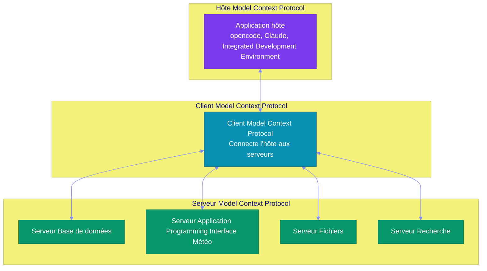
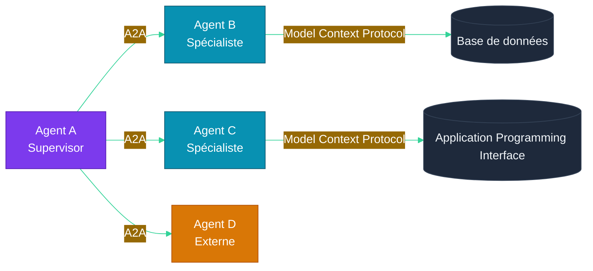

# Chapitre 7 — Model Context Protocol & Standards d'Interopérabilité

## Objectifs pédagogiques

- Comprendre le Model Context Protocol et son rôle
- Savoir exposer un service via Model Context Protocol
- Connaître A2A (Agent-to-Agent) et les standards émergents
- Pouvoir connecter un agent opencode à des services externes

---

## Prérequis

Avant de commencer ce chapitre, assurez-vous d'avoir :

- Terminé le **[Chapitre 6](CHAPITRE-06-multi-agent.md)** et son TP supervisor
- Python 3.10+ installé
- opencode fonctionnel
- Compris la notion d'outil exposé à un agent

### Installation des dépendances

#### Linux et macOS

```bash
python3 -m pip install mcp
```

#### Windows PowerShell

```powershell
py -m pip install mcp
```

### Vérification

#### Linux et macOS

```bash
python3 -c "import mcp; print('MCP installe')"
opencode --version
```

#### Windows PowerShell

```powershell
py -c "import mcp; print('MCP installe')"
opencode --version
```

---

## 1. Pourquoi des Standards ?

### 1.1 Le problème

Chaque plateforme agentique a sa propre façon de :
- Définir des outils
- Gérer la mémoire
- Communiquer avec d'autres agents
- Exposer des Application Programming Interface

**Résultat :** Les agents sont difficiles à porter, interconnecter et maintenir.

### 1.2 La solution : Model Context Protocol

Le **Model Context Protocol** (Anthropic, 2025) est un standard ouvert qui définit comment un Large Language Model/agent se connecte à des sources de données et des outils.

> Model Context Protocol est à l'Intelligence Artificielle ce que USB-C est à l'électronique : **un connecteur universel**.

---

## 2. Architecture Model Context Protocol

### 2.1 Composants



| Composant | Rôle | Exemple |
|---|---|---|
| **Hôte** | Application qui utilise un Large Language Model | opencode, Claude Desktop, Integrated Development Environment |
| **Client** | Connecte l'hôte aux serveurs Model Context Protocol | Software Development Kit Model Context Protocol (Python, TypeScript) |
| **Serveur** | Expose des ressources, outils et prompts | Serveur fichier, serveur Base de Donnees, serveur Application Programming Interface |

### 2.2 Primitives Model Context Protocol

| Primitive | Description | Exemple |
|---|---|---|
| **Resources** | Données exposées en lecture | Contenu de fichiers, résultats de requêtes |
| **Tools** | Fonctions exécutables par le Large Language Model | `get_weather()`, `send_email()` |
| **Prompts** | Templates de prompts réutilisables | "Résume ce document" |

---

## 3. Créer un Serveur Model Context Protocol avec Python

### Principe expliqué simplement

Un **serveur Model Context Protocol** expose des capacités à un agent : outils, ressources ou prompts. L'agent n'a pas besoin de connaître votre code interne. Il voit seulement une interface standardisée.

Dans ce chapitre, le serveur expose un outil météo :

```text
Agent opencode
→ appelle l'outil Model Context Protocol get_weather(city="Paris")
→ serveur Model Context Protocol exécute la fonction Python
→ serveur Model Context Protocol retourne "15°C à Paris"
→ agent utilise ce résultat dans sa réponse
```

#### Pourquoi c'est utile ?

- Séparer le code métier de l'agent
- Réutiliser les mêmes outils avec plusieurs clients Intelligence Artificielle
- Standardiser la connexion aux fichiers, bases de données et Application Programming Interfaces
- Limiter les permissions à ce que le serveur expose

#### Limite importante

Model Context Protocol ne rend pas automatiquement un outil sécurisé. Si le serveur expose un outil dangereux, l'agent pourra demander à l'utiliser. Il faut donc valider les paramètres et limiter les actions côté serveur.

### 3.1 Exemple minimal

#### Où créer le fichier ?

**Point de départ :** ouvrez un terminal dans votre dossier d'exercices `~/agentic-labs` (Linux/macOS) ou `$HOME\agentic-labs` (Windows PowerShell).

```bash
mkdir -p chapitre-07-mcp
cd chapitre-07-mcp
pwd
python3 -m pip install mcp
```

Windows PowerShell :

```powershell
mkdir chapitre-07-mcp
cd chapitre-07-mcp
pwd
py -m pip install mcp
```

**Résultat attendu :** `pwd` doit se terminer par `chapitre-07-mcp`. Le fichier `server.py` sera créé dans ce dossier.

Créez `server.py` :

```python
# server.py — Serveur Model Context Protocol météo
from mcp.server.fastmcp import FastMCP

mcp = FastMCP("weather-server")


@mcp.tool()
def get_weather(city: str) -> str:
    """Retourne une température simulée pour une ville."""
    return f"15°C à {city}"


if __name__ == "__main__":
    mcp.run()
```

#### Vérifier la logique métier sans lancer Model Context Protocol

```bash
python3 -c "from server import get_weather; print(get_weather('Paris'))"
```

#### Résultat attendu

```text
15°C à Paris
```

### 3.2 Connecter à opencode

Dans `opencode.json`, déclarer le serveur Model Context Protocol :

```json
{
  "mcp_servers": {
    "weather": {
      "command": "python",
      "args": ["server.py"]
    }
  }
}
```

Ce fichier doit être créé dans le même dossier que `server.py`, donc dans `chapitre-07-mcp/opencode.json`.

Les agents opencode peuvent alors utiliser `get_weather()` comme un outil natif.

---

## 4. A2A — Agent-to-Agent Protocol

### 4.1 Principe

Si Model Context Protocol connecte un **agent à des outils**, A2A connecte un **agent à d'autres agents**.



### 4.2 Cycle de vie d'une tâche A2A

```
1. Agent A envoie une AgentCard à Agent B
   → "Je cherche un spécialiste en météo"

2. Agent B répond avec ses capacités
   → "Je peux donner la météo pour toute ville"

3. Agent A délègue une tâche
   → "Tâche: get_weather_for_cities(['Paris', 'Tokyo'])"

4. Agent B exécute et renvoie le résultat
   → "Résultat: { Paris: 15°C, Tokyo: 22°C }"
```

---

## 5. Standards dans le monde opencode

### 5.1 Fichier `opencode.json`

Le fichier de configuration opencode permet de déclarer :

```json
{
  "$schema": "https://opencode.ai/config.json",
  "model": "opencode/big-pickle",
  "default_agent": "scrum-master",
  "instructions": ["AGENTS.md", "CHAPITRE-01-histoire-ia.md"],
  "agents": {
    "scrum-master": {
      "mode": "primary",
      "description": "Coordonne l'équipe",
      "skills": ["common", "scrum_master"]
    },
    "fullstack-developer": {
      "mode": "subagent",
      "description": "Développe le code",
      "skills": ["common", "fullstack_developer"]
    }
  }
}
```

### 5.2 Fichier `AGENTS.md`

#### À quoi sert ce fichier ?

`AGENTS.md` documente l'équipe d'agents du projet : qui coordonne, qui exécute, comment les tâches circulent et quelles règles de travail doivent être respectées.

Dans un projet opencode, `opencode.json` indique **la configuration technique** : agents disponibles, modèle, skills, permissions. `AGENTS.md` indique **la méthode de travail** : rôles, workflow, conventions, responsabilités.

#### Pourquoi c'est utile ici ?

Dans un projet avec Model Context Protocol, les agents peuvent utiliser des outils externes. Il faut donc clarifier qui a le droit d'orchestrer, qui code, qui teste et comment les résultats sont consolidés. Sans cette documentation, un agent peut utiliser les outils Model Context Protocol sans comprendre l'organisation globale du projet.

#### Où créer le fichier ?

Créez `AGENTS.md` à la racine du projet opencode, au même niveau que `opencode.json` :

```text
mon-projet-mcp/
├── opencode.json
├── AGENTS.md
└── .opencode/
    └── skills/
```

Exemple de contenu :

```markdown
# Équipe de développement

| Agent                  | Rôle                 | Mode      |
|------------------------|----------------------|-----------|
| scrum-master           | Planifie, coordonne  | primary   |
| fullstack-developer    | Code, tests          | subagent  |

## Workflow
1. L'utilisateur donne une instruction
2. Le scrum-master découpe en tâches
3. Les sous-agents exécutent
4. Le scrum-master synthétise
```

#### Résultat attendu

Lorsque `opencode.json` contient :

```jsonc
"instructions": ["AGENTS.md"]
```

opencode charge ce document au démarrage. Les agents comprennent alors le workflow attendu avant d'utiliser les outils Model Context Protocol.

### 5.3 Skills

Les **skills** sont des prompts spécialisés chargés selon le contexte :

```
.opencode/skills/
├── common.md              ← Connaissances partagées
├── scrum_master.md        ← Comment découper un projet
├── fullstack_developer.md ← Comment développer
└── devops.md              ← Docker, Continuous Integration / Continuous Deployment
```

---

## 6. Interopérabilité avec opencode

### 6.1 opencode comme hôte Model Context Protocol

opencode peut se connecter à n'importe quel serveur Model Context Protocol, ce qui permet à vos agents d'utiliser des outils externes sans code spécifique.

### 6.2 Exemple : Agent opencode avec outils Model Context Protocol

```
# Demande à l'agent
"Quel temps fait-il à Paris ?"

# Agent scrum-master (via opencode)
→ Délègue à un sous-agent avec l'outil Model Context Protocol météo
→ L'outil Model Context Protocol retourne "15°C"
→ L'agent synthétise la réponse
```

### 6.3 opencode comme serveur Model Context Protocol

Inversement, vous pouvez exposer les capacités de votre projet opencode via Model Context Protocol pour que d'autres applications Large Language Model puissent y accéder.

---

## 7. Travaux Pratiques — Serveur Model Context Protocol

> **Projet reseau social** : les serveurs Model Context Protocol exposes ici permettent aux agents d'interagir avec la base de donnees et les services du projet social defini dans [`projet/gestion_de_projet/cdc.md`](projet/gestion_de_projet/cdc.md).

**Objectif :** Créer un serveur Model Context Protocol et le connecter à opencode.

**Durée :** 2h

---

### 7.1 Énoncé

Vous devez créer un serveur Model Context Protocol météo utilisable par un agent opencode.

Le serveur doit :

1. Déclarer un outil `get_weather`
2. Recevoir une ville en paramètre
3. Retourner une météo simulée
4. Être testable en ligne de commande
5. Être connectable depuis `opencode.json`

**Fichiers à créer :**
- `serveur-mcp/serveur_meteo.py` — serveur Model Context Protocol
- `serveur-mcp/client_test.py` — client de test
- `serveur-mcp/opencode.json` — connexion opencode au serveur

---

### 7.2 Corrigé — Étape 1 : Installer le Software Development Kit Model Context Protocol

**Point de départ :** ouvrez un terminal dans votre dossier d'exercices. Ce TP crée un **nouveau dossier indépendant** nommé `serveur-mcp`.

```bash
mkdir serveur-mcp && cd serveur-mcp
python3 -m pip install mcp
pwd
```

Windows PowerShell :

```powershell
mkdir serveur-mcp
cd serveur-mcp
py -m pip install mcp
pwd
```

**Résultat attendu :** `pwd` doit se terminer par `serveur-mcp`. Les fichiers `serveur_meteo.py`, `client_test.py` et `opencode.json` seront créés dans ce dossier.

### 7.3 Corrigé — Étape 2 : Serveur Model Context Protocol minimal

Vous êtes toujours dans `serveur-mcp/`. Créez un fichier `serveur_meteo.py` à la racine de ce dossier :

```python
from mcp.server.fastmcp import FastMCP

# Crée un serveur Model Context Protocol nommé "meteo-server".
mcp = FastMCP("meteo-server")


@mcp.tool()
def get_weather(city: str) -> str:
    """Retourne une météo simulée pour une ville."""
    # Dictionnaire de données météo simulées.
    temperatures = {
        "paris": "15°C, ciel nuageux",
        "tokyo": "22°C, ensoleillé",
        "londres": "12°C, pluie légère",
        "new york": "18°C, vent modéré",
    }
    city_key = city.lower().strip()
    return temperatures.get(city_key, f"20°C à {city}, données approximatives")


# Point d'entrée : démarre le serveur Model Context Protocol en transport stdio.
if __name__ == "__main__":
    mcp.run()
```

### 7.4 Corrigé — Étape 3 : Tester le serveur

```bash
python3 serveur_meteo.py
```

Le serveur écoute sur stdio (utilisable par un client Model Context Protocol).

### 7.5 Corrigé — Étape 4 : Client Model Context Protocol

Créez un fichier `client_test.py` :

```python
from serveur_meteo import get_weather


def test_weather():
    """Test local de la logique métier avant branchement Model Context Protocol."""
    assert "15°C" in get_weather("Paris")
    assert "22°C" in get_weather("Tokyo")
    assert "20°C" in get_weather("Ville inconnue")


if __name__ == "__main__":
    test_weather()
    print("Tests locaux OK")
```

Exécutez le test local :

```bash
python3 client_test.py
```

Résultat attendu :

```text
Tests locaux OK
```

### 7.6 Corrigé — Étape 5 : Connecter à opencode

Ajoutez dans `opencode.json` :

```json
{
  "mcp_servers": {
    "meteo": {
      "command": "python",
      "args": ["serveur_meteo.py"]
    }
  },
  "agent": {
    "assistant": {
      "mode": "primary",
      "description": "Assistant avec accès météo",
      "mcp_servers": ["meteo"]
    }
  }
}
```

### 7.7 Corrigé — Étape 6 : Tester avec opencode

Lancez opencode et demandez :

```
"Quel temps fait-il à Tokyo ?"
"Et à Paris ?"
"Quelle est la différence de température entre Londres et New York ?"
```

### 7.8 Validation

- [ ] Le serveur Model Context Protocol répond aux requêtes
- [ ] Le client Model Context Protocol se connecte et appelle les outils
- [ ] opencode utilise le serveur Model Context Protocol pour répondre aux questions météo
- [ ] L'agent opencode combine les appels Model Context Protocol (ex: comparer deux villes)

### Pour aller plus loin

- Ajoutez un outil `get_time(city)` qui retourne l'heure locale
- Créez un serveur Model Context Protocol pour votre base de données (ex: SQLite)
- Hébergez le serveur Model Context Protocol via Hypertext Transfer Protocol au lieu de stdio

---

## Points clés à retenir

1. **Model Context Protocol** est le standard universel pour connecter Large Language Models à des outils et données
2. **A2A** permet à des agents de collaborer entre eux
3. Le **serveur Model Context Protocol** expose des Resources, Tools et Prompts
4. **opencode** supporte nativement Model Context Protocol via `opencode.json`
5. **AGENTS.md** et les **skills** forment la structure agentique du projet

---

## Liens

- [Chapitre 6 — Multi-Agent Orchestration](./CHAPITRE-06-multi-agent.md)
- [Chapitre 10 — Opencode & Labs](./CHAPITRE-10-opencode-labs.md)
- [Documentation Model Context Protocol](https://modelcontextprotocol.io)
- [opencode Documentation](https://opencode.ai)
