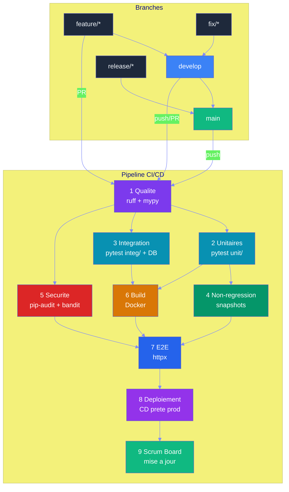
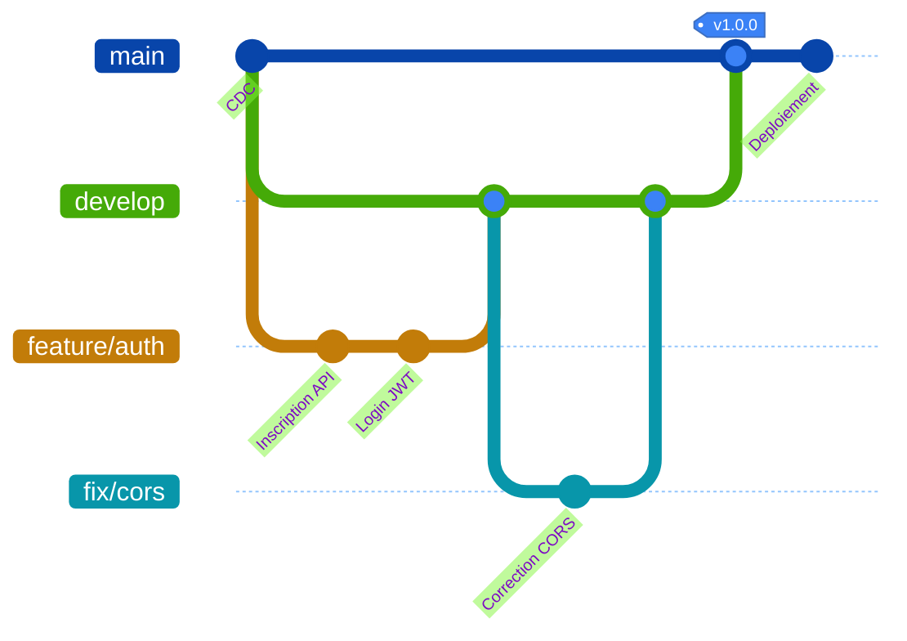
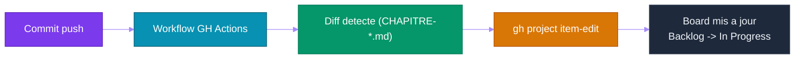
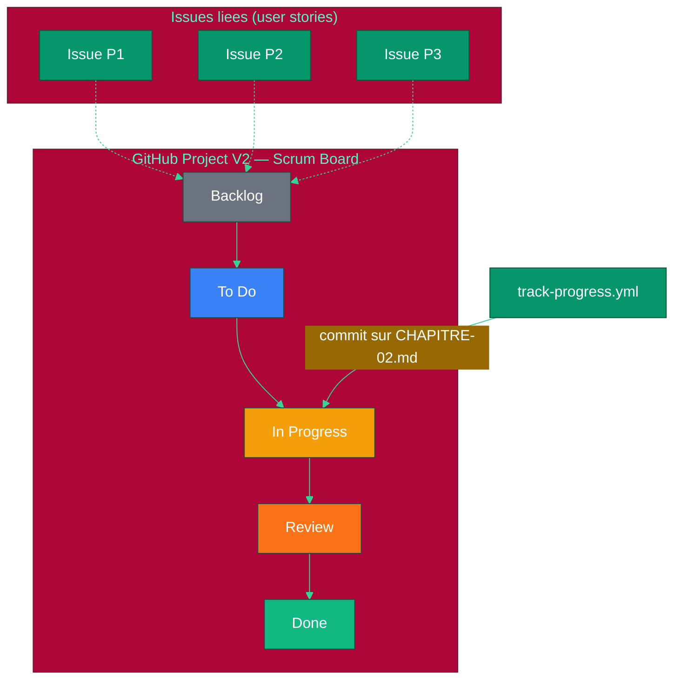

# Chapitre 8 — CI/CD (Continuous Integration / Continuous Deployment) & DevOps pour Agents

## Objectifs pédagogiques

- Comprendre comment tester et valider des agents automatiquement
- Mettre en place une CI/CD complète pour un projet agentique
- Savoir monitorer les performances et coûts des agents
- Connaître les bonnes pratiques DevOps pour systèmes agentiques

---

## Prérequis

Avant de commencer cette chapitre, assurez-vous d'avoir :

- Terminé le **[Chapitre 7](CHAPITRE-07-mcp-standards.md)** et son TP serveur MCP
- Python 3.10+ installé
- Git installé
- Un compte GitHub
- GitHub CLI (`gh`) installé si vous voulez automatiser les issues/projects

### Installation des dépendances Python

```bash
pip install pytest ruff bandit
```

### Vérification

```bash
python3 --version
git --version
pytest --version
ruff --version
bandit --version
gh --version  # optionnel, utile pour GitHub Projects
```

---

## 1. Pourquoi la CI/CD est Cruciale pour les Agents

Les agents sont **non-déterministes** : deux exécutions du même prompt peuvent donner des résultats différents. La CI/CD permet de :

| Objectif | Méthode |
|---|---|
| Vérifier que les agents répondent correctement | Tests comportementaux |
| Détecter les régressions (un changement casse une capacité) | Benchmark automatisé |
| Valider les coûts tokens | Seuils de coût |
| Sécuriser les accès et permissions | Scan de sécurité |
| Déployer sans interruption | Rolling update |

---

## 2. Tester des Agents

### 2.1 Tests unitaires

Créez `tests/test_tools.py` :

```python
# Test unitaire : vérifie que l'outil météo retourne une température
def test_get_weather_tool():
    result = weather_tool("Paris")
    assert "température" in result.lower()
    assert isinstance(result, str)
```

### 2.2 Tests d'intégration

Créez `tests/test_integration.py` :

```python
# Test d'intégration : parcours complet d'un agent météo
def test_agent_meteo_complet():
    agent = WeatherAgent()
    result = agent.run("Quel temps fait-il à Paris ?")
    assert "Paris" in result
    assert "°C" in result or "degrés" in result
```

### 2.3 Tests comportementaux (Évaluation)

Créez `tests/test_benchmarks.py` :

```python
# Benchmark : liste des scénarios de test comportementaux
BENCHMARKS = [
    {
        "input": "Météo à Paris",
        "expected_behavior": "Utilise l'outil get_weather",
        "expected_tools": ["get_weather"],
        "max_tokens": 500,
        "max_steps": 3
    },
    {
        "input": "Bonjour",
        "expected_behavior": "Répond poliment sans outil",
        "expected_tools": [],
        "max_tokens": 100,
        "max_steps": 1
    }
]

# Test de validation des comportements
def test_agent_behavior():
    agent = create_agent()
    for bench in BENCHMARKS:
        result = agent.run(bench["input"])
        assert result.used_tools == bench["expected_tools"]
        assert result.total_steps <= bench["max_steps"]
```

---

## 3. Pipeline CI/CD Professionnel (Fichier Unique)

### 3.1 Architecture

Le pipeline est concu en **9 phases** organisees en dependances paralleles. Chaque phase a un objectif precis et des permissions minimales.



### 3.2 Pipeline YAML unique

Le fichier complet se trouve dans `.github/workflows/cicd-projet.yml`. Il contient les **9 phases** dans un seul fichier YAML :

| Phase | Job | Depend de | Parallelisable | Permissions |
|---|---|---|---|---|
| **1 Qualite** | `quality` | — | — | lecture seule |
| **2 Unitaires** | `unit-tests` | quality | avec phase 3, 5 | lecture seule |
| **3 Integration** | `integration-tests` | quality | avec phase 2, 5 | lecture seule + service DB |
| **4 Non-regression** | `regression-tests` | unit-tests | — | lecture seule |
| **5 Securite** | `security` | quality | avec phase 2, 3 | lecture seule |
| **6 Build** | `build` | unit-tests, integration-tests | — | lecture + packages write |
| **7 E2E** | `e2e-tests` | build | — | lecture seule |
| **8 Deploiement** | `deploy` | toutes sauf 9 | — | environment: production |
| **9 Scrum board** | `update-board` | deploy | — | projects write |

Extrait du pipeline :

```yaml
name: CI/CD Projet Social

# Declencheur : toutes les branches du workflow Gitflow
on:
  push:
    branches:
      - main
      - develop
      - "feature/**"
      - "fix/**"
      - "release/**"
  pull_request:
    branches:
      - develop
      - main

# Annule les runs precedents sur la meme branche
concurrency:
  group: ${{ github.workflow }}-${{ github.ref }}
  cancel-in-progress: true
```

Chaque phase est independante et peut etre executee separement. L'option `continue-on-error: true` est utilisee sur les phases non-bloquantes (securite, non-regression) pour ne pas bloquer le pipeline sur des alertes.

### 3.3 Strategie de Branching Professionnelle

Le pipeline suit le modele **GitFlow simplifie** (ou GitHub Flow enrichi) :

```
main (production, protegee)
  └── develop (integration, protegee avec PR obligatoire)
       ├── feature/ajout-moderation   ← nouvelles fonctionnalites
       ├── fix/correction-auth        ← corrections de bugs
       └── release/v1.2.0             ← preparation de mise en production
```

Regles :

| Branche | Protection | CI declenchee | Deploiement |
|---|---|---|---|
| `feature/*` | Aucune | PR vers develop | Non |
| `fix/*` | Aucune | PR vers develop | Non |
| `develop` | PR requise, review requise | Push + PR | Non |
| `release/*` | PR requise | Push + PR | Non |
| `main` | PR requise, review requise, statuts CI obligatoires | Push + PR | **Oui** (phase 8) |

Avantages de cette strategie :
- **Isolation** : chaque fonctionnalite est developpee dans sa branche
- **Qualite** : les PR vers develop declenchent toute la CI
- **Stabilite** : main ne recoit que du code valide par toutes les phases
- **Traçabilite** : chaque commit est lie a une issue/feature



### 3.4 Integration avec GitHub Projects

Un pipeline CI/CD ne se limite pas a builder et deployer. Il peut aussi **mettre a jour automatiquement un Scrum board** pour suivre la progression du projet en temps reel, sans cout de token LLM supplementaire.

#### Principe



#### Workflow de suivi (zero token LLM)

Le fichier `.github/workflows/track-progress.yml` utilise uniquement la CLI `gh` (pas de LLM) pour detecter les fichiers CHAPITRE-*.md modifies et deplacer automatiquement les cartes dans le Scrum board.

Caracteristiques :
- **Cout : zero token** — bash + gh CLI, pas d'appel LLM
- **Temps reel** — execute a chaque push sur main
- **Automatique** — plus besoin de deplacer les cartes a la main
- **Filtre par fichier** — seul le chapitre modifie est mis a jour

```yaml
name: Suivi de progression du cours

on:
  push:
    branches: [main]
    paths:
      - "CHAPITRE-*.md"

permissions:
  contents: read        # Lecture seule pour le diff
  issues: write         # Mise a jour des issues
  projects: write       # Mise a jour du Project board

jobs:
  track-chapitres:
    runs-on: ubuntu-latest
    steps:
      - uses: actions/checkout@v4
        with:
          fetch-depth: 2

      - name: Analyser les fichiers modifies
        run: |
          CHANGED=$(git diff --name-only HEAD~1 HEAD -- 'CHAPITRE-*.md' || true)
          echo "Fichiers modifies : $CHANGED"
```

#### Architecture du Scrum board



Ce pattern est reutilisable pour n'importe quel projet : il suffit de creer un Project V2, des issues liees, et un workflow qui les synchronise.

---

## 4. Monitoring & Observabilité

### 4.1 Que monitorer pour un agent ?

| Métrique | Pourquoi | Seuil d'alerte |
|---|---|---|
| **Temps de réponse** | L'utilisateur attend | > 10s |
| **Nombre de steps** | Boucle infinie possible | > 10 steps |
| **Tokens consommés** | Coût, budget | > 1000 tokens/appel |
| **Taux d'erreur** | Outils qui échouent | > 5% |
| **Taux de succès** | L'agent résout-il les problèmes ? | < 90% |
| **Appels par session** | Fuite mémoire possible | > 50 |

### 4.2 Logging structuré

Créez `monitoring.py` :

```python
import structlog
logger = structlog.get_logger()

class MonitoredAgent:
    """Agent avec logging structuré pour le monitoring."""
    def run(self, user_input: str) -> str:
        start = time.time()
        logger.info("agent.start", input=user_input)  # Début de l'exécution
        
        try:
            result = self._run_loop(user_input)
            duration = time.time() - start
            logger.info("agent.success",  # Succès de l'exécution
                       input=user_input,
                       duration=duration,
                       tokens=self.total_tokens,
                       steps=self.steps)
            return result
        except Exception as e:
            logger.error("agent.error",  # Erreur lors de l'exécution
                        input=user_input,
                        error=str(e))
            raise
```

---

## 5. Gestion des Coûts

### 5.1 Calcul des coûts

Créez `token_counter.py` :

```python
class TokenCounter:
    """Compteur de tokens avec budget maximum."""
    def __init__(self, max_total: int = 10000):
        self.total = 0  # Total des tokens consommés
        self.max_total = max_total  # Budget maximum autorisé
    
    def track(self, prompt_tokens: int, completion_tokens: int):
        """Enregistre la consommation de tokens."""
        self.total += prompt_tokens + completion_tokens
        if self.total > self.max_total:
            raise BudgetExceeded(f"Budget token dépassé: {self.total}")
```

Avec opencode + big-pickle (modèle gratuit), le coût est **zéro**. Cette section est utile si on migre vers un modèle payant.

### 5.2 Stratégies d'optimisation

| Stratégie | Gain estimé |
|---|---|
| **Limiter le contexte** (max 2000 tokens) | -50% tokens |
| **Mettre en cache les réponses identiques** | -30% appels |
| **Batching** (regrouper les questions) | -40% overhead |
| **Modèle plus petit** pour les tâches simples | -80% coût |
| **Timeouts stricts** | Évite les boucles coûteuses |

---

## 6. Travaux Pratiques — CI/CD (Continuous Integration / Continuous Deployment) pour Agents

> **Projet reseau social** : la chaine CI/CD mise en place ici build, teste et deploie automatiquement le reseau social defini dans [`projet/gestion_de_projet/cdc.md`](projet/gestion_de_projet/cdc.md).

**Objectif :** Mettre en place un pipeline CI/CD complet qui teste et valide des agents automatiquement.

**Durée :** 2h

---

### 6.1 Énoncé

Vous devez créer un mini-projet agentique avec :

1. Un assistant Python simple
2. Des tests comportementaux
3. Des tests qualité (`ruff`)
4. Une structure de dossiers compatible CI/CD
5. Un pipeline GitHub Actions générable par opencode
6. Une vérification locale avant push

**Fichiers à créer :**
- `cicd-agents/assistant.py`
- `cicd-agents/tests/unit/test_agent_behavior.py`
- `cicd-agents/tests/unit/test_quality.py`
- `cicd-agents/.github/workflows/cicd-projet.yml`

---

### 6.2 Corrigé — Étape 1 : Structure du projet

Commencez par créer la structure du projet et un assistant CLI (Command Line Interface) minimal :

```bash
mkdir cicd-agents && cd cicd-agents
mkdir -p tests/unit tests/integration tests/regression tests/e2e .github/workflows
```

Créez `assistant.py` :

```python
import re

class Assistant:
    """Assistant simple avec capacités météo et calcul."""
    def __init__(self):
        self.weather_db = {  # Base de données météo intégrée
            "Paris": "15°C",
            "Tokyo": "22°C",
            "Londres": "10°C",
        }

    def run(self, user_input: str) -> str:
        """Traite une entrée utilisateur et retourne une réponse."""
        text = user_input.lower()
        if "météo" in text or "weather" in text:  # Demande météo
            cities = re.findall(r"\b[A-Z][a-zA-ZéèêëàâäùûüôöîïçÉÈÊËÀÂÄÙÛÜÔÖÎÏÇ-]+\b", user_input)
            city = cities[0] if cities else "Paris"
            if city in self.weather_db:
                return f"À {city}, il fait {self.weather_db[city]}."
            return f"Je n'ai pas d'information météo pour {city}."
        if "calcul" in text or "calc" in text:  # Demande de calcul
            expr = user_input.split(":", 1)[-1].strip()
            try:
                return str(eval(expr))
            except Exception:
                return "Erreur de calcul"
        return f"Je ne comprends pas: {user_input}"
```

### 6.3 Corrigé — Étape 2 : Tests comportementaux

Créez `tests/unit/test_agent_behavior.py` :

```python
import sys
sys.path.append("..")  # Ajoute le dossier parent au chemin Python
from assistant import Assistant

# Test météo pour Paris
def test_meteo_paris():
    agent = Assistant()
    result = agent.run("météo à Paris")
    assert "°C" in result or "degrés" in result

# Test météo pour Tokyo
def test_meteo_tokyo():
    agent = Assistant()
    result = agent.run("météo à Tokyo")
    assert "°C" in result or "degrés" in result

# Test de calcul simple
def test_calcul_simple():
    agent = Assistant()
    result = agent.run("calcul: 2 + 2")
    assert "4" in result

# Test de calcul complexe avec parenthèses
def test_calcul_complexe():
    agent = Assistant()
    result = agent.run("calcul: (10 + 5) * 2")
    assert "30" in result

# Test de question inconnue (ne doit pas planter)
def test_question_inconnue():
    agent = Assistant()
    result = agent.run("quelle est la couleur du ciel ?")
    assert result  # Ne doit pas planter

# Test de ville inconnue (ne doit pas planter)
def test_ville_inconnue():
    agent = Assistant()
    result = agent.run("météo à Inconnueville")
    assert result  # Ne doit pas planter
```

### 6.4 Corrigé — Étape 3 : Tests de qualité

Créez `tests/unit/test_quality.py` :

```python
import subprocess

def test_lint():
    """Vérifie que le code passe le linting ruff."""
    result = subprocess.run(["ruff", "check", "."], capture_output=True, text=True)
    assert result.returncode == 0, f"Lint erreurs:\n{result.stdout}"

def test_imports():
    """Vérifie que les imports fonctionnent sans erreur."""
    result = subprocess.run(["python", "-c", "from assistant import Assistant"], 
                          capture_output=True, text=True)
    assert result.returncode == 0, f"Import échoué:\n{result.stderr}"
```

### 6.5 Corrigé — Étape 4 : Pipeline CI/CD unique (agentic)

Le pipeline du cours est defini dans `.github/workflows/cicd-projet.yml` (fichier unique, 9 phases). Vous pouvez le **generer** via opencode en demandant au scrum-master :

```
"Génère le pipeline CI/CD complet dans .github/workflows/cicd-projet.yml :
 - 9 phases : qualité, tests unitaires, tests intégration (avec base de données),
   non-régression (snapshots), sécurité, build Docker, E2E (httpx),
   déploiement (prêt pour la prod, étapes commentées), mise à jour Scrum board
 - Protection des branches : feature/* → develop → main
 - Concurrency group pour annuler les builds obsolètes
 - Permissions minimales sur chaque job"
```

Les agents opencode :
1. Le **scrum-master** analyse la demande et consulte le CDC
2. Le **devops** genere le fichier YAML avec toutes les phases
3. Le **tester** cree les squelettes de dossiers de tests
4. Le pipeline est operationnel au prochain push

### 6.6 Corrigé — Étape 5 : Structure des dossiers de tests

Le pipeline attend cette structure :

```
tests/
├── unit/          ← tests unitaires (phase 2)
├── integration/   ← tests d'intégration avec base de données (phase 3)
├── regression/    ← tests de non-régression, snapshots (phase 4)
└── e2e/           ← tests E2E via httpx (phase 7)
```

Les dossiers ont déjà été créés à l'étape 1. Si vous avez créé les tests à la racine par erreur, déplacez-les :

```bash
mkdir -p tests/{unit,integration,regression,e2e}
mv test_agent_behavior.py tests/unit/  # seulement si le fichier est à la racine
mv test_quality.py tests/unit/         # seulement si le fichier est à la racine
```

### 6.7 Corrigé — Étape 6 : Tester en local

```bash
pip install pytest ruff bandit
ruff check .
pytest tests/unit/ -v
```

### 6.8 Corrigé — Étape 7 : Créer le Scrum Board

Mettez en place un tableau Scrum pour suivre la progression des CHAPITRES et du pipeline CI/CD :

1. **Créez un GitHub Project V2** (onglet Projects > New project)
2. **Ajoutez les colonnes Scrum** : Backlog | To Do | In Progress | Review | Done
3. **Créez une Issue pour chaque Chapitre** (P1 a P10) et associez-les au Project
4. **Ajoutez un workflow de suivi** : creez `.github/workflows/track-progress.yml`

Le workflow `track-progress.yml` detecte automatiquement les pushes sur les fichiers CHAPITRE-*.md et deplace la carte correspondante de "Backlog" vers "In Progress". Zero token LLM necessaire.

```bash
# Exemple : creer une issue depuis le terminal
gh issue create --title "Chapitre 8 — CI/CD & DevOps" \
  --label "course" --body "Suivi de progression"

# Ajouter l'issue au project (colonne "Backlog")
gh project item-edit --project-id <NUM_PROJECT> --id <ITEM_ID> \
  --field "Sprint Status" --single-select "Backlog"
```

### 6.9 Corrigé — Étape 8 : Activer le déploiement (CD)

La phase 8 du pipeline est **prête pour la production mais commentée**. Pour l'activer :

1. Configurez un registre Docker (GitHub Container Registry)
2. Ajoutez les secrets GitHub : `DEPLOY_HOST`, `DEPLOY_KEY`, `DEPLOY_USER`
3. Decommentez les etapes dans `cicd-projet.yml` (phase 8)

Ou demandez a l'agent opencode :

```
"Active le déploiement sur le serveur de production :
 - Décommente les étapes Docker push et SSH
 - Configure les secrets GitHub
 - Teste le déploiement"
```

L'agent devops :
1. Lit la phase 8 commentee dans le YAML
2. Decommente les etapes necessaires
3. Propose les commandes pour configurer les secrets

### 6.10 Validation

- [ ] `pytest tests/unit/ -v` passe avec tous les tests verts
- [ ] `ruff check .` passe sans erreur
- [ ] Le pipeline `.github/workflows/cicd-projet.yml` est configuré
- [ ] Les tests comportementaux valident les cas normaux ET les cas d'erreur
- [ ] Le Scrum board est visible dans l'onglet Projects
- [ ] Le workflow `track-progress.yml` est configuré
- [ ] La phase "Deploiement" affiche une simulation (production desactivee)

### Pour aller plus loin

- Ajoutez un job de benchmark qui mesure les tokens consommés par appel
- Créez un test de non-régression avec syrupy (snapshots)
- Activez le deploiement sur un serveur de test (staging)
- Ajoutez une notification Slack/email en cas d'echec du pipeline

---

## Points clés à retenir

1. Les **tests agents** sont différents des tests classiques — ils valident des comportements
2. Un **pipeline CI/CD** pour agents doit inclure des benchmarks comportementaux
3. Le **monitoring** (temps, steps, tokens, erreurs) est indispensable en production
4. Avec opencode + big-pickle, les **coûts sont nuls** — idéal pour l'apprentissage
5. Les **stratégies d'optimisation** token permettent de passer à l'échelle

---

## Liens

- [Chapitre 9 — Sécurité & Safety](./CHAPITRE-09-securite.md)
- [Chapitre 10 — Opencode & Labs](./CHAPITRE-10-opencode-labs.md)
- [GitHub Actions Documentation](https://docs.github.com/en/actions)
