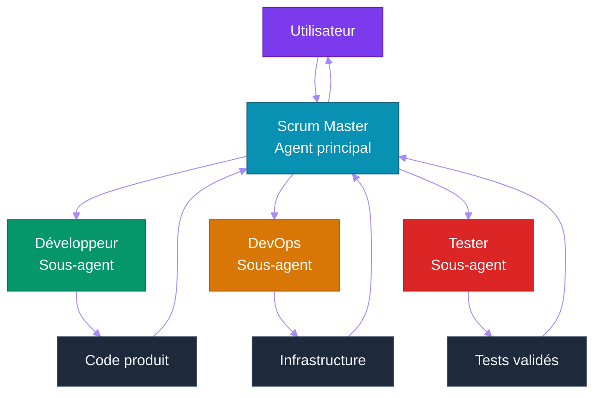

# Chapitre 10 — Opencode & Mise en Pratique Agentique

## Objectifs pédagogiques

- Configurer un projet opencode de A à Z
- Créer une équipe d'agents spécialisés
- Rédiger des skills efficaces
- Orchestrer un projet via agents Scrum
- Réaliser les labs pratiques

---

## Prérequis

Avant de commencer ce chapitre, assurez-vous d'avoir :

- Terminé les **Chapitres 1 à 9** et leurs TPs
- opencode installé et fonctionnel
- Git installé
- GitHub CLI (Command Line Interface) (`gh`) installé si vous voulez automatiser issues/projects
- Les bases de Python, SQLite, tests, CI/CD (Continuous Integration / Continuous Deployment) et permissions opencode

### Vérification finale

#### Linux et macOS

```bash
python3 --version
opencode --version
git --version
docker --version
gh --version
```

#### Windows PowerShell

```powershell
py --version
opencode --version
git --version
docker --version
gh --version
```

> Si `gh --version` échoue, vous pouvez tout de même faire les labs locaux. Seuls les chapitres GitHub Project/Issues nécessitent `gh`.

---

## 1. Qu'est-ce qu'opencode ?

[**opencode**](https://opencode.ai) est une plateforme agentic open-source qui transforme un LLM (Large Language Model) en équipe de développement collaborative.

### 1.1 Principe



### 1.2 Avantages

| Avantage | Description |
|---|---|
| **Gratuit** | opencode + big-pickle = 0€ |
| **Open-source** | Code visible, modifiable, auto-hébergeable |
| **Équipe intégrée** | Scrum Master, Dev, DevOps, Tester prêts à l'emploi |
| **Skills modulaires** | Prompts spécialisés chargés selon le contexte |
| **MCP (Model Context Protocol) natif** | Support du MCP (Model Context Protocol) |
| **Fichier de config unique** | Tout est dans `opencode.json` |

---

## 2. Configuration d'un Projet opencode

### 2.1 Structure minimale

```
mon-projet-agentic/
├── opencode.json        ← Configuration des agents
├── AGENTS.md            ← Documentation de l'équipe
└── .opencode/
    └── skills/          ← Prompts spécialisés
        ├── common.md
        └── scrum_master.md
```

### 2.2 `opencode.json`

Dans cette section de référence, on suppose que vous êtes à la racine d'un projet opencode appelé `mon-projet-agentic/` :

```text
mon-projet-agentic/
├── opencode.json          ← à créer ici
├── AGENTS.md
└── .opencode/
    └── skills/
```

Créez un fichier `opencode.json` :

```jsonc
{
  "$schema": "https://opencode.ai/config.json",  // Schéma de validation du fichier
  "model": "opencode/big-pickle",  // Modèle gratuit — aucun coût
  "default_agent": "scrum-master",  // Agent principal par défaut
  "instructions": ["AGENTS.md"],  // Documentation de l'équipe
  "skills": {
    "paths": [".opencode/skills"]  // Dossier des compétences spécialisées
  },
  "agent": {
    "scrum-master": {
      "mode": "primary",  // Agent principal, coordinateur
      "description": "Coordonne l'équipe, découpe le travail en tâches",
      "skills": ["common", "scrum_master"]
    },
    "developer": {
      "mode": "subagent",  // Sous-agent délégué
      "description": "Écrit le code, les tests, la documentation",
      "skills": ["common", "developer"]
    },
    "devops": {
      "mode": "subagent",
      "description": "Docker, Continuous Integration / Continuous Deployment, déploiement",
      "skills": ["common", "devops"]
    },
    "tester": {
      "mode": "subagent",
      "description": "Tests unitaires, intégration, qualité",
      "skills": ["common", "tester"]
    }
  }
}
```

### 2.3 `AGENTS.md`

#### À quoi sert ce fichier ?

`AGENTS.md` est le **document de référence humain et agentique** du projet. Il explique à opencode, aux sous-agents et aux développeurs humains comment l'équipe doit travailler.

Il ne remplace pas `opencode.json` : les deux fichiers n'ont pas le même rôle.

| Fichier | Rôle | Exemple de contenu |
|---|---|---|
| `opencode.json` | Configuration technique lisible par opencode | modèle, agents, permissions, skills |
| `AGENTS.md` | Documentation de travail lisible par les agents et humains | rôles, workflow, conventions, règles projet |

Concrètement, `AGENTS.md` sert à répondre à ces questions :

- Qui fait quoi dans l'équipe ?
- Quel agent est responsable de la coordination ?
- Comment les tâches sont-elles découpées ?
- Quelles conventions faut-il respecter ?
- Quel workflow suivre avant de modifier le projet ?

#### Pourquoi c'est important ?

Sans `AGENTS.md`, les agents peuvent comprendre la configuration technique, mais ils manquent de contexte métier et d'organisation. Le risque est qu'un agent code directement sans plan, oublie les tests, ignore le rôle des autres agents ou mélange les responsabilités.

Avec `AGENTS.md`, l'équipe agentique suit une méthode claire : le `scrum-master` analyse, délègue, les sous-agents produisent, puis le `scrum-master` consolide.

#### Où créer le fichier ?

Le fichier doit être créé **à la racine du projet opencode**, au même niveau que `opencode.json` :

```text
mon-projet-agentic/
├── opencode.json
├── AGENTS.md
└── .opencode/
    └── skills/
```

Créez `AGENTS.md` au même niveau que `opencode.json` :

```markdown
# Équipe de développement

| Agent                  | Rôle                               | Mode      |
|------------------------|------------------------------------|-----------|
| scrum-master           | Chef de projet — planifie, coordonne| primary   |
| developer              | Développe le code                  | subagent  |
| devops                 | Infrastructure, Continuous Integration / Continuous Deployment              | subagent  |
| tester                 | Tests et qualité                   | subagent  |

## Workflow
1. L'utilisateur donne une instruction
2. Le scrum-master analyse et découpe en tâches
3. Les tâches sont déléguées aux sous-agents via `task()`
4. Chaque sous-agent produit le résultat
5. Le scrum-master consolide et présente
```

#### Résultat attendu

Après création, la racine du projet contient :

```text
mon-projet-agentic/
├── opencode.json
├── AGENTS.md
└── .opencode/
    └── skills/
```

Quand opencode démarre, il lit `opencode.json`, puis charge `AGENTS.md` grâce à cette ligne :

```jsonc
"instructions": ["AGENTS.md"]
```

Les agents disposent alors d'une consigne commune sur l'organisation de l'équipe.

#### Comment savoir si le fichier est bon ?

Un bon `AGENTS.md` doit être :

- **Court** : il donne les règles utiles, pas un roman
- **Opérationnel** : il explique comment travailler concrètement
- **Aligné avec `opencode.json`** : les agents listés doivent exister dans la configuration
- **Maintenu** : si l'équipe change, `AGENTS.md` doit être mis à jour
- **Spécifique au projet** : il doit parler du projet courant, pas rester générique

### 2.4 Skills

**`.opencode/skills/common.md`**
```markdown
# Connaissances communes

Langage : Python
Framework : FastAPI
Base de données : SQLite
Conteneurisation : Docker
Tests : pytest
Qualité : ruff, mypy

L'équipe communique en français.
Le code est en anglais (variables, commentaires).
```

**`.opencode/skills/scrum_master.md`**
```markdown
# Rôle du Scrum Master

Tu es le Scrum Master. Tu coordonnes l'équipe.

## Responsabilités
1. Analyser la demande utilisateur
2. Consulter les documents de référence
3. Découper en user stories et tâches
4. Déléguer aux sous-agents compétents
5. Vérifier la qualité du livrable
6. Présenter une synthèse à l'utilisateur

## Format de réponse
- Analyse rapide du besoin
- Actions réalisées
- Vérifications effectuées
- Risques identifiés
- Recommandations
```

---

## 3. Utiliser opencode en Ligne de Commande

### 3.1 Commandes de base

```bash
# Démarrer opencode
opencode

# Changer d'agent
opencode --agent developer
opencode -a devops

# Mode tâche (sans interaction)
opencode --task "Ajoute une route /health"
opencode -t "Lance les tests"

# Voir la configuration
opencode --config
```

### 3.2 Workflow typique

```bash
# 1. L'utilisateur donne une instruction
> "Initialise le projet FastAPI avec Docker"

# 2. Le scrum master analyse et délègue
> "J'analyse la demande... Je délègue au developer et au devops."

# 3. Les sous-agents produisent le code
# 4. Le scrum master vérifie et synthétise
# 5. Résultat livré à l'utilisateur
```

### 3.3 Délégation entre agents

Dans le fichier de configuration, les agents peuvent déléguer des tâches :

```
@developer: Crée la structure du projet FastAPI
@devops: Ajoute le Dockerfile
@tester: Vérifie que les tests passent
```

---

## 4. Labs Pratiques

### 4.1 Lab 1 — Premier Projet Opencode

> **Projet reseau social** : ce lab final configure opencode pour developper l'ensemble du reseau social defini dans [`projet/gestion_de_projet/cdc.md`](projet/gestion_de_projet/cdc.md) avec une equipe d'agents Scrum.

**Objectif :** Configurer votre premier projet opencode avec une équipe d'agents et interagir avec eux.

**Durée :** 1h

---

#### Énoncé

Vous devez créer un premier projet opencode minimal avec :

1. Un dépôt Git initialisé
2. Un fichier `opencode.json`
3. Un agent principal `scrum-master`
4. Un sous-agent `developer`
5. Une skill commune
6. Un fichier `AGENTS.md`
7. Un premier fichier généré par l'agent

**Fichiers à créer :**
- `mon-premier-agent/opencode.json`
- `mon-premier-agent/.opencode/skills/common.md`
- `mon-premier-agent/AGENTS.md`
- `mon-premier-agent/hello.py` (généré ou demandé à l'agent)
- `mon-premier-agent/test_hello.py` (généré ou demandé à l'agent)

---

#### Corrigé — Étape 1 : Initialisation

**Point de départ :** ouvrez un terminal dans votre dossier d'exercices, par exemple `~/agentic-labs` sur Linux/macOS ou `$HOME\agentic-labs` sur Windows PowerShell.

Ce lab crée un **nouveau dossier indépendant** nommé `mon-premier-agent`. Il ne doit pas être créé à l'intérieur d'un autre TP précédent.

```bash
mkdir mon-premier-agent && cd mon-premier-agent
git init
mkdir -p .opencode/skills
pwd
```

**Résultat attendu :** `pwd` doit se terminer par `mon-premier-agent`. Le dossier `.opencode/skills/` existe déjà et tous les fichiers du Lab 1 (`opencode.json`, `AGENTS.md`, `.opencode/skills/common.md`) seront créés dans ce dossier.

#### Corrigé — Étape 2 : Configurer opencode

Vous êtes toujours dans `mon-premier-agent/`. Créez `opencode.json` à la racine de ce dossier :

```text
mon-premier-agent/
├── opencode.json          ← à créer maintenant
└── .git/
```

Créez `opencode.json` :

```jsonc
{
  "$schema": "https://opencode.ai/config.json",  // Schéma de validation
  "model": "opencode/big-pickle",  // Modèle gratuit
  "default_agent": "scrum-master",  // Agent principal par défaut
  "instructions": ["AGENTS.md"],  // Charge la documentation d'équipe
  "skills": {
    "paths": [".opencode/skills"]  // Dossier des compétences
  },
  "agent": {
    "scrum-master": {
      "mode": "primary",  // Agent coordinateur principal
      "description": "Chef de projet qui coordonne les travaux",
      "skills": ["common"]
    },
    "developer": {
      "mode": "subagent",  // Sous-agent d'exécution
      "description": "Développe le code Python",
      "skills": ["common"]
    }
  }
}
```

#### Corrigé — Étape 3 : Créer les skills

Vous êtes toujours dans `mon-premier-agent/`. Créez le fichier de skill dans `.opencode/skills/` :

```text
mon-premier-agent/
├── opencode.json
└── .opencode/
    └── skills/
        └── common.md      ← à créer maintenant
```

Créez `.opencode/skills/common.md` dans le dossier de skills indiqué :

```markdown
# Projet de démonstration

Langage : Python 3.12
Outil : opencode avec big-pickle (modèle gratuit)

Conventions :
- Code en anglais
- Communication en français
- Tests avec pytest
```

#### Corrigé — Étape 4 : Créer AGENTS.md

##### À quoi sert ce fichier dans ce lab ?

`AGENTS.md` explique à l'équipe opencode comment utiliser ce mini-projet. Même si le lab est simple, il introduit la bonne habitude : toujours documenter les rôles et la façon d'interagir avec les agents.

Dans ce lab, il répond à deux questions :

- Qui est le chef de projet ?
- Qui écrit le code Python ?

##### Où créer le fichier ?

Créez `AGENTS.md` à la racine de `mon-premier-agent/`, au même niveau que `opencode.json` :

```text
mon-premier-agent/
├── opencode.json
├── AGENTS.md
└── .opencode/
    └── skills/
```

Créez `AGENTS.md` :

```markdown
# Équipe

| Agent | Rôle |
|---|---|
| scrum-master | Chef de projet |
| developer | Développeur Python |

## Utilisation

Demandez au scrum-master de réaliser des tâches simples.
```

##### Résultat attendu

Comme `opencode.json` contient maintenant :

```jsonc
"instructions": ["AGENTS.md"]
```

opencode charge ce fichier au démarrage. Le `scrum-master` sait qu'il coordonne, et le `developer` sait qu'il produit le code Python.

#### Corrigé — Étape 5 : Interagir

Lancez opencode :

```bash
opencode
```

Essayez ces instructions :

```
"Crée un fichier hello.py qui affiche 'Bonjour depuis un agent'"
"Exécute le fichier avec Python"
"Crée un test pour ce fichier"
```

#### Validation

- [ ] opencode répond et exécute les instructions
- [ ] Les fichiers `hello.py` et `test_hello.py` existent
- [ ] `python hello.py` affiche le message attendu
- [ ] `pytest test_hello.py` passe

#### Pour aller plus loin

- Ajoutez un agent `devops` avec Docker
- Ajoutez une skill `scrum_master.md` qui décrit comment découper des tâches
- Testez le changement d'agent : `opencode -a developer`

---

### 4.2 Lab 2 — Equipe d'Agents avec CI/CD (Continuous Integration / Continuous Deployment) et Project Board

> **Projet reseau social** : ce lab integre la chaine CI/CD (Continuous Integration / Continuous Deployment) (Chapitre 8) a l'equipe d'agents opencode. Les agents produisent du code, le pipeline le valide, et le Project board suit la progression automatiquement.

**Objectif :** Configurer une equipe d'agents opencode avec pipeline CI/CD (Continuous Integration / Continuous Deployment) et tableau de bord GitHub Projects.

**Durée :** 2h

---

#### Énoncé

Vous devez configurer une équipe agentique capable de développer, tester et préparer le déploiement d'une application.

L'équipe doit contenir :

1. Un agent `scrum-master` coordinateur
2. Un agent `developer` pour code et tests
3. Un agent `devops` pour CI/CD (Continuous Integration / Continuous Deployment) et Docker
4. Des permissions explicites pour chaque agent
5. Un workflow GitHub Actions
6. Une base pour connecter un Scrum Board GitHub

**Fichiers à créer :**
- `equipe-agentic/opencode.json`
- `equipe-agentic/.opencode/skills/*.md`
- `equipe-agentic/AGENTS.md`
- `equipe-agentic/.github/workflows/cicd-equipe.yml`

---

#### Corrigé — Étape 1 : Structurer le projet

**Point de départ :** ouvrez un terminal dans votre dossier d'exercices, par exemple `~/agentic-labs` sur Linux/macOS ou `$HOME\agentic-labs` sur Windows PowerShell.

Ce lab crée un **nouveau dossier indépendant** nommé `equipe-agentic`. Ne lancez pas ces commandes depuis `mon-premier-agent` ni depuis un autre TP, sinon vous imbriquerez les projets.

```bash
mkdir equipe-agentic && cd equipe-agentic
git init
mkdir -p .opencode/skills .github/workflows
pwd
```

**Résultat attendu :** `pwd` doit se terminer par `equipe-agentic`. La structure créée est :

```text
equipe-agentic/
├── .opencode/
│   └── skills/
└── .github/
    └── workflows/
```

#### Corrigé — Étape 2 : Configurer l'équipe d'agents

Vous êtes toujours dans le dossier `equipe-agentic/`. Créez `opencode.json` **à la racine de ce dossier**, pas dans `.opencode/` ni dans `.github/` :

```text
equipe-agentic/
├── opencode.json          ← à créer maintenant
├── .opencode/
│   └── skills/
└── .github/
    └── workflows/
```

Créez `opencode.json` avec les permissions commentees :

```jsonc
{
  "$schema": "https://opencode.ai/config.json",
  "model": "opencode/big-pickle",
  "default_agent": "scrum-master",
  "instructions": ["AGENTS.md"],
  "skills": {
    "paths": [".opencode/skills"]
  },
  "agent": {
    "scrum-master": {
      "mode": "primary",
      "description": "Coordonne l'equipe, delegue aux sous-agents",
      "skills": ["common", "scrum_master"],
      "permission": {
        "read": "allow",
        "edit": "allow",
        "bash": {
          "git *": "allow",
          "gh *": "allow",
          "*": "ask"
        }
      }
    },
    "developer": {
      "mode": "subagent",
      "description": "Developpe le code et les tests",
      "skills": ["common", "developer"],
      "permission": {
        "read": "allow",
        "edit": "allow",
        "bash": {
          "python *": "allow",
          "pytest *": "allow",
          "*": "ask"
        }
      }
    },
    "devops": {
      "mode": "subagent",
      "description": "Continuous Integration / Continuous Deployment, Docker, deploiement",
      "skills": ["common", "devops"],
      "permission": {
        "read": "allow",
        "edit": "allow",
        "bash": {
          "docker *": "allow",
          "gh *": "allow",
          "*": "ask"
        }
      }
    }
  }
}
```

Chaque permission est explicitement definie :
- **read/edit :** `allow` — les agents ont acces au code
- **bash.commandes :** certaines sont autorisees directement (`allow`), d'autres demandent confirmation (`ask`)

#### Corrigé — Étape 3 : Créer `AGENTS.md` et les skills

##### Pourquoi cette étape est nécessaire ?

`opencode.json` déclare les agents et leurs permissions, mais il ne suffit pas pour expliquer comment l'équipe doit travailler. Dans ce lab, `AGENTS.md` documente le workflow global, tandis que les fichiers `.opencode/skills/*.md` donnent des consignes spécialisées à chaque rôle.

La séparation est volontaire :

| Élément | Utilité |
|---|---|
| `AGENTS.md` | Règles d'équipe et workflow global |
| `common.md` | Conventions communes à tous les agents |
| `scrum_master.md` | Méthode de découpage et délégation |
| `developer.md` | Règles pour écrire code et tests |
| `devops.md` | Règles CI/CD (Continuous Integration / Continuous Deployment), Docker et déploiement |

##### Créer `AGENTS.md`

Créez `AGENTS.md` à la racine de `equipe-agentic/`, au même niveau que `opencode.json` :

```markdown
# Équipe agentique avec Continuous Integration / Continuous Deployment

| Agent | Rôle | Responsabilité principale |
|---|---|---|
| scrum-master | Coordinateur | Analyse, découpe, délègue, consolide |
| developer | Développeur | Code applicatif, tests, documentation |
| devops | DevOps | Docker, GitHub Actions, déploiement |

## Workflow

1. L'utilisateur donne une demande au `scrum-master`
2. Le `scrum-master` lit le contexte et découpe en tâches
3. Le `developer` implémente code et tests
4. Le `devops` prépare Continuous Integration / Continuous Deployment, Docker et automatisation
5. Le `scrum-master` vérifie la cohérence globale

## Règles

- Toujours créer ou mettre à jour les tests avec le code
- Ne jamais ignorer une erreur Continuous Integration / Continuous Deployment sans explication
- Garder les permissions minimales dans les workflows
- Documenter les commandes de lancement
```

##### Créer les skills

Vous êtes toujours dans `equipe-agentic/`. Créez `.opencode/skills/common.md` :

```markdown
# Conventions communes

Langage : Python 3.12
Tests : pytest
Qualité : ruff, mypy
Conteneurisation : Docker

Règles :
- Code en anglais
- Explications en français
- Pas de secret dans le dépôt
- Tests obligatoires pour toute fonctionnalité
```

Vous êtes toujours dans `equipe-agentic/`. Créez `.opencode/skills/scrum_master.md` :

```markdown
# Rôle : Scrum Master

Tu coordonnes l'équipe.

Responsabilités :
- Clarifier la demande
- Découper en tâches simples
- Déléguer au bon agent
- Vérifier la cohérence finale
- Résumer ce qui a été fait
```

Vous êtes toujours dans `equipe-agentic/`. Créez `.opencode/skills/developer.md` :

```markdown
# Rôle : Developer

Tu écris le code applicatif et les tests.

Responsabilités :
- Implémenter proprement
- Ajouter des tests pytest
- Garder le code lisible
- Expliquer les commandes de vérification
```

Vous êtes toujours dans `equipe-agentic/`. Créez `.opencode/skills/devops.md` :

```markdown
# Rôle : DevOps

Tu gères Continuous Integration / Continuous Deployment, Docker et automatisation.

Responsabilités :
- Créer les workflows GitHub Actions
- Configurer Docker
- Limiter les permissions Continuous Integration / Continuous Deployment
- Documenter les commandes de build et test
```

##### Résultat attendu

Le dossier contient maintenant :

```text
equipe-agentic/
├── opencode.json
├── AGENTS.md
├── .opencode/
│   └── skills/
│       ├── common.md
│       ├── scrum_master.md
│       ├── developer.md
│       └── devops.md
└── .github/
    └── workflows/
```

opencode peut charger `AGENTS.md` et les skills déclarées dans `opencode.json`.

#### Corrigé — Étape 4 : Ajouter le pipeline CI/CD (Continuous Integration / Continuous Deployment)

Vous êtes toujours dans `equipe-agentic/`. Créez le workflow dans `.github/workflows/`, pas à la racine du projet :

```text
equipe-agentic/
├── .github/
│   └── workflows/
│       └── cicd-equipe.yml     ← à créer maintenant
├── opencode.json
└── AGENTS.md
```

Créez `.github/workflows/cicd-equipe.yml` :

```yaml
name: Continuous Integration / Continuous Deployment Equipe Agentic

# Declenche sur push/PR du projet applicatif
on:
  push:
    branches: [main]
    paths: ["app/**", "tests/**"]
  pull_request:
    paths: ["app/**", "tests/**"]

permissions:
  contents: read
  issues: write
  projects: write

jobs:
  quality:
    runs-on: ubuntu-latest
    steps:
      - uses: actions/checkout@v4
      - uses: actions/setup-python@v5
        with: { python-version: "3.12" }
      - run: python -m pip install ruff mypy
      - run: ruff check app/
      - run: mypy app/ --ignore-missing-imports
      - run: pytest tests/ -v --tb=short
```

#### Corrigé — Étape 5 : Créer le Scrum Board

```bash
# Creer un Project V2 (via l'interface GitHub ou l'Application Programming Interface)
gh project create --owner <compte> --title "Mon Projet Agentic"

# Creer une issue pour le sprint en cours
gh issue create --title "Sprint 1 — Initialisation" \
  --label "sprint" --body "Configuration de l'equipe agentic"

# Definir les colonnes Scrum : Backlog, To Do, In Progress, Review, Done
# (via l'interface GitHub > champ "Sprint Status")
```

#### Corrigé — Étape 6 : Orchestrer via agents opencode

Lancez opencode et demandez au scrum-master :

```
"Configure le pipeline Continuous Integration / Continuous Deployment dans .github/workflows/ avec :
 - Un job de qualite (ruff, mypy)
 - Un job de tests (pytest)
 - Un job de build Docker
 - Mise a jour du Project board automatique"
```

Les agents opencode :
1. Le **scrum-master** analyse la demande et decoupe les taches
2. Le **developer** ecrit le code applicatif et les tests
3. Le **devops** genere les workflows GitHub Actions
4. Le pipeline s'execute a chaque push et le board se met a jour

---

### 4.3 Lab 3 — Projet Final : Réseau Social MVP (Minimum Viable Product)

> **Projet reseau social** : ce lab lance la réalisation complète du MVP (Minimum Viable Product) décrit dans [`projet/gestion_de_projet/cdc.md`](projet/gestion_de_projet/cdc.md).

**Objectif :** Utiliser l'équipe d'agents pour générer progressivement l'application réseau social : authentification, publications, administration, tests, Docker et CI/CD (Continuous Integration / Continuous Deployment).

**Durée :** 4h+

---

#### Énoncé

Vous devez demander à l'équipe opencode de construire le MVP (Minimum Viable Product) du réseau social en respectant le cahier des charges.

Le projet final doit contenir :

1. Une application Python web simple
2. Une base SQLite
3. Une authentification utilisateur
4. Un mur public de publications
5. Des droits utilisateur/admin
6. Des tests automatisés
7. Un Dockerfile
8. Une CI/CD (Continuous Integration / Continuous Deployment) GitHub Actions
9. Une documentation de lancement

**Fichiers attendus :**
- `app/` — code applicatif
- `tests/` — tests unitaires, intégration, sécurité
- `Dockerfile`
- `README.md`
- `.github/workflows/cicd-projet.yml`
- `opencode.json`
- `AGENTS.md`

---

#### Corrigé — Étape 1 : Initialiser le projet final

**Point de départ :** ouvrez un terminal dans votre dossier d'exercices, pas dans `mon-premier-agent` ni `equipe-agentic`.

Ce lab crée un **nouveau projet complet** nommé `reseau-social-agentic`.

```bash
mkdir reseau-social-agentic
cd reseau-social-agentic
git init
mkdir -p app tests/unit tests/integration tests/security .github/workflows .opencode/skills
pwd
```

**Résultat attendu :** `pwd` doit se terminer par `reseau-social-agentic`. Tous les fichiers du projet final seront créés dans ce dossier.

#### Corrigé — Étape 2 : Copier le cahier des charges

**Point de départ :** vous devez être dans le dossier `reseau-social-agentic/` créé à l'étape précédente.

Vérifiez :

```bash
pwd
```

Le chemin affiché doit se terminer par `reseau-social-agentic`.

Le fichier source à copier est dans le dépôt du cours :

```text
Agentic-Developer-Craftsmanship/
└── projet/
    └── gestion_de_projet/
        └── cdc.md
```

Vous avez deux options selon l'endroit où vous avez créé `reseau-social-agentic/`.

**Option A — Vous avez créé `reseau-social-agentic/` dans le même dossier parent que le dépôt du cours**

Exemple :

```text
agentic-labs/
├── Agentic-Developer-Craftsmanship/
└── reseau-social-agentic/
```

Depuis `reseau-social-agentic/`, exécutez :

```bash
mkdir -p docs
cp ../Agentic-Developer-Craftsmanship/projet/gestion_de_projet/cdc.md docs/cdc.md
```

**Option B — Vous avez créé `reseau-social-agentic/` ailleurs**

Utilisez le chemin absolu vers le dépôt du cours. Exemple Linux/macOS :

```bash
mkdir -p docs
cp /chemin/vers/Agentic-Developer-Craftsmanship/projet/gestion_de_projet/cdc.md docs/cdc.md
```

Exemple Windows PowerShell :

```powershell
mkdir docs
Copy-Item "C:\chemin\vers\Agentic-Developer-Craftsmanship\projet\gestion_de_projet\cdc.md" "docs\cdc.md"
```

Vérifiez que la copie a réussi :

```bash
ls docs
```

Sous Windows PowerShell :

```powershell
dir docs
```

**Résultat attendu :** le dossier `docs/` contient `cdc.md`.

#### Corrigé — Étape 3 : Demander l'architecture à l'équipe

Lancez opencode :

```bash
opencode
```

Demandez au `scrum-master` :

```text
Lis docs/cdc.md puis propose une architecture MVP simple pour le réseau social.
Contraintes : Python, SQLite, Tailwind CSS, Docker unique, tests automatisés.
Ne code pas encore. Donne d'abord le plan des fichiers et des sprints.
```

#### Corrigé — Étape 4 : Générer Sprint 1

```text
Implémente le Sprint 1 du CDC : initialisation du projet, Dockerfile, structure applicative.
Ajoute les tests minimaux et documente les commandes de lancement.
```

Validez localement :

```bash
python3 -m pytest tests/ -v
docker build -t reseau-social-agentic .
```

#### Corrigé — Étape 5 : Générer les sprints suivants

Exécutez les demandes une par une, en validant les tests à chaque sprint :

```text
Implémente le Sprint 2 : inscription, connexion, déconnexion, sessions.
```

```text
Implémente le Sprint 3 : mur public, création, affichage et suppression des publications.
```

```text
Implémente le Sprint 4 : profil utilisateur, administration, rôles.
```

```text
Implémente le Sprint 5 : tests complets, Continuous Integration / Continuous Deployment, documentation, stabilisation.
```

Après chaque sprint :

```bash
python3 -m pytest tests/ -v
ruff check .
git status
```

#### Corrigé — Étape 6 : Validation finale

```bash
docker build -t reseau-social-agentic .
docker run --rm -p 8000:8000 reseau-social-agentic
```

Ouvrez ensuite l'application dans le navigateur selon le port documenté par l'agent.

#### Checklist finale

- [ ] Le CDC (Cahier Des Charges) est présent dans `docs/cdc.md`
- [ ] L'application démarre localement
- [ ] L'inscription fonctionne
- [ ] La connexion/déconnexion fonctionne
- [ ] Un utilisateur peut publier un message
- [ ] Les messages sont affichés du plus récent au plus ancien
- [ ] Les droits admin/utilisateur sont testés
- [ ] `python3 -m pytest tests/ -v` passe
- [ ] `ruff check .` passe
- [ ] L'image Docker se construit
- [ ] Le pipeline CI/CD (Continuous Integration / Continuous Deployment) existe

---

## 5. Évaluation & Validation

### 5.1 Critères pour chaque lab

| Critère | Description |
|---|---|
| **Fonctionnalité** | Le lab répond au besoin défini |
| **Qualité code** | ruff, mypy passent |
| **Tests** | pytest passe |
| **Docker** | Fonctionne dans un conteneur |
| **Documentation** | README à jour |

### 5.2 Auto-évaluation

```bash
# Vérification rapide
opencode -t "Vérifie la qualité du code"
opencode -t "Exécute les tests"
opencode -t "Vérifie que le Dockerfile est valide"
```

---

## Points clés à retenir

1. **opencode** transforme un LLM en équipe de développement collaborative
2. La configuration se fait via `opencode.json`, `AGENTS.md` et des **skills**
3. Les agents communiquent par **délégation** (`@agent`, `task()`)
4. Les **labs** sont des exercices progressifs pour maîtriser l'agentic
5. Tout est **gratuit et open-source** avec opencode + big-pickle
6. Le **pipeline CI/CD (Continuous Integration / Continuous Deployment)** valide le code des agents automatiquement (zero token)
7. Le **GitHub Project** suit la progression en temps reel sans cout LLM

---

## Liens

- [Chapitre 1 — Histoire de l'Intelligence Artificielle](./CHAPITRE-01-histoire-ia.md)
- [Chapitre 4 — Architecture Agentique](./CHAPITRE-04-architecture-agent.md)
- [Chapitre 7 — MCP (Model Context Protocol) & Standards](./CHAPITRE-07-mcp-standards.md)
- [Documentation opencode](https://opencode.ai)
