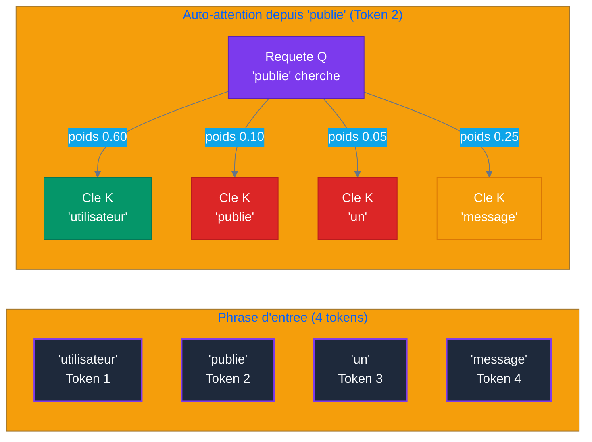

# Partie 1 — Histoire & Genèse de l'IA

## Objectifs pédagogiques

- Comprendre les grandes étapes qui ont mené à l'IA moderne
- Savoir situer chaque découverte dans son contexte
- Distinguer les ruptures fondamentales des améliorations incrémentales
- Comprendre pourquoi les systèmes agentiques émergent aujourd'hui

---

## 1. Les Fondations (1950-2012)

### 1.1 Le test de Turing (1950)

Alan Turing pose la question : *« Les machines peuvent-elles penser ? »* Il propose le **test de Turing** : une machine est dite intelligente si un humain ne peut pas distinguer ses réponses de celles d'un humain lors d'une conversation textuelle aveugle.

**Pourquoi c'est important :** C'est la première formalisation de l'intelligence artificielle comme objectif scientifique.

### 1.2 Les premiers systèmes (1956-1970)

- **1956** : Conférence de Dartmouth — naissance officielle du terme *Intelligence Artificielle*
- **1964-1966** : ELIZA (MIT) — premier chatbot, par simulation de thérapeute rogérien. Simple jeu de motifs, mais les utilisateurs lui attribuaient une conscience.
- **1969** : Minsky & Papert démontrent les limites du perceptron (réseau à une couche). → Premier hiver de l'IA.

**Découverte clé :** Les systèmes à base de règles (*expert systems*) fonctionnent dans des domaines étroits mais ne généralisent pas.

### 1.3 Le premier hiver de l'IA (1970-1980)

- Les promesses n'ont pas été tenues. Les gouvernements réduisent les financements.
- Les systèmes experts sont fragiles : chaque nouvelle règle peut casser les précédentes.
- **Conclusion :** L'intelligence ne peut pas être programmée manuellement à grande échelle. Il faut que la machine apprenne par elle-même.

### 1.4 La renaissance (1980-1990)

- **Rétropropagation** (Rumelhart, Hinton, Williams, 1986) : algorithme fondamental qui permet d'entraîner des réseaux de neurones multicouches.
- Retour des réseaux de neurones, mais toujours limités par la puissance de calcul et les données.

### 1.5 Le deuxième hiver (1990-2000)

- Les SVM (Support Vector Machines) et méthodes bayésiennes dominent. Les réseaux de neurones sont jugés trop instables.
- **Conclusion :** Sans données massives ni calcul parallèle, le deep learning ne peut pas exprimer son potentiel.

### 1.6 La révolution du Big Data (2000-2012)

- Internet explose → données massives disponibles.
- GPU (Graphics Processing Unit) gaming → calcul parallèle accessible.
- **2009** : Fei-Fei Li lance **ImageNet** — 14 millions d'images labellisées.
- **2012** : **AlexNet** (Krizhevsky, Sutskever, Hinton) gagne ImageNet avec une avance écrasante. Le deep learning entre dans l'ère moderne.

**Rupture :** Pour la première fois, un réseau de neurones profonds surpasse massivement toutes les méthodes traditionnelles en vision par ordinateur.

---

## 2. La Rupture Transformer (2017)

### 2.1 Le papier fondateur

En juin 2017, Vaswani et al. publient **"Attention Is All You Need"** (Google Research). L'article propose une architecture radicalement nouvelle : le **Transformer** (architecture de deep learning basée sur l'auto-attention).

### 2.2 Le problème que ça résout

Avant le Transformer, les modèles de séquence (RNN (Recurrent Neural Network), LSTM (Long Short-Term Memory)) traitaient les mots un par un, séquentiellement :
- Impossible de paralléliser → lent
- Difficulté à capturer les dépendances longues (au-delà de ~50 mots)
- Gradient qui disparaît (*vanishing gradient*) dans les longues séquences

### 2.3 Le mécanisme d'attention

Le Transformer introduit **l'auto-attention** (*self-attention*, mécanisme d'attention qui pondère l'importance relative des mots) : chaque mot regarde tous les autres mots de la phrase en même temps et décide sur lesquels porter son attention.

**Exemple (projet reseau social) — visualisation des poids d'attention :**



### 2.4 La scalabilité

Contrairement aux RNN, le Transformer peut être parallélisé et **scalé** : plus de paramètres, plus de données, plus de GPU = meilleures performances. Cette propriété de *scaling* est ce qui a rendu possible les modèles modernes.

### 2.5 Pourquoi c'est une découverte fondamentale

| Avant Transformer | Après Transformer |
|:---|---:|
| Traitement séquentiel (lent) | Parallélisable (rapide) |
| Contexte limité (~50-100 tokens) (unité de texte, mot ou sous-mot) | Contexte long (128K+ tokens) |
| Scaling difficile | Scaling linéaire avec les ressources |
| Un domaine à la fois (NLP (Natural Language Processing) ou vision) | Architecture universelle (texte, image, audio, code) |

---

## 3. L'Ère Générative (2020-2023)

### 3.1 GPT-3 (Generative Pre-trained Transformer 3) et l'émergence (2020)

OpenAI publie GPT-3 (175 milliards de paramètres). La découverte n'est pas le modèle lui-même, mais **l'émergence** :
- GPT-2 (1.5B) était faible sur les tâches complexes
- GPT-3 (175B) sait faire des choses qui n'étaient pas programmées explicitement : traduction jamais vue, raisonnement simple, code

**Découverte :** Quand un modèle dépasse un certain seuil de paramètres, des capacités nouvelles apparaissent spontanément (*emergence*).

### 3.2 RLHF (Reinforcement Learning from Human Feedback) — Le tournant (2022)

Le **Reinforcement Learning from Human Feedback** (RLHF) aligne les LLMs sur les préférences humaines :
1. Un modèle pré-entraîné génère des réponses
2. Des humains notent ces réponses
3. On entraîne un *reward model* qui prédit la note humaine
4. On fine-tune le LLM (Large Language Model) avec ce reward model

**Résultat :** Les modèles ne sont plus seulement *capables*, ils sont *utiles et alignés*. ChatGPT (novembre 2022) en est le premier exemple grand public.

### 3.3 Instruction Tuning & Chain-of-Thought

- **Instruction Tuning** (2022) : Fine-tuner le modèle sur des paires (instruction, réponse correcte). Le modèle apprend à *suivre des instructions* plutôt qu'à *continuer du texte*.
- **Chain-of-Thought** (Wei et al., 2022) : Demander au modèle de *raisonner étape par étape* améliore drastiquement les résultats sur les tâches de raisonnement.

### 3.4 L'explosion GPT-4 & concurrents (2023)

- **GPT-4** (mars 2023) : multimodal, raisonnement avancé, capable de passer des examens (barreau, médecine)
- **Claude** (Anthropic) : focus sur la sécurité et la transparence
- **Llama 2** (Meta) : open-source, poids disponibles
- **Mistral** : efficient, open-source, performant

**Découverte de 2023 :** Les modèles open-source (Llama, Mistral) rattrapent rapidement les modèles propriétaires sur de nombreuses tâches.

---

## 4. L'Ère Agentique (2024-2026)

### 4.1 Le constat de départ

Un LLM seul est passif :
- Il répond à des prompts, mais n'agit pas
- Il n'a pas de mémoire persistante
- Il ne peut pas utiliser d'outils
- Il ne planifie pas

**Solution :** Envelopper le LLM dans une **boucle agent** qui lui donne des capacités d'action et de raisonnement.

### 4.2 Tool Use & Function Calling (2024)

Le LLM peut déclarer quel outil utiliser, et un orchestrateur exécute l'appel :

```
"Quel temps fait-il à Paris ?"
→ LLM : tool_call(get_weather, city="Paris")
→ Exécution : get_weather("Paris") → "15°C, nuageux"
→ LLM : "Il fait 15°C et nuageux à Paris."
```

**Rupture :** Le LLM passe de *producteur de texte* à *orchestrateur d'actions*.

### 4.3 Le pattern ReAct (Reasoning + Acting) (2023-2024)

**ReAct** (Reasoning + Acting, Yao et al., 2023) alterne pensée, action et observation :

```
Thought: L'utilisateur veut connaître la météo à Paris. Je dois utiliser l'API (Application Programming Interface) météo.
Action: get_weather("Paris")
Observation: 15°C, nuageux
Thought: J'ai la météo. Je peux répondre.
Réponse: Il fait 15°C à Paris avec un ciel nuageux.
```

Ce pattern est la base de tous les systèmes agentiques modernes.

### 4.4 Mémoire & RAG (Retrieval-Augmented Generation) (2024)

Deux types de mémoire émergent :
- **Court-terme** : le contexte de la conversation (fenêtre de tokens)
- **Long-terme** : stockage persistant (vecteurs embeddings, base SQL (Structured Query Language))

Le **RAG** (Retrieval-Augmented Generation) combine :
1. Indexer des documents sous forme de vecteurs (embeddings)
2. À chaque question, chercher les passages les plus pertinents
3. Les injecter dans le contexte du LLM

### 4.5 Multi-Agent Orchestration (2025-2026)

Patterns qui émergent :
- **Supervisor** : un LLM chef délègue à des sous-agents spécialisés
- **Fan-out** : plusieurs agents travaillent en parallèle
- **Débat** : plusieurs agents argumentent pour converger vers une meilleure réponse
- **Hiérarchique** : agents subordonnés → agents managers → agent décisionnaire

### 4.6 MCP — Model Context Protocol (2025-2026)

Anthropic introduit **MCP**, un standard ouvert pour connecter LLMs à des sources de données et outils :
- Un serveur MCP expose des *ressources*, *outils* et *prompts*
- N'importe quel client MCP (LLM, agent, application) peut les consommer
- Equivalent du *USB-C* pour l'IA : interopérabilité universelle

### 4.7 GitHub Agents & opencode (2026)

- **GitHub Copilot Coding Agent** : agent autonome dans l'IDE (Integrated Development Environment), capable de chercher, lire, éditer, exécuter des tests
- **Opencode** : plateforme agentic open-source orchestrant des équipes d'agents spécialisés via des fichiers de configuration (`opencode.json`, `AGENTS.md`)
- Les agents deviennent des membres à part entière de l'équipe de développement

> **Projet reseau social** : tout au long de ce cours, nous utiliserons comme projet le developpement d'une application web sociale simplifiee (inspiree de Twitter/Facebook). Le Cahier des Charges complet est disponible dans [`projet/gestion_de_projet/cdc.md`](projet/gestion_de_projet/cdc.md). Chaque TP montrera comment l'agentic permet de construire ce projet concret.

---

## 5. Panorama 2026

### 5.1 Les acteurs

| Acteur | Modèle phare | Particularité |
|---|---|---|
| OpenAI | GPT-5 | Généraliste, API la plus utilisée |
| Anthropic | Claude Opus 4.5 | Sécurité, long contexte, agentic |
| Google | Gemini 2.0 | Multimodal natif |
| Meta | Llama 4 | Open-source performant |
| Mistral | Mistral Large | Efficient, open-source |
| xAI | Grok 3 | Raisonnement, temps réel |

### 5.2 Benchmarks clés

- **SWE-bench** (résolution de bugs GitHub) : de 3% (2023) à >90% (2026)
- **HumanEval** (génération de code) : saturé à ~95%
- **MMLU** (connaissance générale) : saturé à ~92%

**Tendance :** Les benchmarks classiques saturent. Les nouveaux benchmarks (SWE-bench, AgentBench) mesurent les capacités *agentiques* plutôt que la connaissance statique.

### 5.3 Limites actuelles

- **Hallucination** : les modèles inventent encore des faits
- **Coût** : un appel agentique peut coûter 10-100x un appel classique
- **Latence** : les boucles agentiques multiplient les appels
- **Prompt injection** : des instructions malveillantes dans les données peuvent détourner un agent
- **Jailbreak** : contournement des garde-fous de sécurité

### 5.4 Pourquoi ce cours ?

Les LLMs seuls sont insuffisants pour les applications réelles. La compétence la plus demandée en 2026 n'est pas la *prompt engineering* mais l'**architecture agentique** : concevoir des systèmes où des LLMs collaborant avec des outils, de la mémoire et d'autres agents résolvent des problèmes complexes de façon autonome.

Ce cours vous donne les clés pour concevoir, construire et déployer ces systèmes.

---

## Pour aller plus loin

- Vaswani et al., *"Attention Is All You Need"* (2017)
- Wei et al., *"Chain-of-Thought Prompting Elicits Reasoning in Large Language Models"* (2022)
- Yao et al., *"ReAct: Synergizing Reasoning and Acting in Language Models"* (2023)
- Anthropic, *"Model Context Protocol"* (2025)
- GitHub, *"Copilot Coding Agent"* (2026)

---
**Projet reseau social** : [`projet/gestion_de_projet/cdc.md`](projet/gestion_de_projet/cdc.md)
