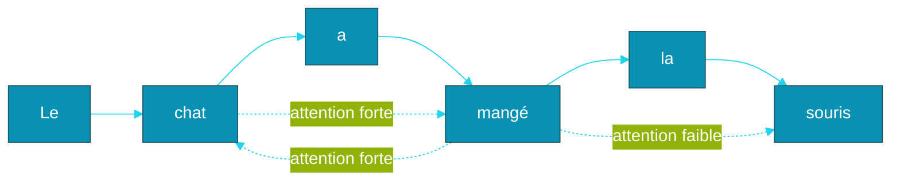
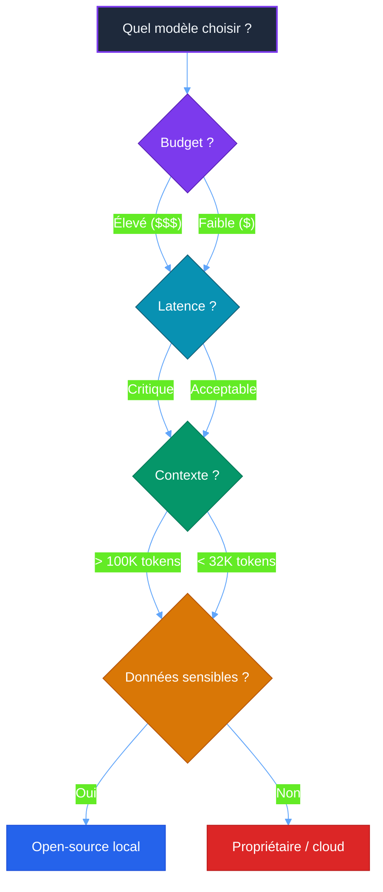

# Partie 2 — Architecture des LLMs

## Objectifs pédagogiques

- Comprendre le fonctionnement interne d'un LLM (Large Language Model) (tokenisation → prédiction)
- Maîtriser la notion de fenêtre de contexte et ses implications
- Connaître les différents types de modèles et leurs usages
- Comprendre les scaling laws et l'émergence

---

## 1. Tokenisation

### 1.1 Principe

Un LLM ne lit pas du texte, il lit des **tokens** (unités de texte, mots ou sous-mots) — des morceaux de mots ou caractères.

```
"Les agents IA sont fascinants"
→ ["Les", " agents", " IA", " sont", " fascin", "ants"]
```

**Règles générales :**
- 1 token ≈ 0.75 mot en français
- 1 token ≈ 0.25 mot en anglais (plus dense)
- Les mots rares ou techniques sont découpés en plusieurs tokens
- Les espaces et ponctuations comptent

### 1.2 Implications pratiques

| Capacité | Tokens | Mots (français) |
|---|---|---|
| Contexte court (GPT (Generative Pre-trained Transformer)-3) | 4 096 | ~3 000 |
| Contexte long (GPT-4) | 128 000 | ~96 000 |
| Contexte géant (Claude 4) | 200 000 | ~150 000 |
| Contexte infini (Gemini) | 1 000 000 | ~750 000 |

**Impact sur les agents :** Plus la fenêtre de contexte est grande, plus l'agent peut raisonner sur des informations nombreuses avant de décider.

---

## 2. Mécanisme d'Attention

### 2.1 Le problème

Dans une phrase, les mots n'ont pas tous la même importance et leurs relations ne sont pas linéaires :

```
"Le chat, qui avait très faim, a mangé la souris."
                     ↑
               "a mangé" se réfère à "chat", pas à "souris"
```

### 2.2 Solution : Self-Attention

Chaque token calcule un **score d'attention** (mécanisme de pondération contextuelle) avec tous les autres tokens de la phrase :



L'attention permet au modèle de **pondérer** l'influence de chaque mot sur la représentation des autres.

### 2.3 Multi-Head Attention

Au lieu d'un seul calcul d'attention, on en fait plusieurs en parallèle (*têtes*) :
- Une tête peut capturer les relations grammaticales
- Une autre les relations sémantiques
- Une autre la position dans la phrase

Le tout est concaténé et re-projeté.

---

## 3. Architecture Transformer

### 3.1 Vue d'ensemble

```mermaid
%%{init: {'theme': 'base', 'themeVariables': {
  'primaryColor': '#059669',
  'primaryTextColor': '#fff',
  'primaryBorderColor': '#047857',
  'lineColor': '#34d399'
}}}%%
graph TD
    subgraph Entrée
        I[Texte d'entrée]
    end
    I --> T[Tokenisation + Embedding]
    T --> P[Positional Encoding]
    
    subgraph Transformer Block × N
        P --> MHA[Multi-Head Attention]
        MHA --> A1[Add & LayerNorm]
        A1 --> FF[Feed Forward]
        FF --> A2[Add & LayerNorm]
    end
    
    A2 --> O[Sortie]
    
    style I fill:#1e293b,color:#f1f5f9,stroke:#334155
    style T fill:#7c3aed,color:#fff,stroke:#5b21b6
    style P fill:#7c3aed,color:#fff,stroke:#5b21b6
    style MHA fill:#0891b2,color:#fff,stroke:#155e75
    style A1 fill:#0891b2,color:#fff,stroke:#155e75
    style FF fill:#0891b2,color:#fff,stroke:#155e75
    style A2 fill:#0891b2,color:#fff,stroke:#155e75
    style O fill:#059669,color:#fff,stroke:#047857
```

### 3.2 Les couches

1. **Embedding** (représentation vectorielle d'un token) : chaque token → vecteur numérique dense (ex: 4096 dimensions)
2. **Positional Encoding** : ajoute une information de position (ordre des mots)
3. **Multi-Head Attention** : calcule les relations entre tous les tokens
4. **Feed Forward** : réseau de neurones classique qui transforme chaque token
5. **LayerNorm** : normalisation qui stabilise l'entraînement
6. **Résidu** (Add) : ajoute l'entrée à la sortie (*skip connection*)

Ces blocs sont empilés **N fois** (ex: GPT-3 = 96 couches).

---

## 4. Scaling Laws

### 4.1 La découverte (Kaplan et al., 2020)

Les performances d'un LLM suivent une **loi de puissance** prévisible :

```
Performance ∝ (Paramètres) × (Données) × (Calcul)
```

Si on multiplie l'un de ces trois facteurs par 10, la performance s'améliore de façon prévisible.

### 4.2 L'émergence (2022)

Au-delà d'un certain seuil (~100 milliards de paramètres), des capacités **émergent** :

| Taille | Capacités |
|---|---|
| < 1B | Génération basique, complétion |
| 1-10B | Traduction,问答 simple |
| 10-100B | Raisonnement, code, planification |
| > 100B | Émergence : tool use, instruction following avancé |

### 4.3 Évolution des modèles (2018-2026)

| Modèle | Année | Paramètres | Contexte |
|---|---|---|---|
| GPT-1 | 2018 | 117M | 512 |
| GPT-2 | 2019 | 1.5B | 1 024 |
| GPT-3 | 2020 | 175B | 2 048 |
| GPT-4 | 2023 | ~1.8T | 128K |
| Claude 4 | 2025 | ~2T | 200K |
| DeepSeek-R1 | 2025 | ~1T | 128K |
| GPT-5 | 2026 | ~3T | 256K |

---

## 5. Processus de génération

### 5.1 Autoregression

Un LLM génère du texte **token par token**, en prédisant le token suivant à chaque étape :

```
"Les agents" → ["IA"] (probabilité 0.45)
            → ["intelligents"] (probabilité 0.30)
            → ["autonomes"] (probabilité 0.15)
            → ...
```

### 5.2 Température

Contrôle l'**aléas** dans la sélection du prochain token :

| Température | Effet | Usage |
|---|---|---|
| 0.0 | Toujours le token le plus probable | Précision, faits |
| 0.2 - 0.5 | Peu d'aléas | Code, logique |
| 0.7 - 0.9 | Aléas modéré | Créatif, conversation |
| 1.0+ | Très aléas | Brainstorming, poésie |

### 5.3 Top-k et Top-p

- **Top-k** : ne considérer que les k tokens les plus probables
- **Top-p** : ne considérer que les tokens dont la somme cumulée des probabilités atteint p

---

## 6. Types de modèles

### 6.1 Modèles propriétaires

| Modèle | Forces | Faiblesses |
|---|---|---|
| GPT-5 | Généraliste, API (Application Programming Interface) stable | Coûteux, pas modifiable |
| Claude 4 | Long contexte, safety | Moins performant en code |
| Gemini 2 | Multimodal natif | Moins flexible |

### 6.2 Modèles open-source

| Modèle | Forces | Usage |
|---|---|---|
| Llama 4 | Performant, communauté | Fine-tuning (ajustement fin du modèle sur des données spécifiques) local |
| Mistral | Efficient, léger | Applications embarquées |
| DeepSeek | Raisonnement, math | Tâches complexes |
| Qwen | Multilingue | International |

### 6.3 Critères de choix pour un agent



---

> **Projet reseau social** : le projet social defini dans [`projet/gestion_de_projet/cdc.md`](projet/gestion_de_projet/cdc.md) utilisera les LLMs via opencode pour automatiser le developpement de ses fonctionnalites (authentification, mur public, gestion utilisateurs).

---

## Points clés à retenir

1. Un LLM est un **prédicteur de tokens** entraîné sur des masses de texte
2. Le **Transformer** est l'architecture universelle depuis 2017
3. L'**attention** permet au modèle de se concentrer sur les relations pertinentes
4. Le **scaling** (plus de paramètres + données + calcul) améliore les performances de façon prévisible
5. L'**émergence** de capacités agentiques (tool use, planification) apparaît au-delà d'un certain seuil
6. Le choix d'un modèle dépend du **budget, de la latence, du contexte requis et de la sensibilité des données**

---

## Liens

- [Partie 1 — Histoire de l'IA (Intelligence Artificielle)](./PARTIE-01-histoire-ia.md)
- [Partie 3 — Prompt & Tool Use](./PARTIE-03-prompt-tool-use.md)
- [Documentation technique — Architecture Transformer (Vaswani et al., 2017)](https://arxiv.org/abs/1706.03762)

---
**Projet reseau social** : [`projet/gestion_de_projet/cdc.md`](projet/gestion_de_projet/cdc.md)
