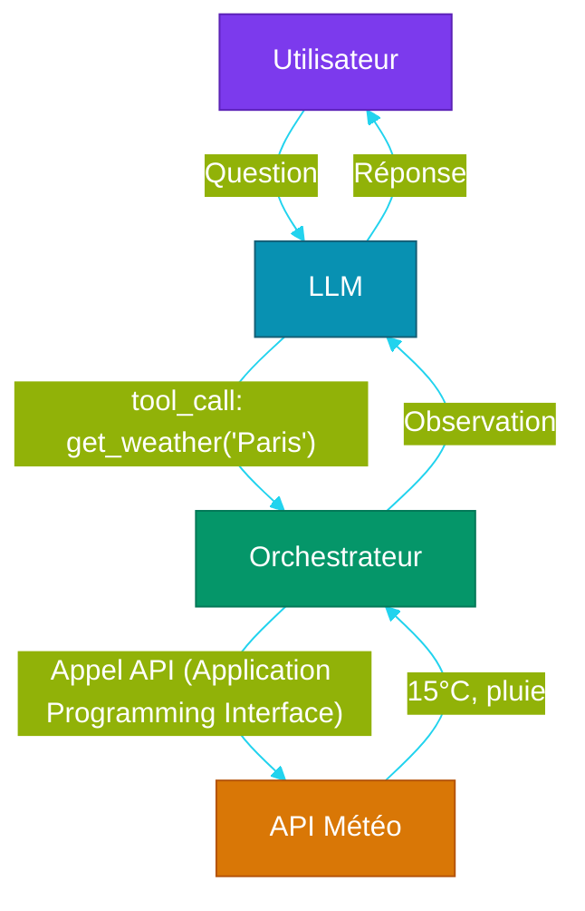
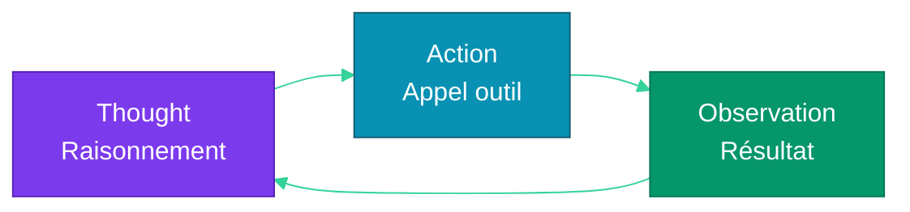

# Partie 3 — Prompt Engineering & Tool Use

## Objectifs pédagogiques

- Maîtriser les différentes techniques de prompting
- Savoir concevoir un system prompt efficace
- Comprendre et implémenter le function calling
- Maîtriser le pattern ReAct (Reasoning + Acting)

---

## 1. Les Fondamentaux du Prompt

### 1.1 Structure d'un prompt

Un prompt se compose de plusieurs éléments :

```mermaid
%%{init: {'theme': 'base', 'themeVariables': {
  'primaryColor': '#6366f1',
  'primaryTextColor': '#fff',
  'lineColor': '#818cf8'
}}}%%
graph LR
    subgraph Prompt
        SP[System Prompt<br/>Rôle, règles, contexte]
        UP[User Prompt<br/>Question, tâche]
        EX[Exemples<br/>(Few-shot)]
    end
    
    SP --> LLM[LLM (Large Language Model)]
    UP --> LLM
    EX --> LLM
    LLM --> R[Réponse]
    
    style SP fill:#7c3aed,color:#fff,stroke:#5b21b6
    style UP fill:#0891b2,color:#fff,stroke:#155e75
    style EX fill:#059669,color:#fff,stroke:#047857
    style LLM fill:#d97706,color:#fff,stroke:#b45309
    style R fill:#2563eb,color:#fff,stroke:#1d4ed8
```

### 1.2 System Prompt

Le **system prompt** définit le rôle, le ton et les contraintes :

```
Tu es un assistant expert en développement Python.
Tu réponds uniquement avec du code fonctionnel.
Tu expliques brièvement ton raisonnement avant chaque réponse.
```

**Bonnes pratiques :**
- Clair et direct (pas d'ambiguïté)
- Règles précises (format, longueur, ton)
- Contraintes de sécurité (ne pas exécuter de code dangereux)
- Contexte utile (utilisateur, projet, version)

### 1.3 User Prompt

Le prompt utilisateur contient la **demande spécifique** :

```
Peux-tu écrire une fonction Python qui vérifie
si un email est valide ?
```

---

## 2. Techniques de Prompting

### 2.1 Zero-shot

Donner une instruction sans exemple. Fonctionne bien pour les tâches simples.

```
Traduis en anglais : "Les agents IA sont fascinants"
→ "AI agents are fascinating"
```

### 2.2 Few-shot

Fournir **2-3 exemples** avant la question. Améliore la précision pour les tâches complexes.

```
Anglais → Français
"Hello world" → "Bonjour le monde"
"Good morning" → "Bonjour"
"AI agents" → ?
```

### 2.3 CoT (Chain-of-Thought)

Demander au modèle de **raisonner étape par étape** :

```
Jean a 12 pommes. Il en donne 3 à Marie, puis en achète 5.
Combien en a-t-il maintenant ?

Raisonnement :
1. Jean commence avec 12 pommes
2. Il donne 3 à Marie : 12 - 3 = 9
3. Il achète 5 : 9 + 5 = 14
Résultat : 14 pommes
```

**Quand l'utiliser :** Problèmes mathématiques, logiques, planification, décisions multi-étapes.

### 2.4 Instruction vs Format

On peut structurer la réponse attendue :

```
Tu es un assistant de réservation.
Pour chaque demande, réponds au format JSON :
{
  "action": "réserver | annuler | consulter",
  "paramètres": { ... }
}

Demande : "Je veux réserver une table pour 2 à 20h"
```

### 2.5 Persona Pattern

Donner un rôle spécifique au modèle :

```
Tu es un DevOps senior avec 15 ans d'expérience.
Analyse ce Dockerfile et identifie les problèmes de sécurité.
```

---

## 3. Tool Use & Function Calling

### 3.1 Principe

Le LLM peut déclarer qu'il souhaite utiliser un outil externe, sans l'exécuter lui-même.



### 3.2 Définir un outil

```python
tools = [
    {
        "type": "function",
        "function": {
            "name": "get_weather",
            "description": "Obtenir la météo d'une ville",
            "parameters": {
                "type": "object",
                "properties": {
                    "city": {
                        "type": "string",
                        "description": "Nom de la ville"
                    }
                },
                "required": ["city"]
            }
        }
    }
]
```

### 3.3 Appel et exécution

```
Réponse LLM : tool_call(id="call_123", name="get_weather", args={"city": "Paris"})

→ Orchestrateur exécute : get_weather("Paris") → "15°C, nuageux"

→ Envoie l'observation au LLM :
  tool_result(id="call_123", content="15°C, nuageux")

→ LLM répond : "Il fait 15°C et nuageux à Paris."
```

### 3.4 Bonnes pratiques

| Pratique | Pourquoi |
|---|---|
| Description claire de l'outil | Le LLM comprend quand l'utiliser |
| Paramètres bien typés | Moins d'erreurs d'appel |
| Gestion des erreurs | L'outil peut échouer → le LLM doit le savoir |
| Timeout | Un outil lent bloque l'agent |
| Sécurité | Vérifier les arguments avant exécution |

---

## 4. Le Pattern ReAct

### 4.1 Principe

**ReAct** (Reasoning + Acting) alterne trois étapes :



1. **Thought** : Le LLM réfléchit à ce qu'il doit faire
2. **Action** : Il appelle un outil ou produit une réponse
3. **Observation** : Le résultat de l'outil est renvoyé au LLM

### 4.2 Exemple complet

```
Question : "Quel est l'écart de température entre Paris et Tokyo aujourd'hui ?"

Thought: Je dois obtenir la météo des deux villes, puis calculer la différence.
Action: get_weather("Paris")
Observation: 15°C, nuageux

Thought: J'ai la météo de Paris. Il me faut celle de Tokyo.
Action: get_weather("Tokyo")
Observation: 22°C, ensoleillé

Thought: J'ai les deux températures. L'écart est de 22 - 15 = 7°C.
Réponse: L'écart de température entre Paris (15°C) et Tokyo (22°C) est de 7°C.
```

### 4.3 Implémentation simple

```python
def agent_loop(question: str, max_steps: int = 5):
    messages = [{"role": "user", "content": question}]
    
    for step in range(max_steps):
        response = llm.chat(messages, tools=tools)
        
        if response.content:  # Réponse finale
            return response.content
        
        if response.tool_calls:
            for tool_call in response.tool_calls:
                result = execute_tool(tool_call)
                messages.append(tool_call.to_message())
                messages.append({
                    "role": "tool",
                    "content": str(result),
                    "tool_call_id": tool_call.id
                })
    
    return "Max steps atteint"
```

---

## 5. Système de prompt pour un agent

Voici un exemple de **system prompt** pour un agent complet :

```
Tu es un agent autonome capable d'utiliser des outils.
Règles :
1. Réfléchis avant d'agir (Thought: ...)
2. Utilise les outils à ta disposition si nécessaire (Action: ...)
3. Observe le résultat des outils (Observation: ...)
4. Réponds à l'utilisateur quand tu as assez d'informations

Outils disponibles :
- get_weather(ville) → météo actuelle
- search(query) → recherche web
- calculate(expression) → calcul mathématique

Ne JAMAIS inventer des résultats d'outils.
Si un outil échoue, explique pourquoi à l'utilisateur.
```

---

## Points clés à retenir

1. Le **prompt engineering** est la première compétence à maîtriser pour interagir avec les LLMs
2. Le **few-shot** et le **chain-of-thought** améliorent significativement la qualité des réponses
3. Le **function calling** transforme un LLM passif en orchestrateur d'actions
4. Le **pattern ReAct** (Thought → Action → Observation) est la boucle fondamentale de tout système agentique
5. Un **system prompt bien conçu** est crucial pour le comportement d'un agent

---

## Liens

- [Partie 2 — Architecture des LLMs](./PARTIE-02-fondations-llm.md)
- [Partie 4 — Architecture Agentique](./PARTIE-04-architecture-agent.md)
- [Référence OpenAI Function Calling](https://platform.openai.com/docs/guides/function-calling)
- [ReAct Paper (Yao et al., 2023)](https://arxiv.org/abs/2210.03629)
