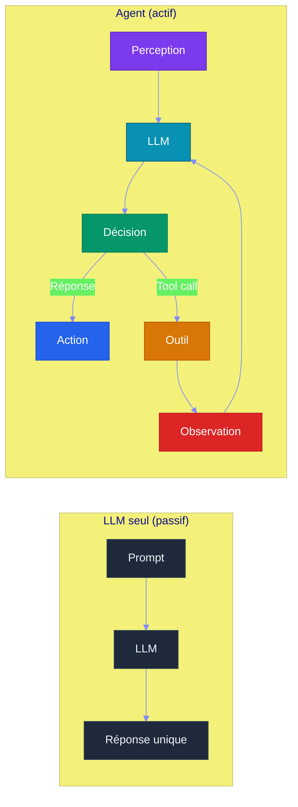
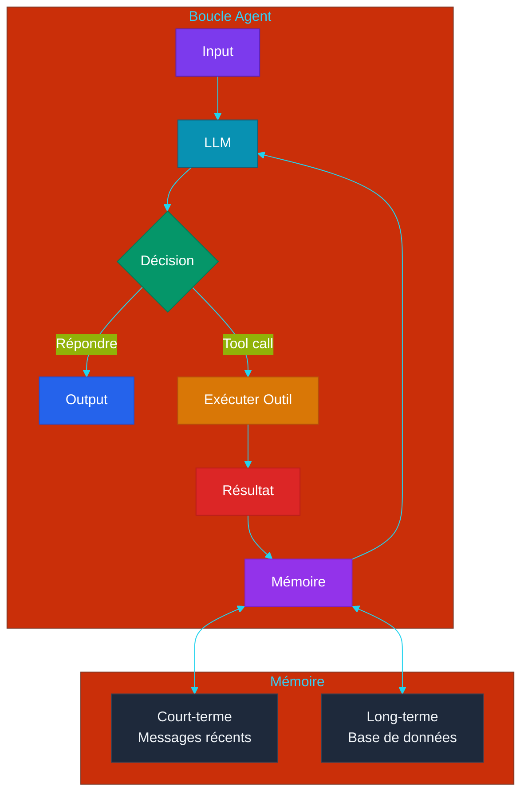
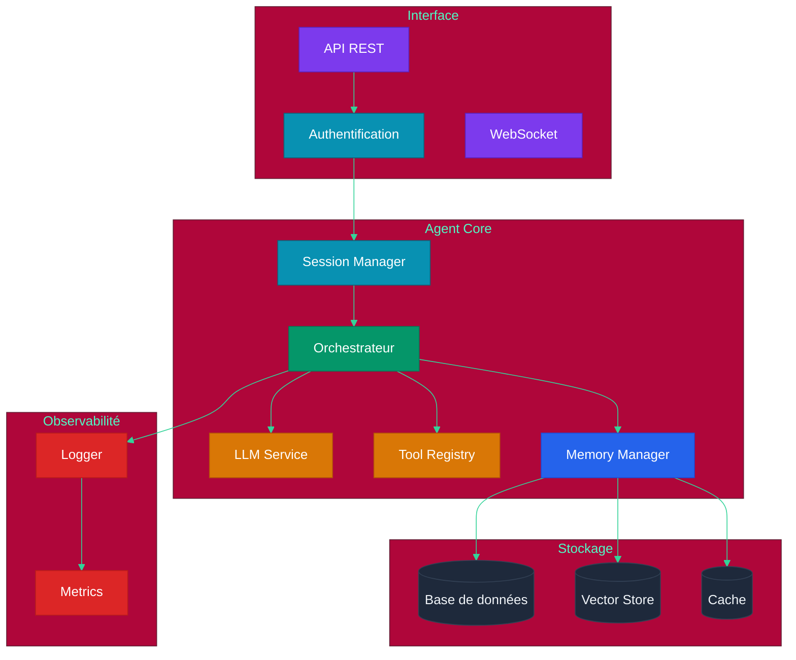

# Partie 4 — Architecture Agentique

## Objectifs pédagogiques

- Comprendre ce qu'est un agent et en quoi il diffère d'un LLM (Large Language Model) seul
- Maîtriser la boucle agent (perception → raisonnement → action)
- Savoir implémenter un agent simple avec état
- Comprendre la gestion de contexte et de mémoire court-terme

---

## 1. Qu'est-ce qu'un Agent ?

### 1.1 Définition

Un **agent** est un système qui :
1. **Perçoit** son environnement (entrée utilisateur, données, événements)
2. **Raisonné** à partir de ces perceptions (via un LLM)
3. **Agit** sur son environnement (réponse, appel d'outil, modification)

### 1.2 LLM seul vs Agent



| Caractéristique | LLM seul | Agent |
|---|---|---|
| Appels API (Application Programming Interface) | 1 | Multiples (boucle) |
| Mémoire | Fenêtre de contexte | Contexte + mémoire persistante |
| Outils | Aucun | Function calling |
| Planification | Aucune | ReAct (Reasoning + Acting), plan multi-étapes |
| Autonomie | Réponse unique | Boucle jusqu'à résolution |

---

## 2. La Boucle Agent

### 2.1 Architecture générale



### 2.2 États de l'agent

Un agent peut être dans plusieurs états :

| État | Description | Action |
|---|---|---|
| **Idle** | En attente d'entrée | Écouter |
| **Thinking** | Le LLM raisonne | Appel LLM |
| **Acting** | Exécution d'un outil | Appel externe |
| **Observing** | Traitement du résultat | Mise à jour mémoire |
| **Error** | Échec d'un outil | Log + re-planification |
| **Done** | Objectif atteint | Retour à Idle |

### 2.3 Implémentation minimale

> **Projet fil rouge** : l'architecture agentique developpee ici sera utilisee pour coordonner le developpement du reseau social defini dans [`projet/gestion_de_projet/cdc.md`](projet/gestion_de_projet/cdc.md).

Créez `agent_simple.py` :

```python
class Agent:
    def __init__(self, llm, tools, system_prompt):
        # Initialise l'agent avec le modèle de langage, les outils et le prompt système
        self.llm = llm  # Modèle de langage pour les réponses
        self.tools = tools  # Outils disponibles pour l'agent
        self.memory = [{"role": "system", "content": system_prompt}]  # Mémoire initiale avec le prompt système
    
    def run(self, user_input: str, max_steps: int = 10):
        # Boucle principale de l'agent : perçoit, raisonne et agit
        self.memory.append({"role": "user", "content": user_input})  # Ajoute l'entrée utilisateur à la mémoire
        
        for step in range(max_steps):  # Limite le nombre d'itérations pour éviter les boucles infinies
            response = self.llm.chat(self.memory, tools=self.tools)  # Appelle le LLM avec la mémoire et les outils
            
            if response.content:  # Si le LLM produit une réponse textuelle (pas d'appel d'outil)
                self.memory.append({"role": "assistant", "content": response.content})  # Stocke la réponse
                return response.content  # Retourne la réponse finale à l'utilisateur
            
            if response.tool_calls:  # Si le LLM demande l'exécution d'un ou plusieurs outils
                for tc in response.tool_calls:  # Parcourt chaque appel d'outil
                    result = self.execute_tool(tc)  # Exécute l'outil et récupère le résultat
                    self.memory.append(tc.to_message())  # Ajoute l'appel d'outil à l'historique
                    self.memory.append({"role": "tool", "content": result})  # Ajoute le résultat de l'outil
        
        return "Max steps atteint"  # Sécurité : évite les boucles infinies
```

---

## 3. Gestion du Contexte

### 3.1 Le problème de la mémoire

La fenêtre de contexte d'un LLM est limitée. Plus la conversation est longue, plus on risque d'atteindre cette limite.

### 3.2 Stratégies de gestion

| Stratégie | Description | Quand l'utiliser |
|---|---|---|
| **Sliding Window** | Garder les N derniers messages | Conversations simples |
| **Summarization** | Résumer les messages anciens | Longues conversations |
| **Token Budget** | Allouer un budget tokens par type | Agents complexes |
| **Structured Memory** | Stocker par type (instructions, faits, historique) | Agents avec rôles |

### 3.3 Sliding Window

Créez `gestion_contexte.py` :

```python
def manage_context(self, max_tokens: int = 4000):
    # Gère la fenêtre de contexte pour ne pas dépasser la limite de tokens
    system = [m for m in self.memory if m["role"] == "system"]  # Conserve les messages système (toujours prioritaires)
    others = [m for m in self.memory if m["role"] != "system"]  # Isole les messages non-système
    
    # Supprime les plus vieux messages quand la limite de tokens est dépassée
    while count_tokens(self.memory) > max_tokens and len(others) > 2:
        others.pop(1)  # Supprime le plus vieux message (après le premier)
    
    self.memory = system + others  # Reconstruit la mémoire complète
```

---

## 4. Planification

### 4.1 Planification statique vs dynamique

| Type | Description | Exemple |
|---|---|---|
| **Statique** | Séquence d'étapes prédéfinie | "1. Chercher → 2. Analyser → 3. Répondre" |
| **Dynamique** | Le LLM génère son propre plan | "Je dois d'abord X, puis Y, ensuite Z" |

### 4.2 Planification dynamique (Plan-and-Solve)

Le LLM génère d'abord un plan, puis l'exécute étape par étape :

```
Question : "Compare les prix des billets Paris-Londres
            cette semaine et trouve le moins cher."

Plan :
1. Appeler search("vols Paris-Londres cette semaine")
2. Analyser les résultats
3. Appeler search("comparateur vols Paris-Londres")
4. Synthétiser les résultats
5. Répondre avec la meilleure option
```

### 4.3 Re-planification

Si une étape échoue, l'agent doit pouvoir **re-planifier** :

```
Observation (étape 1): API météo indisponible
→ Nouveau plan : Utiliser les données historiques
ou une autre source météo
```

---

## 5. Architecture d'un agent en production



---

## Points clés à retenir

1. Un **agent** est un LLM enveloppé dans une boucle perception → raisonnement → action
2. La **boucle agent** est le pattern fondamental : chaque itération peut appeler un outil
3. La **gestion du contexte** est cruciale : sliding window, summarization ou token budget
4. La **planification dynamique** (Plan-and-Solve) donne de l'autonomie à l'agent
5. Un agent en production nécessite session manager, tool registry, memory manager et observabilité

---

## Liens

- [Partie 3 — Prompt & Tool Use](./PARTIE-03-prompt-tool-use.md)
- [Partie 5 — Mémoire & RAG (Retrieval-Augmented Generation)](./PARTIE-05-memoire-rag.md)
- [Partie 6 — Multi-Agent Orchestration](./PARTIE-06-multi-agent.md)
