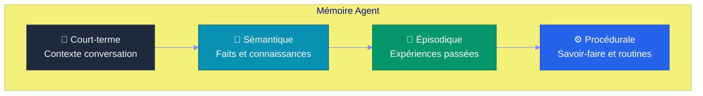
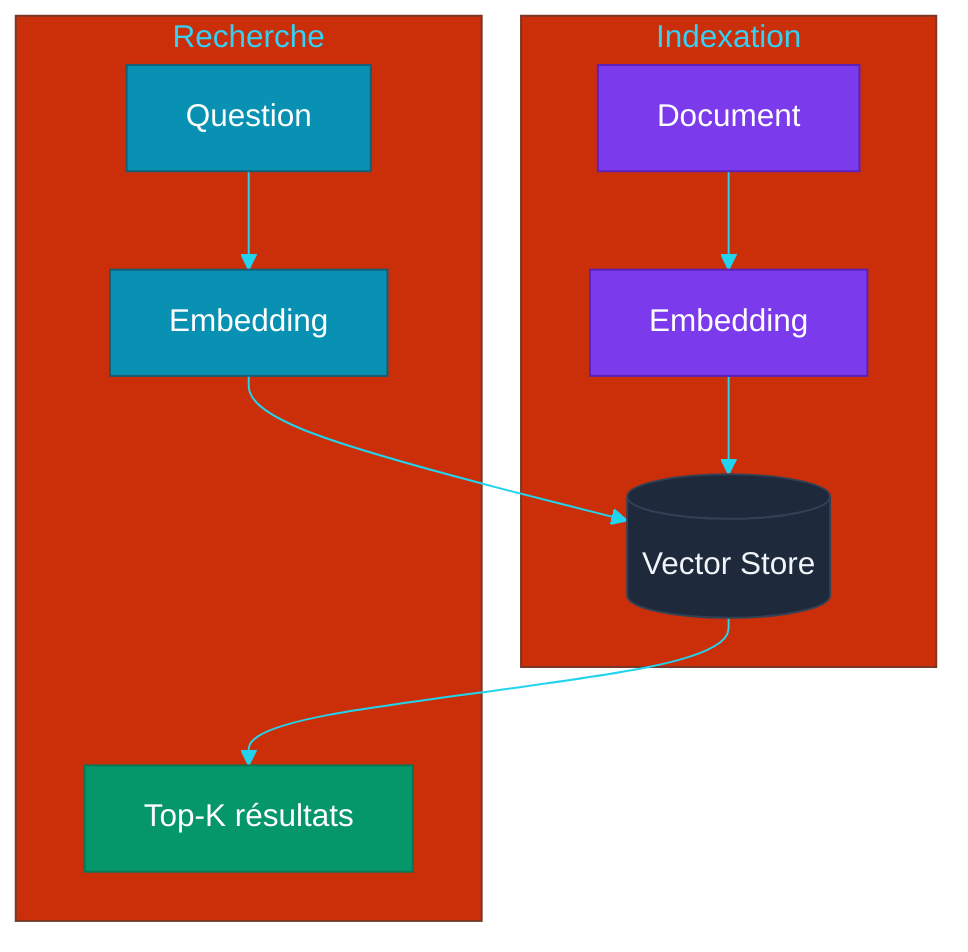
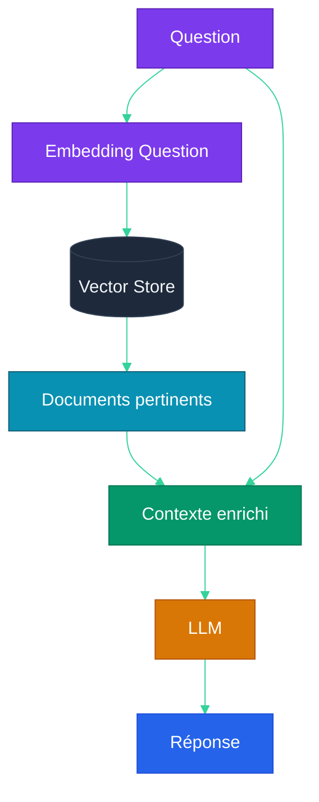
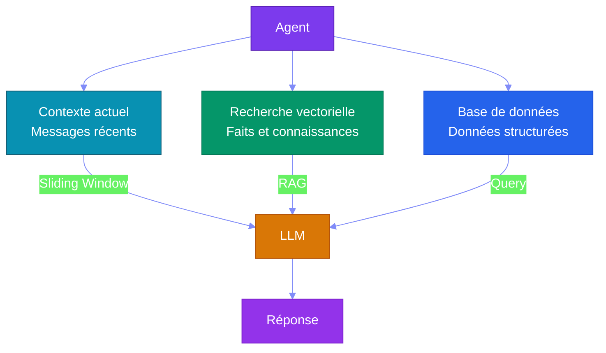

# Partie 5 — Mémoire & RAG (Retrieval-Augmented Generation)

## Objectifs pédagogiques

- Comprendre les différents types de mémoire pour un agent
- Maîtriser les embeddings et vector stores
- Savoir implémenter un RAG (Retrieval-Augmented Generation)
- Connaître les stratégies de mémoire long-terme

---

## 1. Les Types de Mémoire

### 1.1 Pyramide de la mémoire agentique



| Type | Description | Stockage | Persistance |
|---|---|---|---|
| **Court-terme** | Messages récents de la conversation | Fenêtre de contexte LLM (Large Language Model) | Volatile |
| **Sémantique** | Faits, connaissances générales | Vector store / Base SQL (Structured Query Language) | Persistante |
| **Épisodique** | Historique des actions et décisions | Logs structurés | Persistante |
| **Procédurale** | Règles, routines, compétences | Code + Prompts | Permanente |

---

## 2. Embeddings

### 2.1 Principe

Un **embedding** est une représentation vectorielle d'un texte dans un espace sémantique continu.

```mermaid
%%{init: {'theme': 'base', 'themeVariables': {
  'primaryColor': '#7c3aed',
  'primaryTextColor': '#fff',
  'lineColor': '#a78bfa'
}}}%%
graph LR
    T1["Chat"] --> V1["[0.2, 0.8, -0.3, ...]"]
    T2["Félin"] --> V2["[0.3, 0.7, -0.2, ...]"]
    T3["Voiture"] --> V3["[-0.5, 0.1, 0.9, ...]"]
    
    V1 -. "proches ." V2
    V2 -. "proches ." V1
    V1 -. "éloignés" .- V3
    
    style T1 fill:#7c3aed,color:#fff,stroke:#5b21b6
    style T2 fill:#7c3aed,color:#fff,stroke:#5b21b6
    style T3 fill:#dc2626,color:#fff,stroke:#b91c1c
    style V1 fill:#1e293b,color:#f1f5f9,stroke:#334155
    style V2 fill:#1e293b,color:#f1f5f9,stroke:#334155
    style V3 fill:#1e293b,color:#f1f5f9,stroke:#334155
```

**Propriétés :**
- Deux textes proches sémantiquement → vecteurs proches (similarité cosinus élevée)
- Deux textes différents → vecteurs éloignés
- La dimension typique : 384 à 3072 (selon le modèle)

### 2.2 Modèles d'embeddings

| Modèle | Dimensions | Usage |
|---|---|---|
| `text-embedding-3-small` (OpenAI) | 512-1536 | Usage général |
| `text-embedding-3-large` (OpenAI) | 3072 | Haute précision |
| `e5-mistral-7b` (Open source) | 4096 | Multilingue |
| `BGE-M3` (BAAI) | 1024 | Multilingue + dense |

---

## 3. Vector Stores

### 3.1 Principe

Une **base vectorielle** stocke les embeddings et permet de chercher les plus proches voisins.



### 3.2 Solutions disponibles

| Solution | Type | Persistance | Idéal pour |
|---|---|---|---|
| **Chroma** | Python pur | Fichier | Développement, petits projets |
| **FAISS** | Index local | Fichier | Haute performance |
| **Qdrant** | Serveur | Docker | Production |
| **Weaviate** | Serveur | Docker | Production, scalabilité |
| **PGVector** | Extension PostgreSQL | Base de données | Si déjà PostgreSQL |
| **SQLite + vec** | Extension SQLite | Fichier | Projets simples, embarqué |

---

## 4. RAG — Retrieval-Augmented Generation

### 4.1 Architecture



### 4.2 Pipeline RAG

```
1. INDEXATION (une fois)
   Documents → découpage en chunks → embeddings → vector store

2. RECHERCHE (à chaque question)
   Question → embedding → top-K chunks pertinents

3. GÉNÉRATION (à chaque question)
   Contexte (chunks) + Question → LLM → Réponse
```

### 4.3 Implémentation

```python
class RAGAgent:
    def __init__(self, llm, vector_store):
        self.llm = llm
        self.vs = vector_store
    
    def index_documents(self, documents: list[str]):
        chunks = []
        for doc in documents:
            chunks.extend(self._chunk_text(doc, size=512))
        embeddings = self.llm.embed(chunks)
        self.vs.add(embeddings, chunks)
    
    def query(self, question: str) -> str:
        q_emb = self.llm.embed([question])[0]
        chunks = self.vs.search(q_emb, k=5)
        context = "\n\n".join(chunks)
        
        prompt = f"""Contexte :
{context}

Question : {question}

Réponds en utilisant uniquement le contexte ci-dessus.
Si le contexte ne contient pas l'information, dis-le."""
        
        return self.llm.chat(prompt)
```

---

## 5. Stratégies de Chunking

| Stratégie | Description | Quand |
|---|---|---|
| **Fixed size** | Découpage à N tokens | Documents homogènes |
| **Semantic** | Découpage par paragraphe/section | Documents structurés |
| **Sentence** | Découpage par phrase | Textes narratifs |
| **Recursive** | Découpage récursif avec overlap | Documents longs |
| **Agentic** | Découpage intelligent par LLM | Qualité maximale |

---

## 6. Mémoire Long-Terme pour Agents

### 6.1 Architecture hybride



### 6.2 Exemple : Agent qui retient

```python
class AgentAvecMemoire:
    def __init__(self):
        self.llm = LLM()
        self.vs = VectorStore()  # Mémoire long-terme
        self.history = []        # Mémoire court-terme
    
    def remember(self, key: str, value: str):
        """Stocke un fait en mémoire long-terme."""
        text = f"{key}: {value}"
        self.vs.add(self.llm.embed([text])[0], text)
    
    def recall(self, question: str) -> list[str]:
        """Recherche dans la mémoire long-terme."""
        emb = self.llm.embed([question])[0]
        return self.vs.search(emb, k=3)
```

---

## Points clés à retenir

1. Un agent a besoin de **quatre types de mémoire** : court-terme, sémantique, épisodique, procédurale
2. Les **embeddings** transforment le texte en vecteurs numériques comparables
3. Le **RAG** combine recherche vectorielle et génération LLM pour répondre à partir de documents
4. Le **chunking** (découpage des documents) est une étape critique de la qualité du RAG
5. La **mémoire long-terme** permet à un agent de retenir des informations entre les sessions

---

## Liens

- [Partie 4 — Architecture Agentique](./PARTIE-04-architecture-agent.md)
- [Partie 6 — Multi-Agent Orchestration](./PARTIE-06-multi-agent.md)
- [Chroma Documentation](https://docs.trychroma.com/)
- [LangChain RAG Guide](https://python.langchain.com/docs/use_cases/question_answering/)
