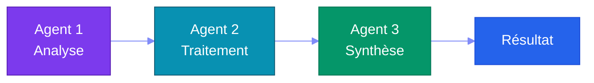
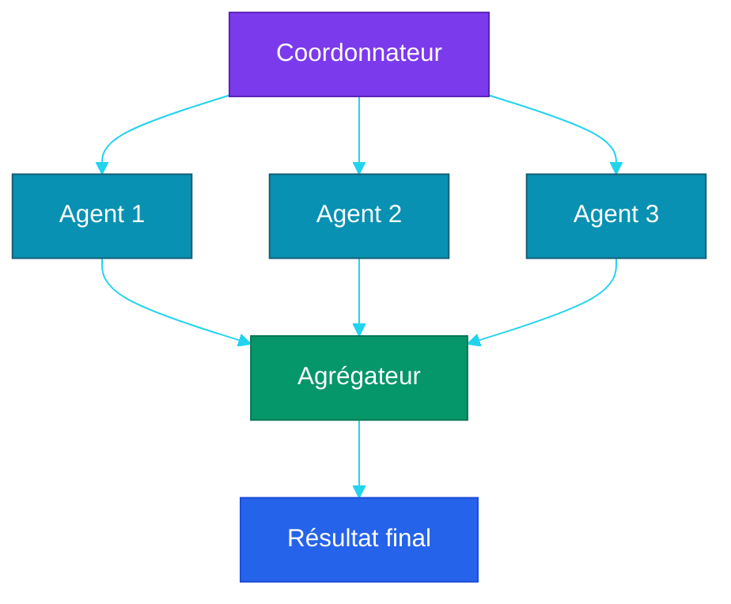
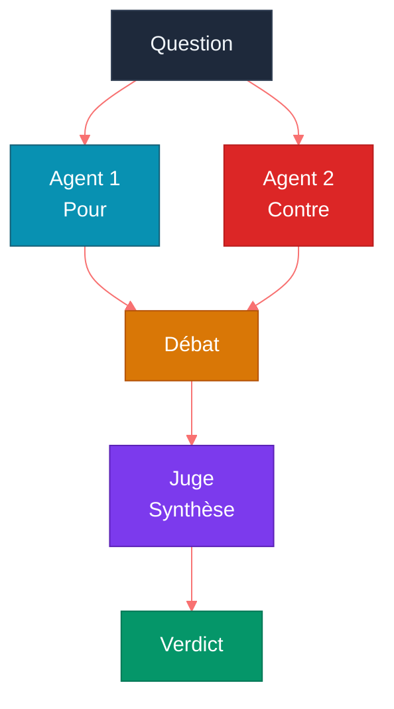
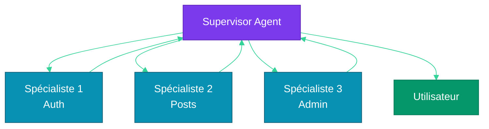
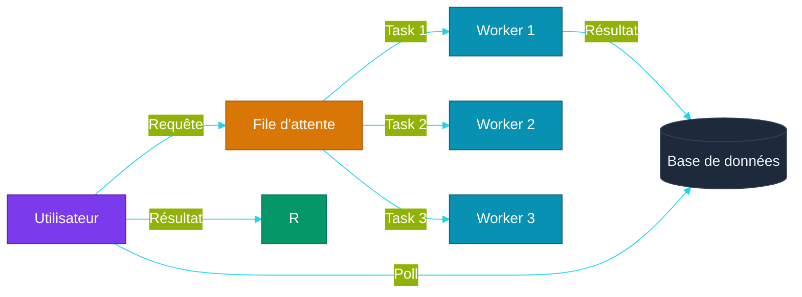

# Partie 6 — Multi-Agent Orchestration

## Objectifs pédagogiques

- Comprendre pourquoi un seul agent ne suffit pas toujours
- Maîtriser les patterns de communication entre agents
- Savoir implémenter un Supervisor Agent
- Connaître les approches asynchrones et files d'attente

---

## 1. Pourquoi Plusieurs Agents ?

### 1.1 Limites d'un agent unique

| Problème | Exemple | Solution multi-agent |
|---|---|---|
| **Spécialisation** | Un agent ne peut pas être bon en tout | Agents spécialisés par domaine |
| **Contexte** | Un seul LLM (Large Language Model) a une fenêtre limitée | Chaque agent a son propre contexte |
| **Parallélisme** | Tâches séquentielles lentes | Agents qui travaillent en parallèle |
| **Résilience** | Un agent qui échoue bloque tout | Agents redondants, fallback |
| **Modularité** | Tout le code dans une boucle | Agents indépendants et remplaçables |

### 1.2 Principe de spécialisation

Chaque agent a un **rôle précis** et un **système prompt dédié** :

```
Agent Modérateur → Analyse de toxicité, spam
Agent Résumé     → Synthèse de contenu
Agent Recherche  → RAG (Retrieval-Augmented Generation), recherche documentaire
Agent Code      → Génération et révision de code
```

---

## 2. Patterns de Communication

### 2.1 Séquentiel (Pipeline)



**Quand :** Tâches où chaque étape dépend de la précédente.
**Exemple :** Analyser → Résumer → Traduire

### 2.2 Fan-Out (Parallèle)



**Quand :** Tâches indépendantes qui peuvent être parallélisées.
**Exemple :** Analyser 3 documents en même temps.

### 2.3 Débat



**Quand :** Décisions complexes où plusieurs perspectives sont utiles.
**Exemple :** "Cette PR est-elle prête à être mergée ?"

### 2.4 Hiérarchique (Supervisor)



**Quand :** Orchestration complexe avec délégation dynamique.
**Exemple :** Un chef de projet qui délègue à des spécialistes.

---

## 3. Architecture Supervisor

### 3.1 Principe

Le **Supervisor Agent** est un LLM qui :
1. Reçoit la demande de l'utilisateur
2. Décide quel(s) sous-agent(s) invoquer
3. Consolide les résultats
4. Planifie la prochaine action

### 3.2 Prompt du Supervisor

```
Tu es un Supervisor Agent. Tu coordonnes une équipe d'agents spécialisés.

Agents disponibles :
- moderator(content) → analyse toxicité, spam (0-1)
- summarizer(texts) → résumé de contenu
- searcher(query) → recherche dans la base de connaissances

Règles :
1. Analyse la demande de l'utilisateur
2. Décide quels agents activer (séquentiel ou parallèle)
3. Consolide les résultats
4. Si un agent échoue, replanifie
5. Réponds à l'utilisateur uniquement quand tu as le résultat final
```

### 3.3 Implémentation

```python
class SupervisorAgent:
    def __init__(self, llm):
        self.llm = llm
        self.agents = {
            "moderator": ModeratorAgent(llm),
            "summarizer": SummarizerAgent(llm),
            "searcher": SearcherAgent(llm),
        }
        self.history = []
    
    def run(self, user_input: str) -> str:
        self.history.append({"role": "user", "content": user_input})
        
        while True:
            response = self.llm.chat(
                self.history,
                system=self._supervisor_prompt(),
                tools=self._agent_tools()
            )
            
            if response.content:  # Réponse finale
                return response.content
            
            for tc in response.tool_calls:
                agent_name = tc.function.name
                args = json.loads(tc.function.arguments)
                result = self.agents[agent_name].run(**args)
                self.history.append({
                    "role": "tool",
                    "content": str(result),
                    "tool_call_id": tc.id
                })
```

---

## 4. Gestion Asynchrone & Files d'Attente

### 4.1 Problème

Un appel agent peut prendre plusieurs secondes, voire minutes. En séquentiel, l'utilisateur attend.

### 4.2 Solution : File d'attente



### 4.3 Approche asynchrone simple

```python
import asyncio
import uuid

class AsyncAgentOrchestrator:
    def __init__(self):
        self.tasks = {}
    
    async def submit(self, agent_name: str, input_data: str) -> str:
        task_id = str(uuid.uuid4())
        self.tasks[task_id] = {"status": "pending", "result": None}
        
        # Lancer en arrière-plan
        asyncio.create_task(self._process(agent_name, input_data, task_id))
        return task_id
    
    async def get_result(self, task_id: str):
        while self.tasks[task_id]["status"] == "pending":
            await asyncio.sleep(0.5)
        return self.tasks[task_id]["result"]
    
    async def _process(self, agent_name, input_data, task_id):
        try:
            self.tasks[task_id]["status"] = "running"
            result = await self.agents[agent_name].arun(input_data)
            self.tasks[task_id]["result"] = result
            self.tasks[task_id]["status"] = "done"
        except Exception as e:
            self.tasks[task_id]["result"] = f"Error: {e}"
            self.tasks[task_id]["status"] = "failed"
```

---

## 5. Erreurs & Résilience

| Pattern | Description | Code |
|---|---|---|
| **Retry** | Réessayer après un échec temporaire | `retry(max=3, delay=1)` |
| **Fallback** | Agent de remplacement si le principal échoue | `agent_b if agent_a fails` |
| **Circuit Breaker** | Arrêter les appels après N échecs consécutifs | Arrêt temporaire puis reprise |
| **Timeout** | Limiter le temps d'exécution d'un agent | `asyncio.wait_for(task, timeout=30)` |
| **Graceful degradation** | Réponse partielle si un agent est indisponible | "Module X indisponible, voici le reste" |

---

## Points clés à retenir

1. Le **multi-agent** permet spécialisation, parallélisme et résilience
2. Les **patterns** fondamentaux : séquentiel, fan-out, débat, hiérarchique
3. Le **Supervisor Agent** est un LLM qui orchestre d'autres LLMs
4. Les **files d'attente** évitent de bloquer l'utilisateur pendant les traitements longs
5. La **résilience** (retry, fallback, timeout) est indispensable en production

---

## Liens

- [Partie 5 — Mémoire & RAG](./PARTIE-05-memoire-rag.md)
- [Partie 7 — MCP (Model Context Protocol) & Standards](./PARTIE-07-mcp-standards.md)
- [Partie 10 — Opencode & Labs](./PARTIE-10-opencode-labs.md)
