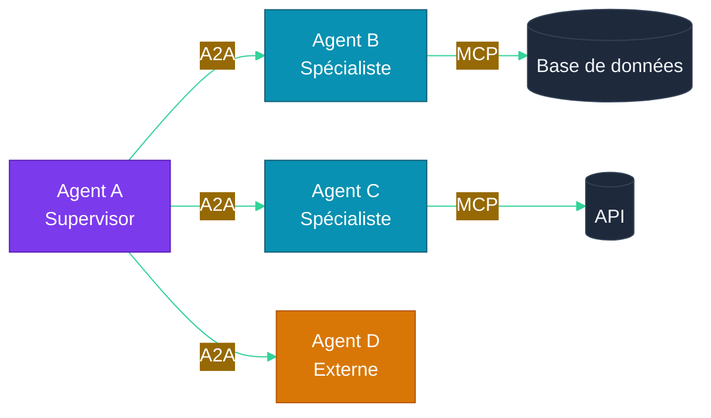

# Partie 7 — MCP (Model Context Protocol) & Standards d'Interopérabilité

## Objectifs pédagogiques

- Comprendre le Model Context Protocol (MCP) et son rôle
- Savoir exposer un service via MCP
- Connaître A2A (Agent-to-Agent) et les standards émergents
- Pouvoir connecter un agent opencode à des services externes

---

## 1. Pourquoi des Standards ?

### 1.1 Le problème

Chaque plateforme agentique a sa propre façon de :
- Définir des outils
- Gérer la mémoire
- Communiquer avec d'autres agents
- Exposer des APIs

**Résultat :** Les agents sont difficiles à porter, interconnecter et maintenir.

### 1.2 La solution : MCP

Le **Model Context Protocol** (Anthropic, 2025) est un standard ouvert qui définit comment un LLM (Large Language Model)/agent se connecte à des sources de données et des outils.

> MCP est à l'IA ce que USB-C est à l'électronique : **un connecteur universel**.

---

## 2. Architecture MCP

### 2.1 Composants

```mermaid
%%{init: {'theme': 'base', 'themeVariables': {
  'primaryColor': '#6366f1',
  'primaryTextColor': '#fff',
  'lineColor': '#818cf8'
}}}%%
graph TD
    subgraph "Hôte MCP"
        H[Application hôte<br/>opencode, Claude, IDE]
    end
    
    subgraph "Client MCP"
        C[Client MCP<br/>Connecte l'hôte aux serveurs]
    end
    
    subgraph "Serveur MCP"
        S1[Serveur Base de données]
        S2[Serveur API (Application Programming Interface) Météo]
        S3[Serveur Fichiers]
        S4[Serveur Recherche]
    end
    
    H <--> C
    C <--> S1
    C <--> S2
    C <--> S3
    C <--> S4
    
    style H fill:#7c3aed,color:#fff,stroke:#5b21b6
    style C fill:#0891b2,color:#fff,stroke:#155e75
    style S1 fill:#059669,color:#fff,stroke:#047857
    style S2 fill:#059669,color:#fff,stroke:#047857
    style S3 fill:#059669,color:#fff,stroke:#047857
    style S4 fill:#059669,color:#fff,stroke:#047857
```

| Composant | Rôle | Exemple |
|---|---|---|
| **Hôte** | Application qui utilise un LLM | opencode, Claude Desktop, IDE |
| **Client** | Connecte l'hôte aux serveurs MCP | SDK MCP (Python, TypeScript) |
| **Serveur** | Expose des ressources, outils et prompts | Serveur fichier, serveur DB, serveur API |

### 2.2 Primitives MCP

| Primitive | Description | Exemple |
|---|---|---|
| **Resources** | Données exposées en lecture | Contenu de fichiers, résultats de requêtes |
| **Tools** | Fonctions exécutables par le LLM | `get_weather()`, `send_email()` |
| **Prompts** | Templates de prompts réutilisables | "Résume ce document" |

---

## 3. Créer un Serveur MCP avec Python

### 3.1 Exemple minimal

```python
# server.py — Serveur MCP météo
from mcp.server import Server
from mcp.types import Tool, TextContent

app = Server("weather-server")

@app.list_tools()
async def list_tools() -> list[Tool]:
    return [
        Tool(
            name="get_weather",
            description="Obtenir la météo d'une ville",
            parameters={
                "type": "object",
                "properties": {
                    "city": {"type": "string"}
                },
                "required": ["city"]
            }
        )
    ]

@app.call_tool()
async def call_tool(name: str, args: dict) -> list[TextContent]:
    if name == "get_weather":
        # Implémentation météo
        return [TextContent(f"15°C à {args['city']}")]
```

### 3.2 Connecter à opencode

Dans `opencode.json`, déclarer le serveur MCP :

```json
{
  "mcp_servers": {
    "weather": {
      "command": "python",
      "args": ["server.py"]
    }
  }
}
```

Les agents opencode peuvent alors utiliser `get_weather()` comme un outil natif.

---

## 4. A2A — Agent-to-Agent Protocol

### 4.1 Principe

Si MCP connecte un **agent à des outils**, A2A connecte un **agent à d'autres agents**.



### 4.2 Cycle de vie d'une tâche A2A

```
1. Agent A envoie une AgentCard à Agent B
   → "Je cherche un spécialiste en météo"

2. Agent B répond avec ses capacités
   → "Je peux donner la météo pour toute ville"

3. Agent A délègue une tâche
   → "Tâche: get_weather_for_cities(['Paris', 'Tokyo'])"

4. Agent B exécute et renvoie le résultat
   → "Résultat: { Paris: 15°C, Tokyo: 22°C }"
```

---

## 5. Standards dans le monde opencode

### 5.1 Fichier `opencode.json`

Le fichier de configuration opencode permet de déclarer :

```json
{
  "$schema": "https://opencode.ai/config.json",
  "model": "opencode/big-pickle",
  "default_agent": "scrum-master",
  "instructions": ["AGENTS.md", "PARTIE-01-histoire-ia.md"],
  "agents": {
    "scrum-master": {
      "mode": "primary",
      "description": "Coordonne l'équipe",
      "skills": ["common", "scrum_master"]
    },
    "fullstack-developer": {
      "mode": "subagent",
      "description": "Développe le code",
      "skills": ["common", "fullstack_developer"]
    }
  }
}
```

### 5.2 Fichier `AGENTS.md`

Documente l'équipe, les rôles, le workflow :

```markdown
# Équipe de développement

| Agent | Rôle | Mode |
|---|---|---|
| scrum-master | Planifie, coordonne | primary |
| fullstack-developer | Code, tests | subagent |

## Workflow
1. L'utilisateur donne une instruction
2. Le scrum-master découpe en tâches
3. Les sous-agents exécutent
4. Le scrum-master synthétise
```

### 5.3 Skills

Les **skills** sont des prompts spécialisés chargés selon le contexte :

```
.opencode/skills/
├── common.md              ← Connaissances partagées
├── scrum_master.md        ← Comment découper un projet
├── fullstack_developer.md ← Comment développer
└── devops.md              ← Docker, CI/CD (Continuous Integration / Continuous Deployment)
```

---

## 6. Interopérabilité avec opencode

### 6.1 opencode comme hôte MCP

opencode peut se connecter à n'importe quel serveur MCP, ce qui permet à vos agents d'utiliser des outils externes sans code spécifique.

### 6.2 Exemple : Agent opencode avec outils MCP

```
# Demande à l'agent
"Quel temps fait-il à Paris ?"

# Agent scrum-master (via opencode)
→ Délègue à un sous-agent avec l'outil MCP météo
→ L'outil MCP retourne "15°C"
→ L'agent synthétise la réponse
```

### 6.3 opencode comme serveur MCP

Inversement, vous pouvez exposer les capacités de votre projet opencode via MCP pour que d'autres applications LLM puissent y accéder.

---

## Points clés à retenir

1. **MCP** est le standard universel pour connecter LLMs à des outils et données
2. **A2A** permet à des agents de collaborer entre eux
3. Le **serveur MCP** expose des Resources, Tools et Prompts
4. **opencode** supporte nativement MCP via `opencode.json`
5. **AGENTS.md** et les **skills** forment la structure agentique du projet

---

## Liens

- [Partie 6 — Multi-Agent Orchestration](./PARTIE-06-multi-agent.md)
- [Partie 10 — Opencode & Labs](./PARTIE-10-opencode-labs.md)
- [Documentation MCP](https://modelcontextprotocol.io)
- [opencode Documentation](https://opencode.ai)
