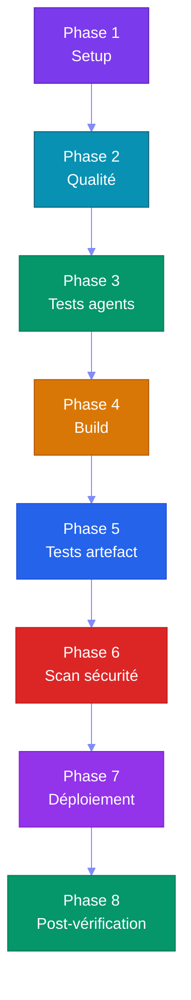

# Partie 8 — CI/CD (Continuous Integration / Continuous Deployment) & DevOps pour Agents

## Objectifs pédagogiques

- Comprendre comment tester et valider des agents automatiquement
- Mettre en place une CI/CD complète pour un projet agentique
- Savoir monitorer les performances et coûts des agents
- Connaître les bonnes pratiques DevOps pour systèmes agentiques

---

## 1. Pourquoi la CI/CD est Cruciale pour les Agents

Les agents sont **non-déterministes** : deux exécutions du même prompt peuvent donner des résultats différents. La CI/CD permet de :

| Objectif | Méthode |
|---|---|
| Vérifier que les agents répondent correctement | Tests comportementaux |
| Détecter les régressions (un changement casse une capacité) | Benchmark automatisé |
| Valider les coûts tokens | Seuils de coût |
| Sécuriser les accès et permissions | Scan de sécurité |
| Déployer sans interruption | Rolling update |

---

## 2. Tester des Agents

### 2.1 Tests unitaires

Créez `tests/test_tools.py` :

```python
# Test unitaire : vérifie que l'outil météo retourne une température
def test_get_weather_tool():
    result = weather_tool("Paris")
    assert "température" in result.lower()
    assert isinstance(result, str)
```

### 2.2 Tests d'intégration

Créez `tests/test_integration.py` :

```python
# Test d'intégration : parcours complet d'un agent météo
def test_agent_meteo_complet():
    agent = WeatherAgent()
    result = agent.run("Quel temps fait-il à Paris ?")
    assert "Paris" in result
    assert "°C" in result or "degrés" in result
```

### 2.3 Tests comportementaux (Évaluation)

Créez `tests/test_benchmarks.py` :

```python
# Benchmark : liste des scénarios de test comportementaux
BENCHMARKS = [
    {
        "input": "Météo à Paris",
        "expected_behavior": "Utilise l'outil get_weather",
        "expected_tools": ["get_weather"],
        "max_tokens": 500,
        "max_steps": 3
    },
    {
        "input": "Bonjour",
        "expected_behavior": "Répond poliment sans outil",
        "expected_tools": [],
        "max_tokens": 100,
        "max_steps": 1
    }
]

# Test de validation des comportements
def test_agent_behavior():
    agent = create_agent()
    for bench in BENCHMARKS:
        result = agent.run(bench["input"])
        assert result.used_tools == bench["expected_tools"]
        assert result.total_steps <= bench["max_steps"]
```

---

## 3. Pipeline CI/CD pour Agents

### 3.1 Architecture



### 3.2 Pipeline YAML (YAML Ain't Markup Language) (GitHub Actions)

Créez `.github/workflows/cicd-agent.yml` :

```yaml
name: CI/CD Agent

on: [push, pull_request]  # Déclencheur : push ou pull request

jobs:
  quality:
    runs-on: ubuntu-latest
    steps:
      - uses: actions/checkout@v4
      - uses: actions/setup-python@v5
        with: { python-version: "3.12" }
      - run: pip install -r requirements-dev.txt
      - run: ruff check .  # Vérification du linting
      - run: mypy .  # Vérification des types

  test-agents:
    needs: quality  # Dépend du job quality
    runs-on: ubuntu-latest
    steps:
      - uses: actions/checkout@v4
      - uses: actions/setup-python@v5
      - run: pip install -r requirements-dev.txt
      - name: Exécuter les tests agents
        run: pytest tests/ -v --benchmark
      - name: Vérifier les coûts tokens
        run: python scripts/check_token_cost.py --max 1000

  build:
    needs: test-agents  # Dépend du job test-agents
    runs-on: ubuntu-latest
    steps:
      - run: docker build -t agent-app .  # Construction de l'image
      - run: docker run -d --name agent-test agent-app
      - run: |
          sleep 5
          curl -sf http://localhost:8000/health  # Vérification santé
      - run: docker rm -f agent-test

  deploy:
    needs: build  # Dépend du job build
    if: github.ref == 'refs/heads/main'  # Déploiement uniquement sur main
    runs-on: ubuntu-latest
    steps:
      - run: echo "Déploiement..."
```

---

## 4. Monitoring & Observabilité

### 4.1 Que monitorer pour un agent ?

| Métrique | Pourquoi | Seuil d'alerte |
|---|---|---|
| **Temps de réponse** | L'utilisateur attend | > 10s |
| **Nombre de steps** | Boucle infinie possible | > 10 steps |
| **Tokens consommés** | Coût, budget | > 1000 tokens/appel |
| **Taux d'erreur** | Outils qui échouent | > 5% |
| **Taux de succès** | L'agent résout-il les problèmes ? | < 90% |
| **Appels par session** | Fuite mémoire possible | > 50 |

### 4.2 Logging structuré

Créez `monitoring.py` :

```python
import structlog
logger = structlog.get_logger()

class MonitoredAgent:
    """Agent avec logging structuré pour le monitoring."""
    def run(self, user_input: str) -> str:
        start = time.time()
        logger.info("agent.start", input=user_input)  # Début de l'exécution
        
        try:
            result = self._run_loop(user_input)
            duration = time.time() - start
            logger.info("agent.success",  # Succès de l'exécution
                       input=user_input,
                       duration=duration,
                       tokens=self.total_tokens,
                       steps=self.steps)
            return result
        except Exception as e:
            logger.error("agent.error",  # Erreur lors de l'exécution
                        input=user_input,
                        error=str(e))
            raise
```

---

## 5. Gestion des Coûts

### 5.1 Calcul des coûts

Créez `token_counter.py` :

```python
class TokenCounter:
    """Compteur de tokens avec budget maximum."""
    def __init__(self, max_total: int = 10000):
        self.total = 0  # Total des tokens consommés
        self.max_total = max_total  # Budget maximum autorisé
    
    def track(self, prompt_tokens: int, completion_tokens: int):
        """Enregistre la consommation de tokens."""
        self.total += prompt_tokens + completion_tokens
        if self.total > self.max_total:
            raise BudgetExceeded(f"Budget token dépassé: {self.total}")
```

Avec opencode + big-pickle (modèle gratuit), le coût est **zéro**. Cette section est utile si on migre vers un modèle payant.

### 5.2 Stratégies d'optimisation

| Stratégie | Gain estimé |
|---|---|
| **Limiter le contexte** (max 2000 tokens) | -50% tokens |
| **Mettre en cache les réponses identiques** | -30% appels |
| **Batching** (regrouper les questions) | -40% overhead |
| **Modèle plus petit** pour les tâches simples | -80% coût |
| **Timeouts stricts** | Évite les boucles coûteuses |

---

## 6. Travaux Pratiques — CI/CD (Continuous Integration / Continuous Deployment) pour Agents

> **Projet fil rouge** : la chaine CI/CD mise en place ici build, teste et deploie automatiquement le reseau social defini dans [`projet/gestion_de_projet/cdc.md`](projet/gestion_de_projet/cdc.md).

**Objectif :** Mettre en place un pipeline CI/CD complet qui teste et valide des agents automatiquement.

**Durée :** 2h

---

### Étape 1 — Structure du projet

Commencez par créer la structure du projet et un assistant CLI (Command Line Interface) minimal :

```bash
mkdir cicd-agents && cd cicd-agents
```

Créez `assistant.py` :

```python
import re

class Assistant:
    """Assistant simple avec capacités météo et calcul."""
    def __init__(self):
        self.weather_db = {  # Base de données météo intégrée
            "Paris": "15°C",
            "Tokyo": "22°C",
            "Londres": "10°C",
        }

    def run(self, user_input: str) -> str:
        """Traite une entrée utilisateur et retourne une réponse."""
        text = user_input.lower()
        if "météo" in text or "weather" in text:  # Demande météo
            cities = re.findall(r"\b[A-Z][a-zA-ZéèêëàâäùûüôöîïçÉÈÊËÀÂÄÙÛÜÔÖÎÏÇ-]+\b", user_input)
            city = cities[0] if cities else "Paris"
            if city in self.weather_db:
                return f"À {city}, il fait {self.weather_db[city]}."
            return f"Je n'ai pas d'information météo pour {city}."
        if "calcul" in text or "calc" in text:  # Demande de calcul
            expr = user_input.split(":", 1)[-1].strip()
            try:
                return str(eval(expr))
            except:
                return "Erreur de calcul"
        return f"Je ne comprends pas: {user_input}"
```

### Étape 2 — Tests comportementaux

Créez `tests/test_agent_behavior.py` :

```python
import sys
sys.path.append("..")  # Ajoute le dossier parent au chemin Python
from assistant import Assistant

# Test météo pour Paris
def test_meteo_paris():
    agent = Assistant()
    result = agent.run("météo à Paris")
    assert "°C" in result or "degrés" in result

# Test météo pour Tokyo
def test_meteo_tokyo():
    agent = Assistant()
    result = agent.run("météo à Tokyo")
    assert "°C" in result or "degrés" in result

# Test de calcul simple
def test_calcul_simple():
    agent = Assistant()
    result = agent.run("calcul: 2 + 2")
    assert "4" in result

# Test de calcul complexe avec parenthèses
def test_calcul_complexe():
    agent = Assistant()
    result = agent.run("calcul: (10 + 5) * 2")
    assert "30" in result

# Test de question inconnue (ne doit pas planter)
def test_question_inconnue():
    agent = Assistant()
    result = agent.run("quelle est la couleur du ciel ?")
    assert result  # Ne doit pas planter

# Test de ville inconnue (ne doit pas planter)
def test_ville_inconnue():
    agent = Assistant()
    result = agent.run("météo à Inconnueville")
    assert result  # Ne doit pas planter
```

### Étape 3 — Tests de qualité

Créez `tests/test_quality.py` :

```python
import subprocess

def test_lint():
    """Vérifie que le code passe le linting ruff."""
    result = subprocess.run(["ruff", "check", "."], capture_output=True, text=True)
    assert result.returncode == 0, f"Lint erreurs:\n{result.stdout}"

def test_imports():
    """Vérifie que les imports fonctionnent sans erreur."""
    result = subprocess.run(["python", "-c", "from assistant import Assistant"], 
                          capture_output=True, text=True)
    assert result.returncode == 0, f"Import échoué:\n{result.stderr}"
```

### Étape 4 — Pipeline GitHub Actions

Créez `.github/workflows/test-agents.yml` :

```yaml
name: Test Agents

on: [push, pull_request]  # Déclenché à chaque push ou pull request

jobs:
  test:
    runs-on: ubuntu-latest
    steps:
      - uses: actions/checkout@v4  # Récupère le code source
      - uses: actions/setup-python@v5
        with:
          python-version: "3.12"  # Version de Python ciblée
      
      - name: Installer les dépendances
        run: |
          python -m pip install --upgrade pip
          pip install pytest ruff
      
      - name: Qualité (ruff)
        run: ruff check .  # Vérification du linting
      
      - name: Tests agents
        run: pytest tests/ -v  # Exécution des tests unitaires
```

Ce pipeline vient compléter l'exemple de la section 3.2 : il se concentre sur la qualité et les tests agents, tandis que le précédent couvrait la construction et le déploiement.

### Étape 5 — Tester en local

```bash
pip install pytest ruff
ruff check .
pytest tests/ -v
```

### Étape 6 — Configurer opencode pour le pipeline

Demandez à l'agent opencode :

```
"Ajoute un job 'benchmark' qui mesure le temps de réponse des outils"
"Ajoute un seuil d'échec : si un outil met plus de 2 secondes, le test échoue"
"Ajoute un rapport de couverture de code"
```

### Validation

- [ ] `pytest tests/` passe avec tous les tests verts
- [ ] `ruff check .` passe sans erreur
- [ ] Le pipeline GitHub Actions est configuré
- [ ] Les tests comportementaux valident les cas normaux ET les cas d'erreur

### Pour aller plus loin

- Ajoutez un benchmark qui mesure les tokens consommés par appel
- Créez un test de non-régression : exécutez l'agent sur 10 questions et stockez les réponses attendues
- Mettez en place un déploiement automatique si tous les tests passent

---

## Points clés à retenir

1. Les **tests agents** sont différents des tests classiques — ils valident des comportements
2. Un **pipeline CI/CD** pour agents doit inclure des benchmarks comportementaux
3. Le **monitoring** (temps, steps, tokens, erreurs) est indispensable en production
4. Avec opencode + big-pickle, les **coûts sont nuls** — idéal pour l'apprentissage
5. Les **stratégies d'optimisation** token permettent de passer à l'échelle

---

## Liens

- [Partie 9 — Sécurité & Safety](./PARTIE-09-securite.md)
- [Partie 10 — Opencode & Labs](./PARTIE-10-opencode-labs.md)
- [GitHub Actions Documentation](https://docs.github.com/en/actions)
