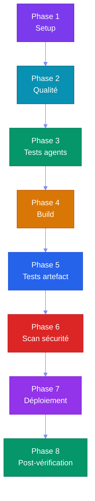

# Partie 8 — CI/CD (Continuous Integration / Continuous Deployment) & DevOps pour Agents

## Objectifs pédagogiques

- Comprendre comment tester et valider des agents automatiquement
- Mettre en place une CI/CD complète pour un projet agentique
- Savoir monitorer les performances et coûts des agents
- Connaître les bonnes pratiques DevOps pour systèmes agentiques

---

## 1. Pourquoi la CI/CD est Cruciale pour les Agents

Les agents sont **non-déterministes** : deux exécutions du même prompt peuvent donner des résultats différents. La CI/CD permet de :

| Objectif | Méthode |
|---|---|
| Vérifier que les agents répondent correctement | Tests comportementaux |
| Détecter les régressions (un changement casse une capacité) | Benchmark automatisé |
| Valider les coûts tokens | Seuils de coût |
| Sécuriser les accès et permissions | Scan de sécurité |
| Déployer sans interruption | Rolling update |

---

## 2. Tester des Agents

### 2.1 Tests unitaires

Tester des fonctions spécifiques :

```python
def test_get_weather_tool():
    result = weather_tool("Paris")
    assert "température" in result.lower()
    assert isinstance(result, str)
```

### 2.2 Tests d'intégration

Tester des parcours agent complets :

```python
def test_agent_meteo_complet():
    agent = WeatherAgent()
    result = agent.run("Quel temps fait-il à Paris ?")
    assert "Paris" in result
    assert "°C" in result or "degrés" in result
```

### 2.3 Tests comportementaux (Évaluation)

Les plus importants pour les agents :

```python
BENCHMARKS = [
    {
        "input": "Météo à Paris",
        "expected_behavior": "Utilise l'outil get_weather",
        "expected_tools": ["get_weather"],
        "max_tokens": 500,
        "max_steps": 3
    },
    {
        "input": "Bonjour",
        "expected_behavior": "Répond poliment sans outil",
        "expected_tools": [],
        "max_tokens": 100,
        "max_steps": 1
    }
]

def test_agent_behavior():
    agent = create_agent()
    for bench in BENCHMARKS:
        result = agent.run(bench["input"])
        assert result.used_tools == bench["expected_tools"]
        assert result.total_steps <= bench["max_steps"]
```

---

## 3. Pipeline CI/CD pour Agents

### 3.1 Architecture



### 3.2 Pipeline YAML (GitHub Actions)

```yaml
name: CI/CD Agent

on: [push, pull_request]

jobs:
  quality:
    runs-on: ubuntu-latest
    steps:
      - uses: actions/checkout@v4
      - uses: actions/setup-python@v5
        with: { python-version: "3.12" }
      - run: pip install -r requirements-dev.txt
      - run: ruff check .
      - run: mypy .

  test-agents:
    needs: quality
    runs-on: ubuntu-latest
    steps:
      - uses: actions/checkout@v4
      - uses: actions/setup-python@v5
      - run: pip install -r requirements-dev.txt
      - name: Exécuter les tests agents
        run: pytest tests/ -v --benchmark
      - name: Vérifier les coûts tokens
        run: python scripts/check_token_cost.py --max 1000

  build:
    needs: test-agents
    runs-on: ubuntu-latest
    steps:
      - run: docker build -t agent-app .
      - run: docker run -d --name agent-test agent-app
      - run: |
          sleep 5
          curl -sf http://localhost:8000/health
      - run: docker rm -f agent-test

  deploy:
    needs: build
    if: github.ref == 'refs/heads/main'
    runs-on: ubuntu-latest
    steps:
      - run: echo "Déploiement..."
```

---

## 4. Monitoring & Observabilité

### 4.1 Que monitorer pour un agent ?

| Métrique | Pourquoi | Seuil d'alerte |
|---|---|---|
| **Temps de réponse** | L'utilisateur attend | > 10s |
| **Nombre de steps** | Boucle infinie possible | > 10 steps |
| **Tokens consommés** | Coût, budget | > 1000 tokens/appel |
| **Taux d'erreur** | Outils qui échouent | > 5% |
| **Taux de succès** | L'agent résout-il les problèmes ? | < 90% |
| **Appels par session** | Fuite mémoire possible | > 50 |

### 4.2 Logging structuré

```python
import structlog
logger = structlog.get_logger()

class MonitoredAgent:
    def run(self, user_input: str) -> str:
        start = time.time()
        logger.info("agent.start", input=user_input)
        
        try:
            result = self._run_loop(user_input)
            duration = time.time() - start
            logger.info("agent.success",
                       input=user_input,
                       duration=duration,
                       tokens=self.total_tokens,
                       steps=self.steps)
            return result
        except Exception as e:
            logger.error("agent.error",
                        input=user_input,
                        error=str(e))
            raise
```

---

## 5. Gestion des Coûts

### 5.1 Calcul des coûts

```python
class TokenCounter:
    def __init__(self, max_total: int = 10000):
        self.total = 0
        self.max_total = max_total
    
    def track(self, prompt_tokens: int, completion_tokens: int):
        self.total += prompt_tokens + completion_tokens
        if self.total > self.max_total:
            raise BudgetExceeded(f"Budget token dépassé: {self.total}")
```

Avec opencode + big-pickle (modèle gratuit), le coût est **zéro**. Cette section est utile si on migre vers un modèle payant.

### 5.2 Stratégies d'optimisation

| Stratégie | Gain estimé |
|---|---|
| **Limiter le contexte** (max 2000 tokens) | -50% tokens |
| **Mettre en cache les réponses identiques** | -30% appels |
| **Batching** (regrouper les questions) | -40% overhead |
| **Modèle plus petit** pour les tâches simples | -80% coût |
| **Timeouts stricts** | Évite les boucles coûteuses |

---

## Points clés à retenir

1. Les **tests agents** sont différents des tests classiques — ils valident des comportements
2. Un **pipeline CI/CD** pour agents doit inclure des benchmarks comportementaux
3. Le **monitoring** (temps, steps, tokens, erreurs) est indispensable en production
4. Avec opencode + big-pickle, les **coûts sont nuls** — idéal pour l'apprentissage
5. Les **stratégies d'optimisation** token permettent de passer à l'échelle

---

## Liens

- [Partie 9 — Sécurité & Safety](./PARTIE-09-securite.md)
- [Partie 10 — Opencode & Labs](./PARTIE-10-opencode-labs.md)
- [GitHub Actions Documentation](https://docs.github.com/en/actions)
