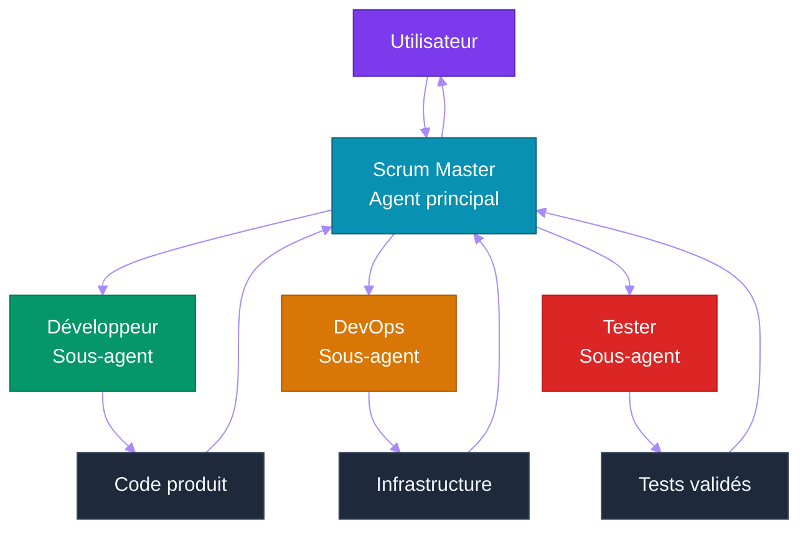

# Partie 10 — Opencode & Mise en Pratique Agentique

## Objectifs pédagogiques

- Configurer un projet opencode de A à Z
- Créer une équipe d'agents spécialisés
- Rédiger des skills efficaces
- Orchestrer un projet via agents Scrum
- Réaliser les labs pratiques

---

## 1. Qu'est-ce qu'opencode ?

[**opencode**](https://opencode.ai) est une plateforme agentic open-source qui transforme un LLM (Large Language Model) en équipe de développement collaborative.

### 1.1 Principe



### 1.2 Avantages

| Avantage | Description |
|---|---|
| **Gratuit** | opencode + big-pickle = 0€ |
| **Open-source** | Code visible, modifiable, auto-hébergeable |
| **Équipe intégrée** | Scrum Master, Dev, DevOps, Tester prêts à l'emploi |
| **Skills modulaires** | Prompts spécialisés chargés selon le contexte |
| **MCP (Model Context Protocol) natif** | Support du Model Context Protocol |
| **Fichier de config unique** | Tout est dans `opencode.json` |

---

## 2. Configuration d'un Projet opencode

### 2.1 Structure minimale

```
mon-projet-agentic/
├── opencode.json        ← Configuration des agents
├── AGENTS.md            ← Documentation de l'équipe
└── .opencode/
    └── skills/          ← Prompts spécialisés
        ├── common.md
        └── scrum_master.md
```

### 2.2 `opencode.json`

```json
{
  "$schema": "https://opencode.ai/config.json",
  "model": "opencode/big-pickle",
  "default_agent": "scrum-master",
  "instructions": ["AGENTS.md"],
  "skills": {
    "paths": [".opencode/skills"]
  },
  "agent": {
    "scrum-master": {
      "mode": "primary",
      "description": "Coordonne l'équipe, découpe le travail en tâches",
      "skills": ["common", "scrum_master"]
    },
    "developer": {
      "mode": "subagent",
      "description": "Écrit le code, les tests, la documentation",
      "skills": ["common", "developer"]
    },
    "devops": {
      "mode": "subagent",
      "description": "Docker, CI/CD (Continuous Integration / Continuous Deployment), déploiement",
      "skills": ["common", "devops"]
    },
    "tester": {
      "mode": "subagent",
      "description": "Tests unitaires, intégration, qualité",
      "skills": ["common", "tester"]
    }
  }
}
```

### 2.3 `AGENTS.md`

```markdown
# Équipe de développement

| Agent | Rôle | Mode |
|---|---|---|
| scrum-master | Chef de projet — planifie, coordonne | primary |
| developer | Développe le code | subagent |
| devops | Infrastructure, CI/CD | subagent |
| tester | Tests et qualité | subagent |

## Workflow
1. L'utilisateur donne une instruction
2. Le scrum-master analyse et découpe en tâches
3. Les tâches sont déléguées aux sous-agents via `task()`
4. Chaque sous-agent produit le résultat
5. Le scrum-master consolide et présente
```

### 2.4 Skills

**`.opencode/skills/common.md`**
```markdown
# Connaissances communes

Langage : Python
Framework : FastAPI
Base de données : SQLite
Conteneurisation : Docker
Tests : pytest
Qualité : ruff, mypy

L'équipe communique en français.
Le code est en anglais (variables, commentaires).
```

**`.opencode/skills/scrum_master.md`**
```markdown
# Rôle du Scrum Master

Tu es le Scrum Master. Tu coordonnes l'équipe.

## Responsabilités
1. Analyser la demande utilisateur
2. Consulter les documents de référence
3. Découper en user stories et tâches
4. Déléguer aux sous-agents compétents
5. Vérifier la qualité du livrable
6. Présenter une synthèse à l'utilisateur

## Format de réponse
- Analyse rapide du besoin
- Actions réalisées
- Vérifications effectuées
- Risques identifiés
- Recommandations
```

---

## 3. Utiliser opencode en Ligne de Commande

### 3.1 Commandes de base

```bash
# Démarrer opencode
opencode

# Changer d'agent
opencode --agent developer
opencode -a devops

# Mode tâche (sans interaction)
opencode --task "Ajoute une route /health"
opencode -t "Lance les tests"

# Voir la configuration
opencode --config
```

### 3.2 Workflow typique

```bash
# 1. L'utilisateur donne une instruction
> "Initialise le projet FastAPI avec Docker"

# 2. Le scrum master analyse et délègue
> "J'analyse la demande... Je délègue au developer et au devops."

# 3. Les sous-agents produisent le code
# 4. Le scrum master vérifie et synthétise
# 5. Résultat livré à l'utilisateur
```

### 3.3 Délégation entre agents

Dans le fichier de configuration, les agents peuvent déléguer des tâches :

```
@developer: Crée la structure du projet FastAPI
@devops: Ajoute le Dockerfile
@tester: Vérifie que les tests passent
```

---

## 4. Labs Pratiques

Les labs sont des exercices où vous utilisez opencode + big-pickle pour construire progressivement un projet agentique.

### Lab 1 — Découverte d'opencode
Configurer votre premier projet opencode avec une équipe de 2 agents.

### Lab 2 — Agent Assistant CLI
Créer un assistant en ligne de commande avec outils (météo, calculatrice).

### Lab 3 — Agent avec Mémoire
Ajouter de la mémoire persistante à l'assistant (SQLite).

### Lab 4 — Multi-Agent Supervisor
Créer un supervisor qui délègue à des agents spécialisés.

### Lab 5 — Serveur MCP
Exposer l'assistant via MCP pour qu'il soit utilisable par d'autres LLMs.

### Lab 6 — CI/CD pour Agents
Mettre en place un pipeline de test et validation pour les agents.

---

## 5. Évaluation & Validation

### 5.1 Critères pour chaque lab

| Critère | Description |
|---|---|
| **Fonctionnalité** | Le lab répond au besoin défini |
| **Qualité code** | ruff, mypy passent |
| **Tests** | pytest passe |
| **Docker** | Fonctionne dans un conteneur |
| **Documentation** | README à jour |

### 5.2 Auto-évaluation

```bash
# Vérification rapide
opencode -t "Vérifie la qualité du code"
opencode -t "Exécute les tests"
opencode -t "Vérifie que le Dockerfile est valide"
```

---

## Points clés à retenir

1. **opencode** transforme un LLM en équipe de développement collaborative
2. La configuration se fait via `opencode.json`, `AGENTS.md` et des **skills**
3. Les agents communiquent par **délégation** (`@agent`, `task()`)
4. Les **labs** sont des exercices progressifs pour maîtriser l'agentic
5. Tout est **gratuit et open-source** avec opencode + big-pickle

---

## Liens

- [Partie 1 — Histoire de l'IA](./PARTIE-01-histoire-ia.md)
- [Partie 4 — Architecture Agentique](./PARTIE-04-architecture-agent.md)
- [Partie 7 — MCP & Standards](./PARTIE-07-mcp-standards.md)
- [Documentation opencode](https://opencode.ai)
- [Labs pratiques](./labs/)
