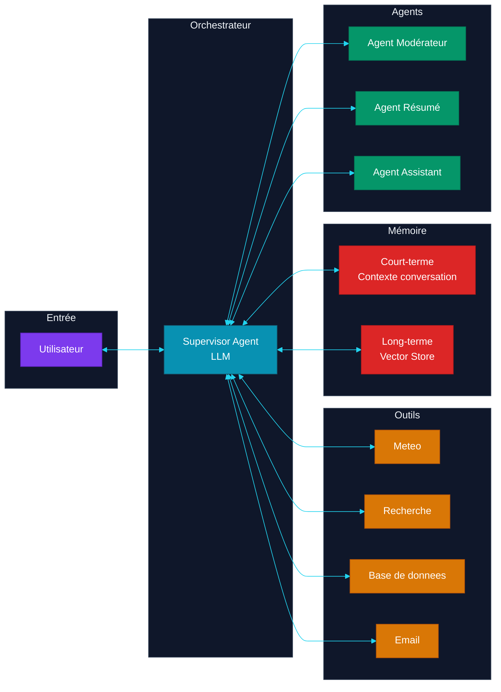
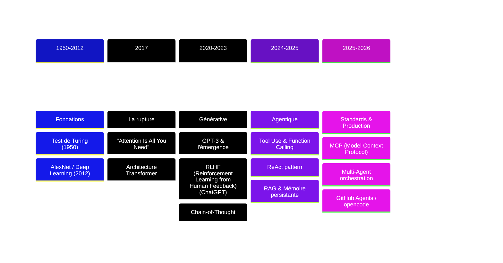

# SdV-Agentic-Dev

> Cours 100% open-source sur le développement de **systèmes agentiques** — de l'histoire de l'IA à la mise en production d'agents autonomes.
>
> **Stack :** opencode + big-pickle — gratuit, zéro dépendance payante.

---

```mermaid
%%{init: {'theme': 'base', 'themeVariables': {
  'primaryColor': '#7c3aed',
  'primaryTextColor': '#fff',
  'primaryBorderColor': '#5b21b6',
  'lineColor': '#a78bfa',
  'secondaryColor': '#1e293b',
  'tertiaryColor': '#0f172a',
  'background': '#0f172a',
  'mainBkg': '#1e293b',
  'nodeBorder': '#5b21b6',
  'clusterBkg': '#0f172a',
  'clusterBorder': '#334155',
  'titleColor': '#f1f5f9',
  'edgeLabelBackground': '#1e293b',
  'nodeTextColor': '#f1f5f9'
}}}}
graph TB
    P1["Partie 1<br/>Histoire de l'IA"] --> P2["Partie 2<br/>Fondations LLM (Large Language Model)"]
    P2 --> P3["Partie 3<br/>Prompt & Tool Use"]
    P3 --> P4["Partie 4<br/>Architecture Agent"]
    P4 --> P5["Partie 5<br/>Memoire & RAG (Retrieval-Augmented Generation)"]
    P5 --> P6["Partie 6<br/>Multi-Agent"]
    P6 --> P7["Partie 7<br/>MCP (Model Context Protocol) & Standards"]
    P7 --> P8["Partie 8<br/>CI/CD (Continuous Integration / Continuous Deployment) & DevOps"]
    P8 --> P9["Partie 9<br/>Securite"]
    P9 --> P10["Partie 10<br/>Opencode & Labs"]
    
    style P1 fill:#7c3aed,color:#fff,stroke:#5b21b6
    style P2 fill:#7c3aed,color:#fff,stroke:#5b21b6
    style P3 fill:#7c3aed,color:#fff,stroke:#5b21b6
    style P4 fill:#7c3aed,color:#fff,stroke:#5b21b6
    style P5 fill:#7c3aed,color:#fff,stroke:#5b21b6
    style P6 fill:#7c3aed,color:#fff,stroke:#5b21b6
    style P7 fill:#7c3aed,color:#fff,stroke:#5b21b6
    style P8 fill:#7c3aed,color:#fff,stroke:#5b21b6
    style P9 fill:#7c3aed,color:#fff,stroke:#5b21b6
    style P10 fill:#059669,color:#fff,stroke:#047857
```

---

## Sommaire

### Partie 1 — Histoire & Genèse de l'IA
Des premiers tests de Turing à l'explosion des Transformers, en passant par les hivers, la révolution deep learning et l'avènement des systèmes agentiques.

### Partie 2 — Architecture des LLMs
Tokenisation, mécanisme d'attention, context window, scaling laws, modèles open-source.

### Partie 3 — Prompt Engineering & Tool Use
System prompt, few-shot, chain-of-thought, function calling, pattern ReAct (Reasoning + Acting).

### Partie 4 — Architecture Agentique
Boucle agent, état, planification, outils, mémoire court-terme.

### Partie 5 — Mémoire & RAG
Embeddings, vector stores, retrieval-augmented generation, mémoire long-terme persistante.

### Partie 6 — Multi-Agent Orchestration
Supervisor, fan-out, débat, patterns de communication, files d'attente asynchrones.

### Partie 7 — MCP & Standards d'Interopérabilité
Model Context Protocol, A2A (Agent-to-Agent), connexion d'agents à des services externes.

### Partie 8 — CI/CD & DevOps pour Agents
Pipeline complet, tests d'agents, monitoring, gestion des coûts tokens.

### Partie 9 — Sécurité & Safety des Agents
Prompt injection, jailbreak, sandboxing, permissions, OWASP (Open Worldwide Application Security Project) LLM.

### Partie 10 — Opencode & Mise en Pratique Agentique
Configurer une équipe d'agents opencode, rédiger des skills, orchestrer un projet Scrum via agents.

---

## Architecture d'un système agentique



---

## Les découvertes clés — Timeline



---

## Prérequis

- Python intermédiaire (POO (Programmation Orientee Objet), typage, modules)
- Notions de base en bases de données (SQL (Structured Query Language))
- Git & GitHub
- Curiosité technique

## Organisation

Le cours suit une progression **des concepts fondamentaux vers la pratique** :

1. **Parties 1-3** : Théorie et bases (histoire, LLMs, prompting)
2. **Parties 4-7** : Conception agentique (architecture, mémoire, orchestration, standards)
3. **Parties 8-9** : Production (CI/CD, sécurité)
4. **Partie 10 + Labs** : **Mise en pratique** avec opencode

---

```mermaid
%%{init: {'theme': 'base', 'themeVariables': {
  'primaryColor': '#059669',
  'primaryTextColor': '#fff',
  'lineColor': '#34d399'
}}}}
graph LR
    A["Theorie<br/>Parties 1-3"] --> B["Conception<br/>Parties 4-7"]
    B --> C["Production<br/>Parties 8-9"]
    C --> D["Pratique<br/>Partie 10 + Labs"]
    
    style A fill:#6366f1,color:#fff,stroke:#4338ca
    style B fill:#0891b2,color:#fff,stroke:#155e75
    style C fill:#d97706,color:#fff,stroke:#b45309
    style D fill:#059669,color:#fff,stroke:#047857
```

---

## Stack technique (100% open-source & gratuit)

| Outil | Rôle | Coût |
|---|---|---|
| [opencode](https://opencode.ai) | Plateforme agentic | Gratuit |
| `big-pickle` (modèle opencode) | LLM local/cloud gratuit | Gratuit |
| Python + FastAPI | Backend | Gratuit |
| SQLite | Base de données | Gratuit |
| Docker | Conteneurisation | Gratuit |
| GitHub Actions | CI/CD | Gratuit (public) |

Aucune API (Application Programming Interface) payante (OpenAI, Anthropic) n'est requise.
Tout le cours fonctionne avec **opencode + big-pickle**.

---

## Liens utiles

| Ressource | Emplacement |
|---|---|
| Glossaire | [`docs/glossaire.md`](docs/glossaire.md) |
| Config agents | [`opencode.json`](opencode.json) |
| Équipe agent | [`agents.md`](agents.md) |
| Cours complet | Tous les fichiers `PARTIE-*.md` |
| Labs pratiques | [`labs/`](labs/) |
